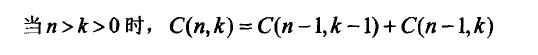
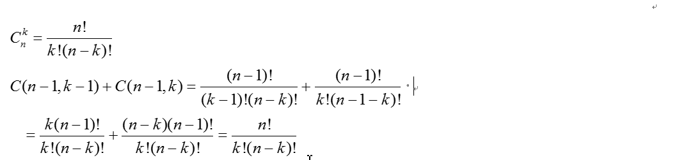
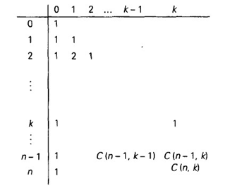
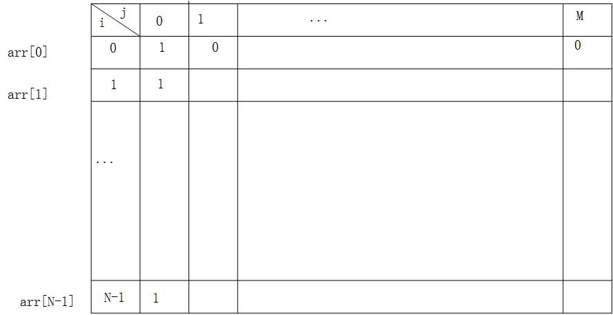

# 题目列表
- 2.1 计算二项式系数
- 2.2 矩阵的最小路径和⭐
- 2.3 最长递增子序列
- 2.4 最长公共子序列问题⭐
- 2.5 最长公共子串问题⭐
- 2.6 最小编辑代价
- 2.7 字符串的交错组成
- 2.8 龙与地下城游戏问题⭐
- 2.9 跳跃游戏
- 2.10 数组中的最长连续序列⭐
- 2.11 子集和问题⭐
- 2.12 最长回文子串


## 一、基本概念
### 1.1 定义
　　**动态规划的本质**，是对问题状态的定义和状态转移方程的定义，是多阶段决策过程最优的通用方法。

### 1.2 基本思想与策略
　　基本思想与分治法类似，也是将待求解的问题分解为若干个子问题（阶段），按顺序求解子阶段，前一子问题的解，为后一子问题的求解提供了有用的信息。在求解任一子问题时，列出各种可能的局部解，通过决策保留那些有可能达到最优的局部解，丢弃其他局部解。依次解决各子问题，最后一个子问题就是初始问题的解。

　　由于动态规划解决的问题多数有重叠子问题这个特点，为减少重复计算，对每一个子问题只解一次，将其不同阶段的不同状态保存在一个二维数组中。因此动态规划也是空间换时间的，一般是将给定问题递推关系中的相同子问题结果记录到表中。

　　与分治法最大的差别是：适合于用动态规划法求解的问题，经分解后得到的子问题往往不是互相独立的（即下一个子阶段的求解是建立在上一个子阶段的解的基础上，进行进一步的求解）。

### 1.3 适用的情况
　　能采用动态规划求解的问题的一般要具有3个性质：

(1)最优化原理：如果问题的最优解所包含的子问题的解也是最优的，就称该问题具有最优子结构，即满足最优化原理。

(2)无后效性：即某阶段状态一旦确定，就不受这个状态以后决策的影响。也就是说，某状态以后的过程不会影响以前的状态，只与当前状态有关。

(3)有重叠子问题：即子问题之间是不独立的，一个子问题在下一阶段决策中可能被多次使用到。（该性质并不是动态规划适用的必要条件，但是如果没有这条性质，动态规划算法同其他算法相比就不具备优势）

### 1.4 求解的基本步骤
　　动态规划所处理的问题是一个多阶段决策问题，一般由初始状态开始，通过对中间阶段决策的选择，达到结束状态。这些决策形成了一个决策序列，同时确定了完成整个过程的一条活动路线(通常是求最优的活动路线)。如图所示。动态规划的设计都有着一定的模式，一般要经历以下几个步骤。

```
初始状态→│决策１│→│决策２│→…→│决策ｎ│→结束状态
```

- (1)划分阶段：按照问题的时间或空间特征，把问题分为若干个阶段。在划分阶段时，注意划分后的阶段一定要是有序的或者是可排序的，否则问题就无法求解。
- (2)确定状态和状态变量：将问题发展到各个阶段时所处于的各种客观情况用不同的状态表示出来。当然，状态的选择要满足无后效性。
- (3)确定决策并写出状态转移方程：因为决策和状态转移有着天然的联系，状态转移就是根据上一阶段的状态和决策来导出本阶段的状态。
- (4)寻找边界条件：给出的状态转移方程是一个递推式，需要一个递推的终止条件或边界条件。

　　一般，只要解决问题的阶段、状态和状态转移决策确定了，就可以写出状态转移方程（包括边界条件）。

　　实际应用中可以按以下几个简化的步骤进行设计：
- （1）分析最优解的性质，并刻画其结构特征。
- （2）递归的定义最优解。
- （3）以自底向上或自顶向下的记忆化方式（备忘录法）计算出最优值
- （4）根据计算最优值时得到的信息，构造问题的最优解

### 1.5 算法实现的说明
　　动态规划的主要难点在于理论上的设计，也就是上面4个步骤的确定，一旦设计完成，实现部分就会非常简单。

　　使用动态规划求解问题，最重要的就是确定动态规划三要素：
- （1）问题的阶段 
- （2）每个阶段的状态
- （3）从前一个阶段转化到后一个阶段之间的递推关系(确定之后画个表，按表编程)。

　　递推关系必须是从次小的问题开始到较大的问题之间的转化，从这个角度来说，动态规划往往可以用递归程序来实现，不过因为递推不可以充分利用前面保存的子问题的解来减少重复计算，所以对于大规模问题来说，动态规划有递推不可比拟的优势。

　　确定了动态规划的这三要素，整个求解过程就可以用一个最优决策表来描述，最优决策表是一个二维表，其中行表示决策的阶段，列表示问题状态，表格需要填写的数据一般对应此问题的在某个阶段某个状态下的最优值（如最短路径，最长公共子序列，最大价值等），填表的过程就是根据递推关系，从1行1列开始，以行或者列优先的顺序，依次填写表格，最后根据整个表格的数据通过简单的取舍或者运算求得问题的最优解。
```
f(n,m)=max{f(n-1,m), f(n-1,m-w[n])+P(n,m)}
```
**两点注意：**
- 填矩阵的顺序，
- 动态规划空间复杂度的优化

　　这2点都跟递推式的依赖关系有关（这是本质），在形式上就表现为填矩阵的时候你的顺序要确保每填一个新位置时你所用到的那些位置（即它依赖的）要已经填好了，在空间优化上表现为当一个位置在以后还有用的时候你不能覆盖它。

## 二、 例子
### 2.1 计算二项式系数
　　在排列组合里面，我们有下面的式子（很容易用组合的定义来证明）：



　　证明：



　　这个式子将C(n , k)的计算问题表述为了（问题描述）C(n-1 , k-1)和C(n -1, k)两个较小的交叠子问题。

　　初始条件：C(n , n) = C(n , 0) = 1

　　我们可以用下列填矩阵的方式求出C(n , k)：



代码：
```Java
public class Solution {
    public static void main(String[] args) {
        System.out.println("输出8的二项式系数：");
        for (int i = 0; i <= 8; i++)
            System.out.println("C(" + 8 + "," + i + ") ———— " + Binomial(8, i));
    }

    public static int Binomial(int n, int k) {// 计算二项式系数C(n,k)
        int[][] result = new int[n + 1][k + 1];
        for (int i = 0; i <= n; i++) { // 按行来填矩阵
            for (int j = 0; j <= min(i, k); j++) {// min(i,k)是这一行需要填的列数
                if (j == 0 || j == i) result[i][j] = 1;
                else result[i][j] = result[i - 1][j - 1] + result[i - 1][j];
            }
        }
        return result[n][k];
    }

    private static int min(int i, int k) {
        if (i < k)
            return i;
        return k;
    }
}
```

### 2.2 <font color="red">矩阵的最小路径和⭐</font>
- [64.最小路径和](../../../2.题目/64.最小路径和.md)

### 2.3 最长递增子序列
- [300.最长上升子序列](../../../2.题目/300.最长上升子序列.md)


### 2.4 <font color="red">最长公共子序列问题⭐</font>
《程序员代码面试指南》P210，超经典！！！
```text
给定两个字符串str1和str2，返回两个字符串的最长公共子序列。
【举例】

str1="1A2C3D4B56"，str2="B1D23CA45B6A"。

"123456"或者"12C4B6"都是最长公共子序列，返回哪一个都行。
```

```text
如果str1的长 度为M，str2的长度为N，生成大小为M×N的矩阵dp，行数为M，列数为N。dp[i][j] 的含义是str1[0..i]与str2[0..j]的最长公共子序列的长度。
```

```Java
class Solution {
    public static String lcse(String str1, String str2) {
        if (str1 == null || str2 == null || str1.equals("") || str2.equals("")) {
            return "";
        }
        char[] chs1 = str1.toCharArray();
        char[] chs2 = str2.toCharArray();
        int[][] dp = getdp(chs1, chs2);
        int m = chs1.length - 1;
        int n = chs2.length - 1;
        char[] res = new char[dp[m][n]];
        int index = res.length - 1;
        while (index >= 0) {
            if (n > 0 && dp[m][n] == dp[m][n - 1]) {
                n--;
            } else if (m > 0 && dp[m][n] == dp[m - 1][n]) {
                m--;
            } else {
                res[index--] = chs1[m];
                m--;
                n--;
            }
        }
        return String.valueOf(res);
    }

    public static int[][] getdp(char[] str1, char[] str2) {
        int[][] dp = new int[str1.length][str2.length];
        dp[0][0] = str1[0] == str2[0] ? 1 : 0;
        for (int i = 1; i < str1.length; i++) {
            dp[i][0] = Math.max(dp[i - 1][0], str1[i] == str2[0] ? 1 : 0);
        }
        for (int j = 1; j < str2.length; j++) {
            dp[0][j] = Math.max(dp[0][j - 1], str1[0] == str2[j] ? 1 : 0);
        }
        for (int i = 1; i < str1.length; i++) {
            for (int j = 1; j < str2.length; j++) {
                dp[i][j] = Math.max(dp[i - 1][j], dp[i][j - 1]);
                if (str1[i] == str2[j]) {
                    dp[i][j] = Math.max(dp[i][j], dp[i - 1][j - 1] + 1);
                }
            }
        }
        return dp;
    }

    public static void main(String[] args) {
        String str1 = "A1BC2D3EFGH45I6JK7LMN";
        String str2 = "12OPQ3RST4U5V6W7XYZ";
        System.out.println(lcse(str1, str2));

    }
}
```

### 2.5 <font color="red">最长公共子串问题⭐</font>
《程序员代码面试指南》P213，超经典！！！

```text
给定两个字符串str1和str2，返回两个字符串的最长公共子串。
【举例】

str1="1AB2345CD"，str2="12345EF"，返回"2345"。
```

```Java
class Solution {
    public static String lcst1(String str1, String str2) {
        if (str1 == null || str2 == null || str1.equals("") || str2.equals("")) {
            return "";
        }
        char[] chs1 = str1.toCharArray();
        char[] chs2 = str2.toCharArray();
        int[][] dp = getdp(chs1, chs2);
        int end = 0;
        int max = 0;
        for (int i = 0; i < chs1.length; i++) {
            for (int j = 0; j < chs2.length; j++) {
                if (dp[i][j] > max) {
                    end = i;
                    max = dp[i][j];
                }
            }
        }
        return str1.substring(end - max + 1, end + 1);
    }

    public static int[][] getdp(char[] str1, char[] str2) {
        int[][] dp = new int[str1.length][str2.length];
        for (int i = 0; i < str1.length; i++) {
            if (str1[i] == str2[0]) {
                dp[i][0] = 1;
            }
        }
        for (int j = 1; j < str2.length; j++) {
            if (str1[0] == str2[j]) {
                dp[0][j] = 1;
            }
        }
        for (int i = 1; i < str1.length; i++) {
            for (int j = 1; j < str2.length; j++) {
                if (str1[i] == str2[j]) {
                    dp[i][j] = dp[i - 1][j - 1] + 1;
                }
            }
        }
        return dp;
    }
    
    public static void main(String[] args) {
        String str1 = "ABC1234567DEFG";
        String str2 = "HIJKL1234567MNOP";
        System.out.println(lcst1(str1, str2)); 
    }
}
```

### 2.6 最小编辑代价
《程序员代码面试指南》P217

```text
给定两个字符串str1和str2，再给定三个整数ic、dc和rc，分别代表插入、删除和 替换一个字符的代价，返回将str1编辑成str2的最小代价。
```

```Java
class Solution {
    public static int minCost1(String str1, String str2, int ic, int dc, int rc) {
        if (str1 == null || str2 == null) {
            return 0;
        }
        char[] chs1 = str1.toCharArray();
        char[] chs2 = str2.toCharArray();
        int row = chs1.length + 1;
        int col = chs2.length + 1;
        int[][] dp = new int[row][col];
        for (int i = 1; i < row; i++) {
            dp[i][0] = dc * i;
        }
        for (int j = 1; j < col; j++) {
            dp[0][j] = ic * j;
        }
        for (int i = 1; i < row; i++) {
            for (int j = 1; j < col; j++) {
                if (chs1[i - 1] == chs2[j - 1]) {
                    dp[i][j] = dp[i - 1][j - 1];
                } else {
                    dp[i][j] = dp[i - 1][j - 1] + rc;
                }
                dp[i][j] = Math.min(dp[i][j], dp[i][j - 1] + ic);
                dp[i][j] = Math.min(dp[i][j], dp[i - 1][j] + dc);
            }
        }
        return dp[row - 1][col - 1];
    }
}
```

### 2.7 字符串的交错组成
《程序员代码面试指南》P220

双指针岂不是更简单，判断aim中每一个是不是来自str1或者str2？不行，可能两个字符串都出现了b，但是用哪个是有区别的，比如用了第一个的b，但是后面的是第二个的b后的字符串

```text
给定三个字符串str1、str2和aim，如果aim包含且仅包含来自str1和str2的所有字符，而且在aim中属于str1的字符之间保持原来在str1中的顺序，属于str2的字 符之间保持原来在str2中的顺序，那么称aim是str1和str2的交错组成。实现一个 函数，判断aim是否是str1和str2交错组成。
```

```Java
class Solution {
    public static boolean isCross1(String str1, String str2, String aim) {
        if (str1 == null || str2 == null || aim == null) {
            return false;
        }
        char[] ch1 = str1.toCharArray();
        char[] ch2 = str2.toCharArray();
        char[] chaim = aim.toCharArray();
        if (chaim.length != ch1.length + ch2.length) {
            return false;
        }
        boolean[][] dp = new boolean[ch1.length + 1][ch2.length + 1];
        dp[0][0] = true;
        for (int i = 1; i <= ch1.length; i++) {
            if (ch1[i - 1] != chaim[i - 1]) {
                break;
            }
            dp[i][0] = true;
        }
        for (int j = 1; j <= ch2.length; j++) {
            if (ch2[j - 1] != chaim[j - 1]) {
                break;
            }
            dp[0][j] = true;
        }
        for (int i = 1; i <= ch1.length; i++) {
            for (int j = 1; j <= ch2.length; j++) {
                if ((ch1[i - 1] == chaim[i + j - 1] && dp[i - 1][j]) || (ch2[j - 1] == chaim[i + j - 1] && dp[i][j - 1])) {
                    dp[i][j] = true;
                }
            }
        }
        return dp[ch1.length][ch2.length];
    }
}
```

### 2.8 <font color="red">龙与地下城游戏问题⭐</font>
《程序员代码面试指南》P223，超经典，**反向**动态规划！！！

```text
给定一个二维数组map，含义是一张地图，例如，如下矩阵：

-2　-3　3
-5 -10 1 
0　30　-5 
游戏的规则如下：

● 骑士从左上角出发，每次只能向右或向下走，最后到达右下角见到公主。

● 地图中每个位置的值代表骑士要遭遇的事情。如果是负数，说明此处有怪兽，要 让骑士损失血量。如果是非负数，代表此处有血瓶，能让骑士回血。

● 骑士从左上角到右下角的过程中，走到任何一个位置时，血量都不能少于1。 为了保证骑士能见到公主，初始血量至少是多少？根据map，返回初始血量。
```

```text
dp[i][j]的含义是如果骑士要走上位置（i，j），并且从该位置选一条最优的路径，最后走到右下角，骑士起码应该具备的血量。根据dp的定义，我们最终需要的是dp[0][0]的结果。

```

```Java
class Solution {
    public static int minHP1(int[][] m) {
        if (m == null || m.length == 0 || m[0] == null || m[0].length == 0) {
            return 1;
        }
        int row = m.length;
        int col = m[0].length;
        int[][] dp = new int[row--][col--];
        dp[row][col] = m[row][col] > 0 ? 1 : -m[row][col] + 1;
        for (int j = col - 1; j >= 0; j--) {
            dp[row][j] = Math.max(dp[row][j + 1] - m[row][j], 1);
        }
        int right = 0;
        int down = 0;
        for (int i = row - 1; i >= 0; i--) {
            dp[i][col] = Math.max(dp[i + 1][col] - m[i][col], 1);
            for (int j = col - 1; j >= 0; j--) {
                right = Math.max(dp[i][j + 1] - m[i][j], 1);
                down = Math.max(dp[i + 1][j] - m[i][j], 1);
                dp[i][j] = Math.min(right, down);
            }
        }
        return dp[0][0];
    }
}
```

### 2.9 跳跃游戏
- [55.跳跃游戏](../../../2.题目/55.跳跃游戏.md)

### 2.10 <font color="red">数组中的最长连续序列⭐</font>
- [128.最长连续序列](../../../2.题目/128.最长连续序列.md)

### 2.11 <font color="red">子集和问题⭐</font>
在动态规划的过程中，是否考虑空集或者空字符的情况，一般区别在于：
1. 初始化值一般不同
2. 在求解的过程中注意下标变化

问题中没有考虑空间压缩，可以参考背包问题。
#### 考虑空集或者空字符串
给定n个正整数W=(w1, w2, …, wn)和正整数M，要求寻找这样一个子集I⊆{1, 2, 3, ..., n},使得∑wi=M,i∈I。举个例子对子集和问题做一个通俗的解释：集合W=(1, 2, 3, 4, 5)，给定一个正整数M=5，是否存在W的一个子集I，使得子集I中的元素相加等于M，这个例子显然存在子集I=(2, 3)。

定义数组arr=[w1, w2, …, wn]，若arr的长度为N，生成行数为N+1，列数为M+1的动态规划表dp。


dp[i][j]的含义是：arr[0,...,i-1]的子集和是否可以是j。

根据这个定义，**dp[i][j]的计算方式如下：**

1. dp[0][1...M]的值，表示由空集是否可以组成和为1..M，故全部为false。
2. dp[0][0]的值，我们定义不选择任何元素构成的和为0，故为true。
3. dp[1..N][0]的值，由上面定义，全为true。
4. dp[i][j]的值，看到求dp[i][j]，第一想法就是找到dp[i][j]和前面已求元素的关系。考虑几种经典情况(动态规划题目经常考虑的几种情况)：

- 若集合中的元素可以重复使用：
    - `dp[i-1][j-k*arr[i-1]](k>=0)`:即arr[0...i-2]子集和是否为j-k*arr[i-1]，注意k=0包含了dp[i-1][j]的情况。
    - dp[i][j-1]:即arr[0...i-1]子集和是否为j-1，这种情况不考虑。
    - dp[i-1][j-1]:即arr[0...i-2]子集和是否为j-1，这种情况不考虑。

其中：`dp[i-1][j-k*arr[i-1]](k>=0)`任一种情况为1，则dp[i][j]=1;**`dp[i-1][j-k*arr[i-1]](k>=0)`有两种计算方法：**

第一种：
```
int num=0;
for (int k = 0; j - arr[i-1] * k >= 0; k++) {
        num+=dp[i-1][j - arr[i - 1] * k];
}
if(num>=1)  dp[i][j] = 1;
```

但是计算复杂度较高。
- 时间复杂度：$O(M*N^2)$
- 空间复杂度：$O(M*N)$

第二种：
- dp[i][j]=$\Sigma dp[i-1][j-k * arr[i-1]]$(k>=0)
- $= dp[i-1][j]+ \Sigma dp[i-1][j-k * arr[i-1]]$(k>=1)
- $=dp[i-1][j]+ \Sigma dp[i-1][j-(k+1) * arr[i-1]]$(k>=0)
- $=dp[i-1][j]+ \Sigma dp[i-1][j - arr[i-1]-k * arr[i-1]]$(k>=0)  // 另m = j - arr[i-1]，发现这一部分就是开始展开的时候，即dp[i][m]
- $=dp[i-1][j]+dp[i][j - arr[i-1]]$


则dp[i][j] = dp[i-1][j] || dp[i][j-arr[i-1]]，即两者任意一个为true，则dp[i][j]为true。

时间和空间复杂度都为O(M*N)

- 若集合中的元素不可以重复使用：
dp[i-1][j]:即arr[0...i-2]子集和是否为j。
dp[i][j-1]:即arr[0...i-1]子集和是否为j-1，这种情况不考虑。
dp[i-1][j-1]:即arr[0...i-2]子集和是否为j-1，这种情况不考虑。
dp[i-1][j-arr[i-1]]:即arr[0...i-2]子集和是否为j-arr[i-1]。

则：dp[i][j]=dp[i-1][j] || dp[i-1][j-arr[i-1]]，即两者任意一个为true，则dp[i][j]为true。
时间和空间复杂度都为O(M*N)

代码(集合中的元素可以重复使用)：
```Java
public class SubsetSumProblem {
    public static void main(String[] srgs) {
        int[] sets = {7, 34, 4, 12, 5, 3};
        int sum = 87;
        boolean isExistSubSet = subsetSumProblem(sets, sum);
        System.out.println("集合" + Arrays.toString(sets) + "是否存在子集的和等于" + sum + ":" + isExistSubSet);
    }

    private static boolean subsetSumProblem(int[] arr, int sum) {
        int row = arr.length + 1;
        int col = sum + 1;
        int[][] dp = new int[row][col];
        dp[0][0] = 1;

        for (int j = 1; j < col; j++) {
            dp[0][j] = 0;
        }

        // 按行填充
        for (int i = 1; i < row; i++) {
            dp[i][0] = 1;
            for (int j = 1; j < col; j++) {
                dp[i][j] = dp[i - 1][j];

                if (dp[i][j] != 1) {
                    if (j - arr[i - 1] >= 0 && dp[i][j - arr[i - 1]] == 1) {
                        dp[i][j] = dp[i][j - arr[i - 1]];
                    } else {
                        dp[i][j] = 0;
                    }
                }
            }
        }
        return dp[row - 1][col - 1] == 1;
    }
}
```

#### 不考虑空集或者空字符串
定义数组arr=[w1, w2, …, wn],若arr的长度为N，生成行数为N，列数为M+1的动态规划表dp。



dp[i][j]的含义是：arr[0,...,i]的子集和是否可以是j。
初始化和推导过程类似于下面的背包问题，这里直接给出代码(集合中的元素可以重复使用)：
```Java
public class SubsetSumProblem {
    public static void main(String[] srgs) {
        int[] sets = {7, 34, 4, 12, 5, 3};
        int sum = 87;
        boolean isExistSubSet = subsetSumProblem(sets, sum);
        System.out.println("集合" + Arrays.toString(sets) + "是否存在子集的和等于" + sum + ":" + isExistSubSet);
    }

	private static boolean subsetSumProblem(int[] arr, int sum) {
		int row = arr.length;
		int col = sum + 1;
		int[][] dp = new int[row][col];
		dp[0][0] = 1;

		for (int j = 1; j < col; j++) {
			dp[0][j] = 0;
			//dp[0][j - arr[0]] != 0表示j - arr[0]是子集和，那么dp[0][j]也是子集和
			if (j - arr[0] >= 0 && dp[0][j - arr[0]] != 0) {
				dp[0][j] = 1;
			}
		}

		// 按行填充
		for (int i = 1; i < row; i++) {
			dp[i][0] = 1;
			for (int j = 1; j < col; j++) {
				dp[i][j] = dp[i - 1][j];
				if (dp[i][j] != 1) {
					if (j - arr[i] >= 0 && dp[i][j - arr[i]] == 1) {
						dp[i][j] = dp[i][j - arr[i]];
					} else {
						dp[i][j] = 0;
					}
				}
			}
		}
		return dp[row-1][col-1] == 1;
	}
}
```

### 2.12 最长回文子串
- [5.最长回文子串](../../../2.题目/5.最长回文子串.md)
