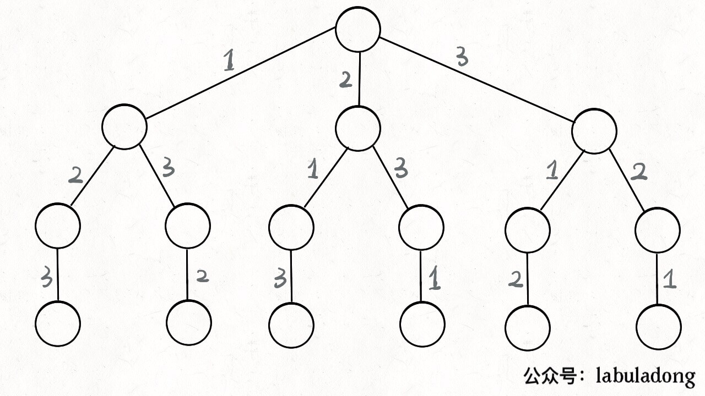
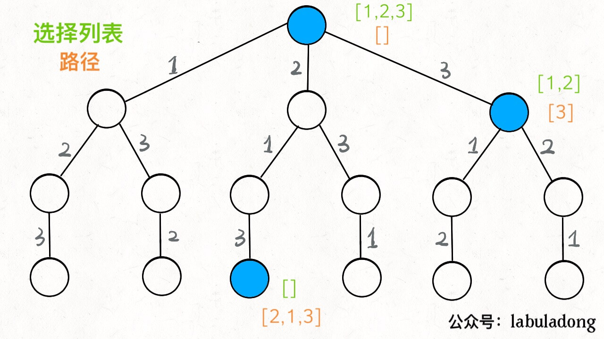

参考：[回溯算法详解修订版](https://github.com/labuladong/fucking-algorithm)

# 回溯算法详解
**解决一个回溯问题，实际上就是一个决策树的遍历过程**。你只需要思考 3 个问题：

1、路径：也就是已经做出的选择。

2、选择列表：也就是你当前可以做的选择。

3、结束条件：也就是到达决策树底层，无法再做选择的条件。

如果你不理解这三个词语的解释，没关系，我们后面会用「全排列」和「N 皇后问题」这两个经典的回溯算法问题来帮你理解这些词语是什么意思，现在你先留着印象。

代码方面，回溯算法的框架：

```python
result = []
def backtrack(路径, 选择列表):
    if 满足结束条件:
        result.add(路径)
        return
    
    for 选择 in 选择列表:
        # 做选择
        将该选择从选择列表移除
        路径.add(选择)
        backtrack(路径, 选择列表)
        # 撤销选择
        路径.remove(选择)
        将该选择再加入选择列表
```

**其核心就是 for 循环里面的递归，在递归调用之前「做选择」，在递归调用之后「撤销选择」**，特别简单。

## 一、全排列问题

我们在高中的时候就做过排列组合的数学题，我们也知道 `n` 个不重复的数，全排列共有 n! 个。

PS：**为了简单清晰起见，我们这次讨论的全排列问题不包含重复的数字**。

那么我们当时是怎么穷举全排列的呢？比方说给三个数 `[1,2,3]`，你肯定不会无规律地乱穷举，一般是这样：

先固定第一位为 1，然后第二位可以是 2，那么第三位只能是 3；然后可以把第二位变成 3，第三位就只能是 2 了；然后就只能变化第一位，变成 2，然后再穷举后两位……

其实这就是回溯算法，我们高中无师自通就会用，或者有的同学直接画出如下这棵回溯树：



只要从根遍历这棵树，记录路径上的数字，其实就是所有的全排列。**我们不妨把这棵树称为回溯算法的「决策树」**。

**为啥说这是决策树呢，因为你在每个节点上其实都在做决策**。比如说你站在下图的红色节点上：


你现在就在做决策，可以选择 1 那条树枝，也可以选择 3 那条树枝。为啥只能在 1 和 3 之中选择呢？因为 2 这个树枝在你身后，这个选择你之前做过了，而全排列是不允许重复使用数字的。

**现在可以解答开头的几个名词：`[2]` 就是「路径」，记录你已经做过的选择；`[1,3]` 就是「选择列表」，表示你当前可以做出的选择；「结束条件」就是遍历到树的底层，在这里就是选择列表为空的时候**。

如果明白了这几个名词，**可以把「路径」和「选择」列表作为决策树上每个节点的属性**，比如下图列出了几个节点的属性：



**我们定义的 `backtrack` 函数其实就像一个指针，在这棵树上游走，同时要正确维护每个节点的属性，每当走到树的底层，其「路径」就是一个全排列**。

回想我们刚才说的，「路径」和「选择」是每个节点的属性，函数在树上游走要正确维护节点的属性，那么就要在这两个特殊时间点搞点动作：


**我们只要在递归之前做出选择，在递归之后撤销刚才的选择**，就能正确得到每个节点的选择列表和路径。我们可以看下全排列问题：

- [46.全排列](../../2.题目/46.全排列.md)


必须说明的是，不管怎么优化，全排列的回溯框架，时间复杂度都不可能低于 O(N!)，因为穷举整棵决策树是无法避免的。**这也是回溯算法的一个特点，不像动态规划存在重叠子问题可以优化，回溯算法就是纯暴力穷举，复杂度一般都很高**。

明白了全排列问题，就可以直接套回溯算法框架了，下面简单看看 N 皇后问题。


## 二、最后总结

回溯算法就是个多叉树的遍历问题，关键就是在前序遍历和后序遍历的位置做一些操作，算法框架如下：

```python
def backtrack(...):
    for 选择 in 选择列表:
        做选择
        backtrack(...)
        撤销选择
```

**写 `backtrack` 函数时，需要维护走过的「路径」和当前可以做的「选择列表」，当触发「结束条件」时，将「路径」记入结果集**。

其实想想看，回溯算法和动态规划是不是有点像呢？我们在动态规划系列文章中多次强调，动态规划的三个需要明确的点就是「状态」「选择」和「base case」，是不是就对应着走过的「路径」，当前的「选择列表」和「结束条件」？

某种程度上说，动态规划的暴力求解阶段就是回溯算法。只是有的问题具有重叠子问题性质，可以用 dp table 或者备忘录优化，将递归树大幅剪枝，这就变成了动态规划。而今天的两个问题，都没有重叠子问题，也就是回溯算法问题了，复杂度非常高是不可避免的。


## 三、题目汇总
- [39.组合总和](../../2.题目/39.组合总和.md)
- [46.全排列](../../2.题目/46.全排列.md)
- [51.N皇后](../../2.题目/51.N皇后.md)
- [78.子集](../../2.题目/78.子集.md)
