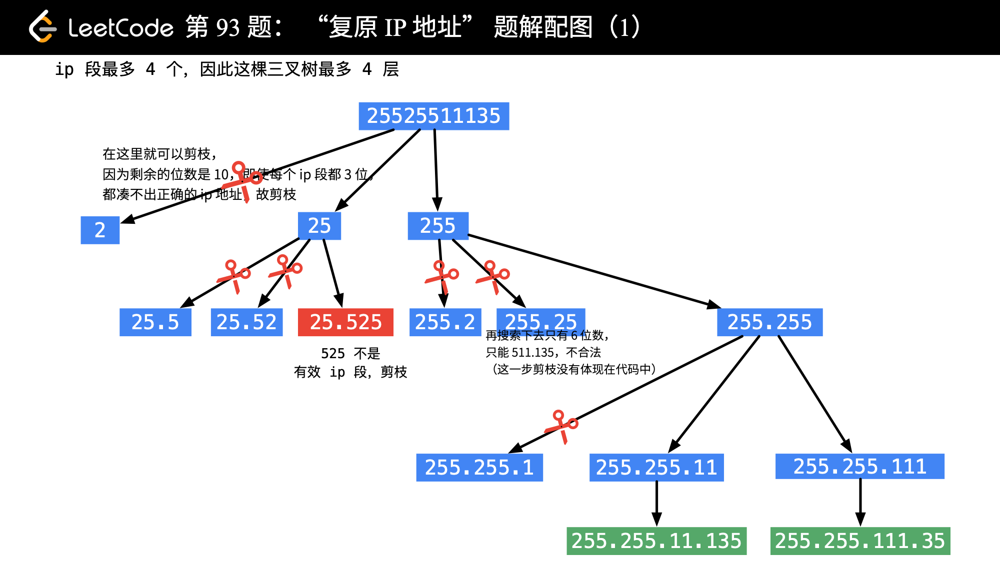

# 目录
* [题目地址](#题目地址)
* [题目描述](#题目描述)
* [解题思路](#解题思路)
* [解法1-动态规划](#解法1-动态规划)
* [解法2-动态规划](#解法2-动态规划)
* [扩展题目](#扩展题目)


# 题目地址
难易程度：
- 

是否经典：
- ⭐️

https://leetcode-cn.com/problems/restore-ip-addresses/


# 题目描述
```text
给定一个只包含数字的字符串，复原它并返回所有可能的 IP 地址格式。

有效的 IP 地址正好由四个整数（每个整数位于 0 到 255 之间组成），整数之间用 '.' 分隔。

 

示例:

输入: "25525511135"
输出: ["255.255.11.135", "255.255.111.35"]
```


# 解题思路
- 回溯

# 解法1-回溯
## 关键点

回溯算法事实上就是在一个树形问题上做深度优先遍历，因此首先需要把问题转换为树形问题。这里请大家一定要拿起纸和笔，模拟一下如何通过指定的字符串 s 生成 IP 地址的过程，把树形图画出来（这一点很重要）。

在画树形图的过程中，你一定会发现有些枝叶是没有必要的，把没有必要的枝叶剪去的操作就是剪枝，在代码中一般通过 break 或者 contine 和 return （表示递归终止）实现。




分析剪枝条件：

1、一开始，字符串的长度小于 4 或者大于 12 ，一定不能拼凑出合法的 ip 地址（这一点可以一般化到中间结点的判断中，以产生剪枝行为）；

2、每一个结点可以选择截取的方法只有 3 种：截 1 位、截 2 位、截 3 位，因此每一个结点可以生长出的分支最多只有 3 条分支；

根据截取出来的字符串判断是否是合理的 ip 段，这里写法比较多，可以先截取，再转换成 int ，再判断。我采用的做法是先转成 int，是合法的 ip 段数值以后，再截取。

3、由于 ip 段最多就 4 个段，因此这棵三叉树最多 4 层，这个条件作为递归终止条件之一；

## 代码
```java
public class Solution {

    public List<String> restoreIpAddresses(String s) {
        int len = s.length();
        List<String> res = new ArrayList<>();
        if (len > 12 || len < 4) {
            return res;
        }

        List<String> path = new ArrayList<>(4);
        backtrack(s, 0, 4, path, res);
        return res;
    }

    /**
     * @param begin  下一个遍历下标
     * @param remain 剩余多少段还没被分割
     */
    private void backtrack(String s, int begin, int remain, List<String> path, List<String> res) {
        if (begin == s.length()) {
            if (remain == 0) {
                res.add(String.join(".", path));
            }
            return;
        }

        for (int i = begin; i < begin + 3; i++) {
            if (i >= s.length()) { // 越界
                break;
            }

            if (remain * 3 < s.length() - i) {  // 剪枝
                continue;
            }

            if (judgeIpSegment(s, begin, i)) {
                String currentIpSegment = s.substring(begin, i + 1);
                path.add(currentIpSegment);

                backtrack(s, i + 1, remain - 1, path, res);
                path.remove(path.size() - 1);
            }
        }
    }

    // 判断left到right是否符合0-255
    private boolean judgeIpSegment(String s, int left, int right) {
        int len = right - left + 1;
        if (len > 1 && s.charAt(left) == '0') {
            return false;
        }

        int res = 0;
        while (left <= right) {
            res = res * 10 + s.charAt(left) - '0';
            left++;
        }

        return res >= 0 && res <= 255;
    }
}
```