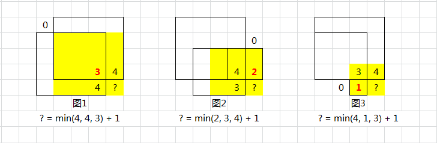

# 目录
* [题目地址](#题目地址)
* [题目描述](#题目描述)
* [解题思路](#解题思路)
* [解法1-动态规划](#解法1-动态规划)
* [解法2-动态规划](#解法2-动态规划)
* [扩展题目](#扩展题目)


# 题目地址
难易程度：
- 

是否经典：
- ⭐️

https://leetcode-cn.com/problems/maximal-square/

# 题目描述
```text
在一个由 0 和 1 组成的二维矩阵内，找到只包含 1 的最大正方形，并返回其面积。

示例:

输入: 

1 0 1 0 0
1 0 1 1 1
1 1 1 1 1
1 0 0 1 0

输出: 4
```


# 解题思路
- 动态规划


# 解法1-动态规划
## 关键点
我们用 dp(i, j)表示以 (i,j) 为右下角，且只包含 1 的正方形的边长最大值。如果我们能计算出所有 dp(i,j) 的值，那么其中的最大值即为矩阵中只包含 1 的正方形的边长最大值，其平方即为最大正方形的面积。

那么如何计算 dp 中的每个元素值呢？对于每个位置 (i,j)，检查在矩阵中该位置的值：
- 如果该位置的值是 0，则 dp(i,j)=0，因为当前位置不可能在由 1 组成的正方形中；
- 如果该位置的值是 1，则 dp(i,j) 的值由其上方、左方和左上方的三个相邻位置的 dp 值决定。具体而言，当前位置的元素值等于三个相邻位置的元素中的最小值加 1，状态转移方程如下：
$dp(i,j)=min(dp(i−1,j),dp(i−1,j−1),dp(i,j−1))+1$
- 此外，还需要考虑边界条件。如果 i 和 j 中至少有一个为 0，则以位置 (i,j) 为右下角的最大正方形的边长只能是 1，因此 dp(i,j)=1。

**理解 min(上, 左, 左上) + 1**
- 若形成正方形（非单 1），以当前为右下角的视角看，则需要：当前格、上、左、左上都是 1
- 可以换个角度：当前格、上、左、左上都不能受 0 的限制，才能成为正方形



上面详解了 三者取最小 的含义：
- 图 1：受限于左上的 0
- 图 2：受限于上边的 0
- 图 3：受限于左边的 0
- 数字表示：以此为正方形右下角的最大边长
- 黄色表示：格子 ? 作为右下角的正方形区域

此时已可得到递推公式
```
// 伪代码
if (grid[i - 1][j - 1] == '1') {
    dp[i][j] = min(dp[i - 1][j - 1], dp[i - 1][j], dp[i][j - 1]) + 1;
}
```

**从感性理解，到代码实现**
- 从上述图解中，我们似乎得到的只是「动态规划 推进 的过程」，即「如何从前面的 dp 推出后面的 dp」，甚至还只是感性理解
- 距离代码我们还缺：dp 具体定义如何，数组多大，初值如何，如何与题目要求的面积相关
- dp 具体定义：dp[i + 1][j + 1] 表示 「以第 i 行、第 j 列为右下角的正方形的最大边长」
    - 为何不是 dp[i][j]
    - 回到图解中，任何一个正方形，我们都「依赖」当前格 左、上、左上三个方格的情况
    - 但第一行的上层已经没有格子，第一列左边已经没有格子，需要做特殊 if 判断来处理
    - 为了代码简洁，我们 假设补充 了多一行全 '0'、多一列全 '0'
    - 此时 dp 数组的大小也明确为 new dp[height + 1][width + 1]
    - 初始值就是将第一列 dp[row][0] 、第一行 dp[0][col] 都赋为 0，相当于已经计算了所有的第一行、第一列的 dp 值

## 代码
```java
class Solution {
    public int maximalSquare(char[][] matrix) {
        // base condition
        if (matrix == null || matrix.length < 1 || matrix[0].length < 1) return 0;

        int height = matrix.length;
        int width = matrix[0].length;
        int maxSide = 0;

        // 相当于已经预处理新增第一行、第一列均为0
        int[][] dp = new int[height + 1][width + 1];

        for (int row = 0; row < height; row++) {
            for (int col = 0; col < width; col++) {
                if (matrix[row][col] == '1') {
                    dp[row + 1][col + 1] = Math.min(Math.min(dp[row + 1][col], dp[row][col + 1]), dp[row][col]) + 1;
                    maxSide = Math.max(maxSide, dp[row + 1][col + 1]);
                }
            }
        }
        return maxSide * maxSide;
    }
}
```


## 复杂度
- 时间复杂度：O(height∗width)
- 空间复杂度：O(height∗width)


# 解法2-动态规划+空间压缩
## 关键点
其实只需关注"当前格子的周边"，故可二维降一维优化
增加 northwest 西北角解决"左上角"的问题

## 代码
```java
class Solution {
    public int maximalSquare(char[][] matrix) {
        if (matrix == null || matrix.length < 1 || matrix[0].length < 1) return 0;
        
        int width = matrix[0].length;
        int maxSide = 0;

        int[] dp = new int[width + 1];
        int northwest = 0; // 西北角、左上角

        for (char[] chars : matrix) {
            northwest = 0; // 遍历每行时，还原回辅助的原值0
            for (int col = 0; col < width; col++) {
                int nextNorthwest = dp[col + 1];
                if (chars[col] == '1') {
                    dp[col + 1] = Math.min(Math.min(dp[col], dp[col + 1]), northwest) + 1;
                    maxSide = Math.max(maxSide, dp[col + 1]);
                } else {
                    dp[col + 1] = 0;
                }
                northwest = nextNorthwest;
            }
        }
        return maxSide * maxSide;
    }
}
```


## 复杂度
- 时间复杂度：O(height∗width)
- 空间复杂度：O(width)