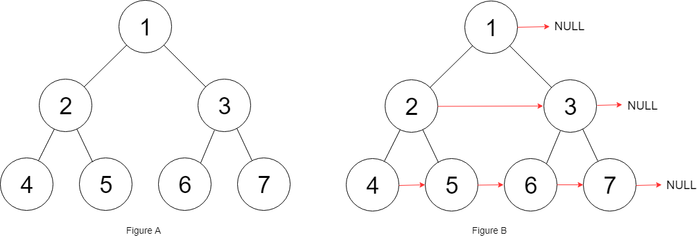

# 目录
* [题目地址](#题目地址)
* [题目描述](#题目描述)
* [解题思路](#解题思路)
* [解法1-动态规划](#解法1-动态规划)
* [解法2-动态规划](#解法2-动态规划)
* [扩展题目](#扩展题目)


# 题目地址
难易程度：
- 

是否经典：
- ⭐️

https://leetcode-cn.com/problems/populating-next-right-pointers-in-each-node/

# 题目描述
```text
给定一个完美二叉树，其所有叶子节点都在同一层，每个父节点都有两个子节点。二叉树定义如下：

struct Node {
  int val;
  Node *left;
  Node *right;
  Node *next;
}
填充它的每个 next 指针，让这个指针指向其下一个右侧节点。如果找不到下一个右侧节点，则将 next 指针设置为 NULL。

初始状态下，所有 next 指针都被设置为 NULL。
```
示例：



# 解题思路
- 层序遍历
- 递归


# 解法1-层序遍历
## 关键点


## 代码
```java
class Solution {
    public Node connect(Node root) {
        if (root == null) return root;
        Queue<Node> queue = new LinkedList<>();
        queue.add(root);
        while (!queue.isEmpty()) {
            for (int i = queue.size(); i > 0; i--) {
                Node node = queue.poll();
                if (i != 1) node.next = queue.peek();
                if (node.left != null) queue.add(node.left);
                if (node.right != null) queue.add(node.right);
            }
        }

        return root;
    }
}
```


## 复杂度
- 时间复杂度：O(N)。每个节点被访问一次，即从队列中弹出，并建立 next 指针。
- 空间复杂度：O(N)。这是一棵完美二叉树，它的最后一个层级包含 N/2 个节点。广度优先遍历的复杂度取决于一个层级上的最大元素数量。这种情况下空间复杂度为 O(N)。


# 解法2-使用已建立的 next 指针
## 关键点
一棵树中，存在两种类型的 next 指针。
第一种情况是连接同一个父节点的两个子节点。它们可以通过同一个节点直接访问到，因此执行下面操作即可完成连接。
```
node.left.next = node.right
```

第二种情况在不同父亲的子节点之间建立连接，这种情况不能直接连接。

第 N 层节点之间建立 next 指针后，再建立第 N+1 层节点的 next 指针。可以通过 next 指针访问同一层的所有节点，因此可以使用第 N 层的 next 指针，为第 N+1 层节点建立 next 指针。

算法
- 从根节点开始，由于第 0 层只有这一个节点，所以不需要连接。直接为第 1 层节点建立 next 指针即可。该算法中需要注意的一点是，当我们为第 N 层节点建立 next 指针时，处于第 N−1 层。当第 N 层节点的 next 指针全部建立完成后，移至第 N 层，建立第 N+1 层节点的 next 指针。

- 遍历某一层的节点时，这层节点的 next 指针已经建立。因此我们只需要知道这一层的最左节点，就可以按照链表方式遍历，不需要使用队列。

## 代码
```java
class Solution {
    public Node connect(Node root) {
        if (root == null) return root;

        Node leftmost = root;   // 每一层的最左节点
        while (leftmost.left != null) {
            Node head = leftmost;
            while (head != null) {   // 遍历该层
                head.left.next = head.right;  // 同一个父节点的两个子节点
                if (head.next != null) {  // 不同父节点的两个子节点
                    head.right.next = head.next.left;
                }

                head = head.next;
            }

            leftmost = leftmost.left; // 下一层
        }

        return root;
    }
}
```


## 复杂度
- 时间复杂度：O(N)
- 空间复杂度：O(1)

# 扩展题目
## 117. 填充每个节点的下一个右侧节点指针 II
```text
给定一个二叉树

struct Node {
  int val;
  Node *left;
  Node *right;
  Node *next;
}
填充它的每个 next 指针，让这个指针指向其下一个右侧节点。如果找不到下一个右侧节点，则将 next 指针设置为 NULL。

初始状态下，所有 next 指针都被设置为 NULL。

 

进阶：

你只能使用常量级额外空间。
使用递归解题也符合要求，本题中递归程序占用的栈空间不算做额外的空间复杂度。
```

示例：

图片压缩大小：


- 层序遍历，与上题代码一样
- 使用已建立的 next 指针

把每层都看成链表，层序遍历一遍。
```java
class Solution {
    public Node connect(Node root) {
        if (root == null) return root;

        Node head = root;
        while(head != null) {
            Node dummy = new Node(); // 建立临时头节点
            Node cur = dummy;   // 头节点的下一个元素是下一层第一个节点
            while(head != null) {
                if (head.left != null) {
                    cur.next = head.left;
                    cur = cur.next;
                }
                if (head.right != null) {
                    cur.next = head.right;
                    cur = cur.next;
                }
                head = head.next;
            }
            head = dummy.next;  // 下一层最左节点
        }

        return root;
    }
}
```


### 复杂度
- 时间复杂度：O(N)
- 空间复杂度：O(1)