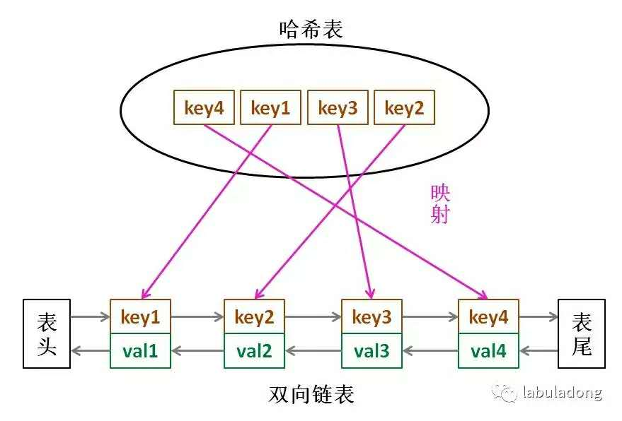

# 目录
* [题目地址](#题目地址)
* [题目描述](#题目描述)
* [解题思路](#解题思路)
* [解法1-LinkedHashMap](#解法1-LinkedHashMap)


# 题目地址
难易程度：
- 

是否经典：
- ⭐️

https://leetcode-cn.com/problems/lru-cache/

# 题目描述
```
运用你所掌握的数据结构，设计和实现一个  LRU (最近最少使用) 缓存机制。它应该支持以下操作： 获取数据 get 和 写入数据 put 。

获取数据 get(key) - 如果密钥 (key) 存在于缓存中，则获取密钥的值（总是正数），否则返回 -1。
写入数据 put(key, value) - 如果密钥不存在，则写入其数据值。当缓存容量达到上限时，它应该在写入新数据之前删除最久未使用的数据值，从而为新的数据值留出空间。

进阶:

你是否可以在 O(1) 时间复杂度内完成这两种操作？

示例:

LRUCache cache = new LRUCache( 2 /* 缓存容量 */ );

cache.put(1, 1);
cache.put(2, 2);
cache.get(1);       // 返回  1
cache.put(3, 3);    // 该操作会使得密钥 2 作废
cache.get(2);       // 返回 -1 (未找到)
cache.put(4, 4);    // 该操作会使得密钥 1 作废
cache.get(1);       // 返回 -1 (未找到)
cache.get(3);       // 返回  3
cache.get(4);       // 返回  4
```


# 解题思路
- LinkedHashMap


# 解法1-LinkedHashMap
## 关键点
LinkedHashMap的有序可以按两种顺序排列，一种是按照插入的顺序，一种是按照读取的顺序（这个题目的示例就是告诉我们要按照读取的顺序进行排序），而其内部是靠建立一个双向链表来维护这个顺序的，在每次插入、删除后，都会调用一个函数来进行双向链表的维护

其主要是两个构造方法，一个是继承 HashMap ，一个是可以选择 accessOrder 的值(默认 false，代表按照插入顺序排序)来确定是按插入顺序还是读取顺序排序。

```$xslt
/**
 * //调用父类HashMap的构造方法。
 * Constructs an empty insertion-ordered <tt>LinkedHashMap</tt> instance
 * with the default initial capacity (16) and load factor (0.75).
 */
public LinkedHashMap() {
    super();
    accessOrder = false;
}
// 这里的 accessOrder 默认是为false，如果要按读取顺序排序需要将其设为 true
// initialCapacity 代表 map 的 容量，loadFactor 代表加载因子 (默认即可)
public LinkedHashMap(int initialCapacity, float loadFactor, boolean accessOrder) {
    super(initialCapacity, loadFactor);
    this.accessOrder = accessOrder;
}
```

## 代码
```Java
class LRUCache extends LinkedHashMap<Integer, Integer>{
    private int capacity;
    
    public LRUCache(int capacity) {
        super(capacity, 0.75F, true);
        this.capacity = capacity;
    }

    public int get(int key) {
        return super.getOrDefault(key, -1);
    }

    public void put(int key, int value) {
        super.put(key, value);
    }

    @Override
    protected boolean removeEldestEntry(Map.Entry<Integer, Integer> eldest) {
        return size() > capacity; 
    }
}
```


## 复杂度
- 时间复杂度：对于 put 和 get 操作复杂度是 O(1)，因为有序字典中的所有操作：get/in/set/move_to_end/popitem（get/containsKey/put/remove）都可以在常数时间内完成。
- 空间复杂度：O(capacity)，因为空间只用于有序字典存储最多 capacity + 1 个元素。


# 解法2-哈希表+双向链表
## 关键点
LRU 算法实际上是让你设计数据结构：首先要接收一个 capacity 参数作为缓存的最大容量，然后实现两个 API，一个是 put(key, val) 方法存入键值对，另一个是 get(key) 方法获取 key 对应的 val，如果 key 不存在则返回 -1。

注意哦，get 和 put 方法必须都是 O(1)O(1) 的时间复杂度。

因为显然 cache 必须有顺序之分，以区分最近使用的和最近未使用的数据；而且我们要在 cache 中查找键是否已存在；如果容量满了要删除最后一个数据；每次访问还要把数据插入到队头。

那么，什么数据结构同时符合上述条件呢？哈希表查找快，但是数据无固定顺序；链表有顺序之分，插入删除快，但是查找慢。所以结合一下，形成一种新的数据结构：哈希链表。

LRU 缓存算法的核心数据结构就是哈希链表，双向链表和哈希表的结合体。这个数据结构长这样：



思想很简单，就是借助哈希表赋予了链表快速查找的特性嘛：可以快速查找某个 key 是否存在缓存（链表）中，同时可以快速删除、添加节点。回想刚才的例子，这种数据结构是不是完美解决了 LRU 缓存的需求？

也许读者会问，为什么要是双向链表，单链表行不行？另外，既然哈希表中已经存了 key，为什么链表中还要存键值对呢，只存值不就行了？

想的时候都是问题，只有做的时候才有答案。这样设计的原因，必须等我们亲自实现 LRU 算法之后才能理解，所以我们开始看代码吧～


很多编程语言都有内置的哈希链表或者类似 LRU 功能的库函数，但是为了帮大家理解算法的细节，我们用 Java 自己造轮子实现一遍 LRU 算法。

首先，我们把双链表的节点类写出来，为了简化，key 和 val 都认为是 int 类型：
```Java
class Node {
    public int key, val;
    public Node next, prev;
    public Node(int k, int v) {
        this.key = k;
        this.val = v;
    }
}
```

然后依靠我们的 Node 类型构建一个双链表，实现几个需要的 API（这些操作的时间复杂度均为 O(1)：
```Java
class DoubleList {  
    private Node head, tail; // 头尾虚节点
    private int size; // 链表元素数

    public DoubleList() {
        head = new Node(0, 0);
        tail = new Node(0, 0);
        head.next = tail;
        tail.prev = head;
        size = 0;
    }

    // 在链表头部添加节点 x
    public void addFirst(Node x) {
        x.next = head.next;
        x.prev = head;
        head.next.prev = x;
        head.next = x;
        size++;
    }

    // 删除链表中的 x 节点（x 一定存在）
    public void remove(Node x) {
        x.prev.next = x.next;
        x.next.prev = x.prev;
        size--;
    }
    
    // 删除链表中最后一个节点，并返回该节点
    public Node removeLast() {
        if (tail.prev == head)
            return null;
        Node last = tail.prev;
        remove(last);
        return last;
    }
    
    // 返回链表长度
    public int size() { return size; }
}
```

到这里就能回答刚才“为什么必须要用双向链表”的问题了，因为我们需要删除操作。删除一个节点不光要得到该节点本身的指针，也需要操作其前驱节点的指针，而双向链表才能支持直接查找前驱，保证操作的时间复杂度 $O(1)$。

有了双向链表的实现，我们只需要在 LRU 算法中把它和哈希表结合起来即可。我们先把逻辑理清楚：

```java
// key 映射到 Node(key, val)
HashMap<Integer, Node> map;
// Node(k1, v1) <-> Node(k2, v2)...
DoubleList cache;

int get(int key) {
    if (key 不存在) {
        return -1;
    } else {        
        将数据 (key, val) 提到开头；
        return val;
    }
}

void put(int key, int val) {
    Node x = new Node(key, val);
    if (key 已存在) {
        把旧的数据删除；
        将新节点 x 插入到开头；
    } else {
        if (cache 已满) {
            删除链表的最后一个数据腾位置；
            删除 map 中映射到该数据的键；
        } 
        将新节点 x 插入到开头；
        map 中新建 key 对新节点 x 的映射；
    }
}
```

如果能够看懂上述逻辑，翻译成代码就很容易理解了：

```java
class LRUCache {
    // key -> Node(key, val)
    private HashMap<Integer, Node> map;
    // Node(k1, v1) <-> Node(k2, v2)...
    private DoubleList cache;
    // 最大容量
    private int cap;
    
    public LRUCache(int capacity) {
        this.cap = capacity;
        map = new HashMap<>();
        cache = new DoubleList();
    }
    
    public int get(int key) {
        if (!map.containsKey(key))
            return -1;
        int val = map.get(key).val;
        // 利用 put 方法把该数据提前
        put(key, val);
        return val;
    }
    
    public void put(int key, int val) {
        // 先把新节点 x 做出来
        Node x = new Node(key, val);
        
        if (map.containsKey(key)) {
            // 删除旧的节点，新的插到头部
            cache.remove(map.get(key));
            cache.addFirst(x);
            // 更新 map 中对应的数据
            map.put(key, x);
        } else {
            if (cap == cache.size()) {
                // 删除链表最后一个数据
                Node last = cache.removeLast();
                map.remove(last.key);
            }
            // 直接添加到头部
            cache.addFirst(x);
            map.put(key, x);
        }
    }
}
```

这里就能回答之前的问答题“为什么要在链表中同时存储 key 和 val，而不是只存储 val”，注意这段代码：

```java
if (cap == cache.size()) {
    // 删除链表最后一个数据
    Node last = cache.removeLast();
    map.remove(last.key);
}
```

当缓存容量已满，我们不仅仅要删除最后一个 Node 节点，还要把 map 中映射到该节点的 key 同时删除，而这个 key 只能由 Node 得到。如果 Node 结构中只存储 val，那么我们就无法得知 key 是什么，就无法删除 map 中的键，造成错误。

至此，你应该已经掌握 LRU 算法的思想和实现了，很容易犯错的一点是：处理链表节点的同时不要忘了更新哈希表中对节点的映射。


## 代码
- 自己实现双向链表
```Java
import java.util.*;

class Node {
    public int key, val;
    public Node next, prev;

    public Node(int k, int v) {
        this.key = k;
        this.val = v;
    }
}

class DoubleList {
    private Node head, tail; // 头尾虚节点
    private int size; // 链表元素数

    public DoubleList() {
        head = new Node(0, 0);
        tail = new Node(0, 0);
        head.next = tail;
        tail.prev = head;
        size = 0;
    }

    // 在链表头部添加节点 x
    public void addFirst(Node x) {
        x.next = head.next;
        x.prev = head;
        head.next.prev = x;
        head.next = x;
        size++;
    }

    // 删除链表中的 x 节点（x 一定存在）
    public void remove(Node x) {
        x.prev.next = x.next;
        x.next.prev = x.prev;
        size--;
    }

    // 删除链表中最后一个节点，并返回该节点
    public Node removeLast() {
        if (tail.prev == head)
            return null;
        Node last = tail.prev;
        remove(last);
        return last;
    }

    // 返回链表长度
    public int size() {
        return size;
    }
}

class LRUCache {
    // key -> Node(key, val)
    private HashMap<Integer, Node> map;
    // Node(k1, v1) <-> Node(k2, v2)...
    private DoubleList cache;
    // 最大容量
    private int cap;

    public LRUCache(int capacity) {
        this.cap = capacity;
        map = new HashMap<>();
        cache = new DoubleList();
    }

    public int get(int key) {
        if (!map.containsKey(key))
            return -1;
        int val = map.get(key).val;
        // 利用 put 方法把该数据提前
        put(key, val);
        return val;
    }

    public void put(int key, int val) {
        // 先把新节点 x 做出来
        Node x = new Node(key, val);

        if (map.containsKey(key)) {
            // 删除旧的节点，新的插到头部
            cache.remove(map.get(key));
            cache.addFirst(x);
            // 更新 map 中对应的数据
            map.put(key, x);
        } else {
            if (cap == cache.size()) {
                // 删除链表最后一个数据
                Node last = cache.removeLast();
                map.remove(last.key);
            }
            // 直接添加到头部
            cache.addFirst(x);
            map.put(key, x);
        }
    }
}
```


- 利用已经存在的双向链表
```Java
import java.util.*;

class Node {
    public int key, val;
    public Node next, prev;

    public Node(int k, int v) {
        this.key = k;
        this.val = v;
    }
}

class LRUCache {
    // key -> Node(key, val)
    private HashMap<Integer, Node> map;
    // Node(k1, v1) <-> Node(k2, v2)...
    private LinkedList<Node> cache;
    // 最大容量
    private int cap;

    public LRUCache(int capacity) {
        this.cap = capacity;
        map = new HashMap<>();
        cache = new LinkedList<>();
    }

    public int get(int key) {
        if (!map.containsKey(key))
            return -1;
        int val = map.get(key).val;
        // 利用 put 方法把该数据提前
        put(key, val);
        return val;
    }

    public void put(int key, int val) {
        // 先把新节点 x 做出来
        Node x = new Node(key, val);

        if (map.containsKey(key)) {
            // 删除旧的节点，新的插到头部
            cache.remove(map.get(key));
            cache.addFirst(x);
            // 更新 map 中对应的数据
            map.put(key, x);
        } else {
            if (cap == cache.size()) {
                // 删除链表最后一个数据
                Node last = cache.removeLast();
                map.remove(last.key);
            }
            // 直接添加到头部
            cache.addFirst(x);
            map.put(key, x);
        }
    }
}
```

