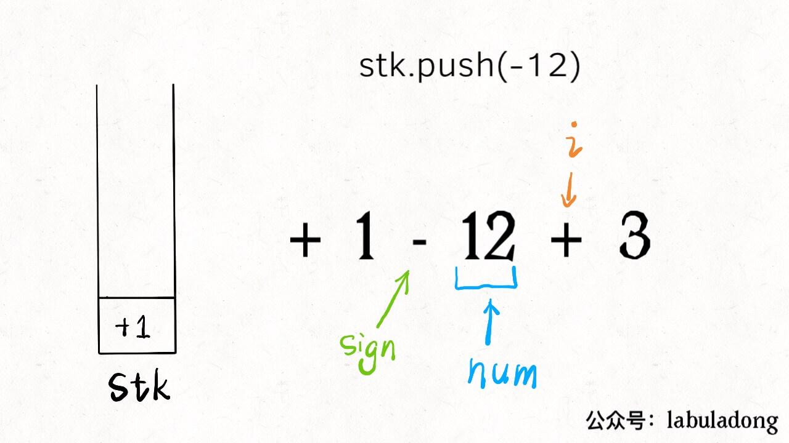
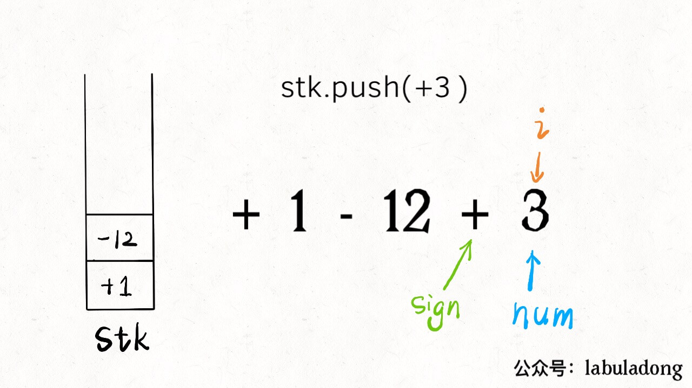
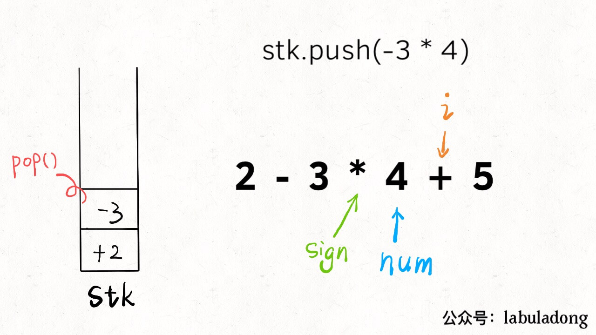
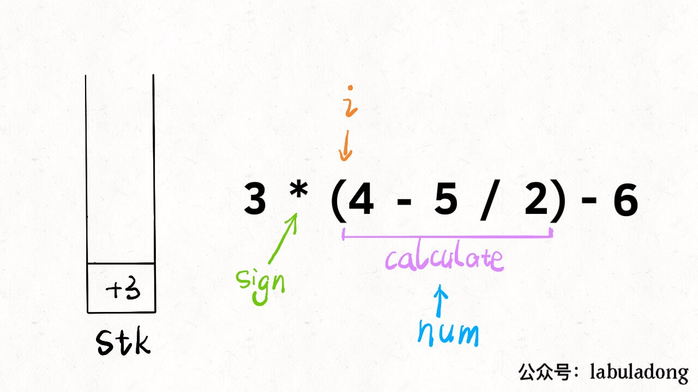

# 目录
* [题目地址](#题目地址)
* [题目描述](#题目描述)
* [解题思路](#解题思路)
* [解法1-栈和运算符反转](#解法1-栈和运算符反转)
* [扩展题目](#扩展题目)


# 题目地址
难易程度：
- 

是否经典：
- ⭐️

https://leetcode-cn.com/problems/basic-calculator/

# 题目描述
```text
实现一个基本的计算器来计算一个简单的字符串表达式的值。

字符串表达式可以包含左括号 ( ，右括号 )，加号 + ，减号 -，非负整数和空格  。

示例 1:

输入: "1 + 1"
输出: 2
示例 2:

输入: " 2-1 + 2 "
输出: 3
示例 3:

输入: "(1+(4+5+2)-3)+(6+8)"
输出: 23
说明：

你可以假设所给定的表达式都是有效的。
请不要使用内置的库函数 eval。
```


# 解题思路
- 栈和运算符反转


# 解法1-栈和运算符反转
## 关键点
这题只要解决了括号的问题就很简单了。再加上本题有个限定条件是只有加和减两种操作，所以在处理括号时只需要考虑括号前的符号：

- 如果(前是-，那么反转括号内的所有运算符（+变成-，-变成+）
- 如果(前是+，则不需要反转括号内的运算符
- 遇到)时，恢复成上一层级的反转规则
- 用一个栈来保存当前的运算符反转规则，true代表反转，false代表不反转，栈为空时也不反转

以1-(2-(3+4)-5)+6为例说明：

- 第一个(前的运算符是-，将反转规则true入栈，栈内容[true]，已处理的算式为1-2
- 下一个运算符是-，而当前栈顶元素为true，故将其反转，此时已处理的算式为1-2+
- 第二个(前的运算符是+（刚刚反转的），故将反转规则false入栈，栈内容[false,true]，已处理的算式为1-2+3
- 下一个运算符是+，当前栈顶元素为false，不需要反转，已处理的算式为1-2+3+4
- 遇到)，将栈顶元素弹出，栈内容[true]，下一个运算符为-，根据当前栈顶元素，需要进行反转，已处理的算式为1-2+3+4+5
- 再次遇到)，将栈顶元素弹出，此时栈为空
- 下一个运算符是+，此时栈为空，不需要反转，最终处理完成的算式为1-2+3+4+5+6
- 现在算式中已经没有括号，直接进行运算即可得出最终结果17

运算符的处理和运算可以在一趟迭代中完成，故算法时间复杂度为O(N)。需要一个栈来保存括号前的运算符，实际使用的辅助空间取决于算式内括号的层数，极限的辅助空间为O(N)

## 代码
```Java
class Solution {
    public int calculate(String s) {
        if (s == null || s.length() == 0) {
            return 0;
        }

        LinkedList<Boolean> stack = new LinkedList<>();
        int result = 0, opr = 0; //result: 当前的结果值; opr: 当前的被加/被减数
        Character op = null; //当前要执行的运算符，每次遇到下一个操作符，我们才会执行上一个，保证数字被统计完毕

        for (char c : s.toCharArray()) {
            if (Character.isDigit(c)) {
                opr = opr * 10 + c - '0';
            } else if (c == '+' || c == '-') {  // 遇到操作符，说明前面连续的数字统计完成，比如123，需要123 >> 120 + 3 >> 100 + 20 + 3，计算即可
                if (op == null) {
                    result = opr;  //遇到第一个运算符时，将result置为opr（即第一个运算符左边的数字）
                } else {
                    result = cal(op, result, opr);   //result = result +/- opr;
                }

                op = swap(stack.peek() == null ? false : stack.peek(), c); //根据栈顶元素决定是否反转运算符
                opr = 0;
            } else if (c == '(') {
                stack.push(op != null && op == '-');
            } else if (c == ')') {
                stack.pop();
            }
        }

        if (op == null) {
            //算式中没有运算符时，opr就是最终结果
            return opr;
        } else {
            //否则将result与opr（即算式中最右边的数字）执行一次运算
            return cal(op, result, opr);
        }
    }

    private char swap(boolean swap, char c) {
        if (swap) {
            return c == '+' ? '-' : '+';
        } else {
            return c;
        }
    }

    private int cal(char op, int opr1, int opr2) {
        switch (op) {
            case '+':
                return opr1 + opr2;
            case '-':
                return opr1 - opr2;
            default:
                return 0;
        }
    }
}
```


## 复杂度
- 时间复杂度：O(N)
- 空间复杂度：O(N)

# 扩展题目
## 150. 逆波兰表达式求值
https://leetcode-cn.com/problems/evaluate-reverse-polish-notation/

```text
有效的运算符包括 +, -, *, / 。每个运算对象可以是整数，也可以是另一个逆波兰表达式。

说明：

整数除法只保留整数部分。
给定逆波兰表达式总是有效的。换句话说，表达式总会得出有效数值且不存在除数为 0 的情况。
示例 1：

输入: ["2", "1", "+", "3", "*"]
输出: 9
解释: ((2 + 1) * 3) = 9
示例 2：

输入: ["4", "13", "5", "/", "+"]
输出: 6
解释: (4 + (13 / 5)) = 6
示例 3：

输入: ["10", "6", "9", "3", "+", "-11", "*", "/", "*", "17", "+", "5", "+"]
输出: 22
解释: 
  ((10 * (6 / ((9 + 3) * -11))) + 17) + 5
= ((10 * (6 / (12 * -11))) + 17) + 5
= ((10 * (6 / -132)) + 17) + 5
= ((10 * 0) + 17) + 5
= (0 + 17) + 5
= 17 + 5
= 22
```

- 解法一：数组
```Java
class Solution {
    //纯数组模拟栈实现(推荐)   3 ms	36 MB
    public static int evalRPN(String[] tokens) {
        int[] numStack = new int[tokens.length / 2 + 1];
        int index = 0;
        for (String s : tokens) {
            switch (s) {
                case "+":
                    numStack[index - 2] += numStack[--index];
                    break;
                case "-":
                    numStack[index - 2] -= numStack[--index];
                    break;
                case "*":
                    numStack[index - 2] *= numStack[--index];
                    break;
                case "/":
                    numStack[index - 2] /= numStack[--index];
                    break;
                default:
                    // numStack[index++] = Integer.valueOf(s); valueOf改为parseInt，减少自动拆箱装箱操作
                    numStack[index++] = Integer.parseInt(s);
                    break;
            }
        }
        return numStack[0];
    }
}
```

- 解法二：栈实现
```Java
class Solution {
    // 栈实现   8 ms	36.7 MB	
    public static int evalRPN(String[] tokens) {
        Stack<Integer> numStack = new Stack<>();
        Integer op1, op2;
        for (String s : tokens) {
            switch (s) {
                case "+":
                    op2 = numStack.pop();
                    op1 = numStack.pop();
                    numStack.push(op1 + op2);
                    break;
                case "-":
                    op2 = numStack.pop();
                    op1 = numStack.pop();
                    numStack.push(op1 - op2);
                    break;
                case "*":
                    op2 = numStack.pop();
                    op1 = numStack.pop();
                    numStack.push(op1 * op2);
                    break;
                case "/":
                    op2 = numStack.pop();
                    op1 = numStack.pop();
                    numStack.push(op1 / op2);
                    break;
                default:
                    numStack.push(Integer.valueOf(s));
                    break;
            }
        }
        return numStack.pop();
    }
}
```


## 227. 基本计算器 II
```text
实现一个基本的计算器来计算一个简单的字符串表达式的值。

字符串表达式仅包含非负整数，+， - ，*，/ 四种运算符和空格。整数除法仅保留整数部分。

示例 1:

输入: "3+2*2"
输出: 7
示例 2:

输入: " 3/2 "
输出: 1
示例 3:

输入: " 3+5 / 2 "
输出: 5
说明：

你可以假设所给定的表达式都是有效的。
请不要使用内置的库函数 eval。
```

该题我们直接怼最高难度，假设表达式包含括号。


我们最终要实现的计算器功能如下：
 
1、输入一个字符串，可以包含`+ - * /`、数字、括号以及空格，你的算法返回运算结构。

2、要符合运算法则，括号的优先级最高，先乘除后加减。

3、除号是整数除法，无论正负都向 0 取整（5/2=2，-5/2=-2）。

4、可以假定输入的算式一定合法，且计算过程不会出现整型溢出，不会出现除数为 0 的意外情况。

比如输入如下字符串，算法会返回 9：

`3 * (2-6 /(3 -7))`

可以看到，这就已经非常接近我们实际生活中使用的计算器了，虽然我们以前肯定都用过计算器，但是如果简单思考一下其算法实现，就会大惊失色：

1、按照常理处理括号，要先计算最内层的括号，然后向外慢慢化简。这个过程我们手算都容易出错，何况写成算法呢！

2、要做到先乘除，后加减，这一点教会小朋友还不算难，但教给计算机恐怕有点困难。

3、要处理空格。我们为了美观，习惯性在数字和运算符之间打个空格，但是计算之中得想办法忽略这些空格。

我记得很多大学数据结构的教材上，在讲栈这种数据结构的时候，应该都会用计算器举例，但是有一说一，讲的真的垃圾，不知道多少未来的计算机科学家就被这种简单的数据结构劝退了。

那么本文就来聊聊怎么实现上述一个功能完备的计算器功能，**关键在于层层拆解问题，化整为零，逐个击破**，相信这种思维方式能帮大家解决各种复杂问题。

下面就来拆解，从最简单的一个问题开始。

### 一、字符串转整数

是的，就是这么一个简单的问题，首先告诉我，怎么把一个字符串形式的**正**整数，转化成 int 型？

```cpp
string s = "458";

int n = 0;
for (int i = 0; i < s.size(); i++) {
    char c = s[i];
    n = 10 * n + (c - '0');
}
// n 现在就等于 458
```

这个还是很简单的吧，老套路了。但是即便这么简单，依然有坑：**`(c - '0')`的这个括号不能省略，否则可能造成整型溢出**。

因为变量`c`是一个 ASCII 码，如果不加括号就会先加后减，想象一下`s`如果接近 INT_MAX，就会溢出。所以用括号保证先减后加才行。

### 二、处理加减法

现在进一步，**如果输入的这个算式只包含加减法，而且不存在空格**，你怎么计算结果？我们拿字符串算式`1-12+3`为例，来说一个很简单的思路：

1、先给第一个数字加一个默认符号`+`，变成`+1-12+3`。

2、把一个运算符和数字组合成一对儿，也就是三对儿`+1`，`-12`，`+3`，把它们转化成数字，然后放到一个栈中。

3、将栈中所有的数字求和，就是原算式的结果。

我们直接看代码，结合一张图就看明白了：

```cpp
int calculate(string s) {
    stack<int> stk;
    // 记录算式中的数字
    int num = 0;
    // 记录 num 前的符号，初始化为 +
    char sign = '+';
    for (int i = 0; i < s.size(); i++) {
        char c = s[i];
        // 如果是数字，连续读取到 num
        if (isdigit(c)) 
            num = 10 * num + (c - '0');
        // 如果不是数字，就是遇到了下一个符号，
        // 之前的数字和符号就要存进栈中
        if (!isdigit(c) || i == s.size() - 1) {
            switch (sign) {
                case '+':
                    stk.push(num); break;
                case '-':
                    stk.push(-num); break;
            }
            // 更新符号为当前符号，数字清零
            sign = c;
            num = 0;
        }
    }
    // 将栈中所有结果求和就是答案
    int res = 0;
    while (!stk.empty()) {
        res += stk.top();
        stk.pop();
    }
    return res;
}
```

我估计就是中间带`switch`语句的部分有点不好理解吧，`i`就是从左到右扫描，`sign`和`num`跟在它身后。当`s[i]`遇到一个运算符时，情况是这样的：



所以说，此时要根据`sign`的 case 不同选择`nums`的正负号，存入栈中，然后更新`sign`并清零`nums`记录下一对儿符合和数字的组合。

另外注意，不只是遇到新的符号会触发入栈，当`i`走到了算式的尽头（`i == s.size() - 1`），也应该将前面的数字入栈，方便后续计算最终结果。



至此，仅处理紧凑加减法字符串的算法就完成了，请确保理解以上内容，后续的内容就基于这个框架修修改改就完事儿了。

### 三、处理乘除法

其实思路跟仅处理加减法没啥区别，拿字符串`2-3*4+5`举例，核心思路依然是把字符串分解成符号和数字的组合。

比如上述例子就可以分解为`+2`，`-3`，`*4`，`+5`几对儿，我们刚才不是没有处理乘除号吗，很简单，**其他部分都不用变**，在`switch`部分加上对应的 case 就行了：

```cpp
for (int i = 0; i < s.size(); i++) {
    char c = s[i];
    if (isdigit(c)) 
        num = 10 * num + (c - '0');

    if (!isdigit(c) || i == s.size() - 1) {
        switch (sign) {
            int pre;
            case '+':
                stk.push(num); break;
            case '-':
                stk.push(-num); break;
            // 只要拿出前一个数字做对应运算即可
            case '*':
                pre = stk.top();
                stk.pop();
                stk.push(pre * num);
                break;
            case '/':
                pre = stk.top();
                stk.pop();
                stk.push(pre / num);
                break;
        }
        // 更新符号为当前符号，数字清零
        sign = c;
        num = 0;
    }
}
```



**乘除法优先于加减法体现在，乘除法可以和栈顶的数结合，而加减法只能把自己放入栈**。

现在我们思考一下**如何处理字符串中可能出现的空格字符**。其实也非常简单，想想空格字符的出现，会影响我们现有代码的哪一部分？

```cpp
// 如果 c 非数字
if (!isdigit(c) || i == s.size() - 1) {
    switch (c) {...}
    sign = c;
    num = 0;
}
```

显然空格会进入这个 if 语句，但是我们并不想让空格的情况进入这个 if，因为这里会更新`sign`并清零`nums`，空格根本就不是运算符，应该被忽略。

那么只要多加一个条件即可：

```cpp
if ((!isdigit(c) && c != ' ') || i == s.size() - 1) {
    ...
}
```

好了，现在我们的算法已经可以按照正确的法则计算加减乘除，并且自动忽略空格符，剩下的就是如何让算法正确识别括号了。

### 四、处理括号

处理算式中的括号看起来应该是最难的，但真没有看起来那么难。

为了规避编程语言的繁琐细节，我把前面解法的代码翻译成 Python 版本：

```python
def calculate(s: str) -> int:
        
    def helper(s: List) -> int:
        stack = []
        sign = '+'
        num = 0

        while len(s) > 0:
            c = s.pop(0)
            if c.isdigit():
                num = 10 * num + int(c)

            if (not c.isdigit() and c != ' ') or len(s) == 0:
                if sign == '+':
                    stack.append(num)
                elif sign == '-':
                    stack.append(-num)
                elif sign == '*':
                    stack[-1] = stack[-1] * num
                elif sign == '/':
                    # python 除法向 0 取整的写法
                    stack[-1] = int(stack[-1] / float(num))                    
                num = 0
                sign = c

        return sum(stack)
    # 需要把字符串转成列表方便操作
    return helper(list(s))
```

这段代码跟刚才 C++ 代码完全相同，唯一的区别是，不是从左到右遍历字符串，而是不断从左边`pop`出字符，本质还是一样的。

那么，为什么说处理括号没有看起来那么难呢，**因为括号具有递归性质**。我们拿字符串`3*(4-5/2)-6`举例：

calculate(`3*(4-5/2)-6`)
= 3 * calculate(`4-5/2`) - 6
= 3 * 2 - 6
= 0

可以脑补一下，无论多少层括号嵌套，通过 calculate 函数递归调用自己，都可以将括号中的算式化简成一个数字。**换句话说，括号包含的算式，我们直接视为一个数字就行了**。

现在的问题是，递归的开始条件和结束条件是什么？**遇到`(`开始递归，遇到`)`结束递归**：

```python
def calculate(s: str) -> int:
        
    def helper(s: List) -> int:
        stack = []
        sign = '+'
        num = 0

        while len(s) > 0:
            c = s.pop(0)
            if c.isdigit():
                num = 10 * num + int(c)
            # 遇到左括号开始递归计算 num
            if c == '(':
                num = helper(s)

            if (not c.isdigit() and c != ' ') or len(s) == 0:
                if sign == '+': ...
                elif sign == '-': ... 
                elif sign == '*': ...
                elif sign == '/': ...
                num = 0
                sign = c
            # 遇到右括号返回递归结果
            if c == ')': break
        return sum(stack)

    return helper(list(s))
```




你看，加了两三行代码，就可以处理括号了，这就是递归的魅力。至此，计算器的全部功能就实现了，通过对问题的层层拆解化整为零，再回头看，这个问题似乎也没那么复杂嘛。

### 五、最后总结

本文借实现计算器的问题，主要想表达的是一种处理复杂问题的思路。

我们首先从字符串转数字这个简单问题开始，进而处理只包含加减法的算式，进而处理包含加减乘除四则运算的算式，进而处理空格字符，进而处理包含括号的算式。

**可见，对于一些比较困难的问题，其解法并不是一蹴而就的，而是步步推进，螺旋上升的**。如果一开始给你原题，你不会做，甚至看不懂答案，都很正常，关键在于我们自己如何简化问题，如何以退为进。

**退而求其次是一种很聪明策略**。你想想啊，假设这是一道考试题，你不会实现这个计算器，但是你写了字符串转整数的算法并指出了容易溢出的陷阱，那起码可以得 20 分吧；如果你能够处理加减法，那可以得 40 分吧；如果你能处理加减乘除四则运算，那起码够 70 分了；再加上处理空格字符，80 有了吧。我就是不会处理括号，那就算了，80 已经很 OK 了好不好。


```Java
import java.util.*;

class Solution {
    public static int calculate(String s) {
        /*
            将 减法、乘法、除法 转换为 加法
            某个数 num, 如果前面的对应的运算符是 -，那么 将 -num 压入栈中
            这样，我们只需在最后将栈的元素全部弹出，完成加法操作，即可得到最终结果

            对于括号，它存在递归性质
            即
            3 * (2 + 4 * 3) + 2
          = 3 * calculate(2 + 4 * 3) + 2
          = 3 * 24 + 2
          即我们可以将括号内的字符串当作一个运算式，再递归调用本函数，最终返回一个数值
        */
        int[] i = new int[1];
        return dfs(s, i);
    }

    private static int dfs(String s, int[] i) {
        Stack<Integer> stack = new Stack<>();

        //记录某个连续的数，比如 "42"，那么我们首先 num = 4，然后遇到 2 ,num = num * 10 + 2 = 42
        int num = 0;
        char op = '+';
        for (; i[0] < s.length(); i[0]++) {
            char ch = s.charAt(i[0]);

            //遇到左括号，递归运算内部子式
            if (ch == '(') {
                ++i[0];
                num = dfs(s, i);
            }

            if (Character.isDigit(ch)) {
                num = num * 10 + (ch - '0');
            }
            //不是数字，不是空格（运算符 或 '(' 或 ')' ） 或者 到了最后一个字符，那么根据前面记录的 op 操作符 将数字压栈，然后将新的运算符 ch 赋值给 op
            if (!Character.isDigit(ch) && ch != ' ' || i[0] == s.length() - 1) {
                switch (op) {
                    case '+':
                        stack.push(num);
                        break;
                    case '-':
                        stack.push(-num);
                        break;
                    case '*':
                        int pre = stack.pop();
                        stack.push(pre * num);
                        break;
                    case '/':
                        pre = stack.pop();
                        stack.push(pre / num);
                        break;
                }
                num = 0;
                op = ch;
            }
            /*
            遇到右括号，退出循环，然后计算结果，返回上一层 dfs
            这一步写在最后是因为，当 ch 为 右括号 时，那么我们需要先将前面已经得到的 num 压入栈中，再退出循环
            */
            if (ch == ')') {
                break;
            }
        }
        int res = 0;
        while (!stack.isEmpty()) {
            res += stack.pop();
        }
        return res;
    }

    public static void main(String[] args) {
        System.out.println(calculate("3+2*2"));
        System.out.println(calculate("3+2*2 + 5*(3+2)"));
    }
}
```