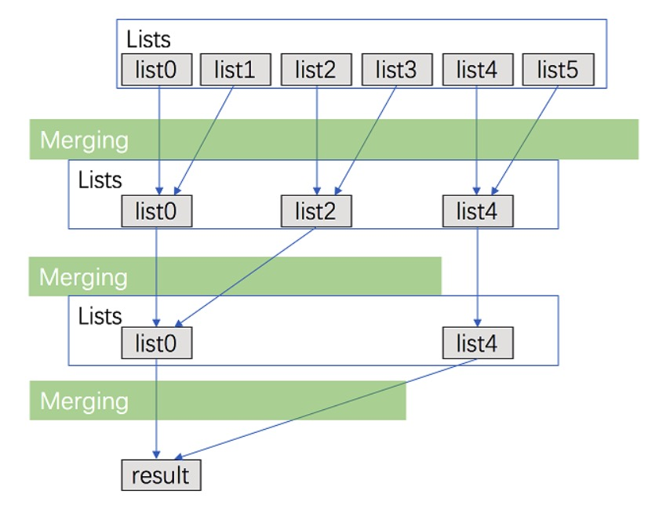

# 目录
* [题目地址](#题目地址)
* [题目描述](#题目描述)
* [解题思路](#解题思路)
* [解法1-逐一比较](#解法1-逐一比较)
* [扩展题目](#扩展题目)


# 题目地址
难易程度：
- 

是否经典：
- ⭐️


https://leetcode-cn.com/problems/merge-k-sorted-lists/


# 题目描述
```
合并 k 个排序链表，返回合并后的排序链表。请分析和描述算法的复杂度。

示例:

输入:
[
  1->4->5,
  1->3->4,
  2->6
]
输出: 1->1->2->3->4->4->5->6
```


# 解题思路
- 逐一比较
- 优先队列
- 分治


# 解法1-逐一比较
## 关键点
比较 k 个节点（每个链表的首节点），获得最小值的节点。将选中的节点接在最终有序链表的后面。

## 代码
```Java
/**
 * Definition for singly-linked list.
 * public class ListNode {
 *     int val;
 *     ListNode next;
 *     ListNode(int x) { val = x; }
 * }
 */
class Solution {
    public ListNode mergeKLists(ListNode[] lists) {
        int min = Integer.MAX_VALUE;
        int mark = -1;
        for (int i = 0; i < lists.length; i++) {
            if (lists[i] != null && lists[i].val < min) {
                min = lists[i].val;
                mark = i;
            }
        }
        if (mark == -1) return null;
        ListNode node = lists[mark];
        lists[mark] = lists[mark].next;
        node.next = mergeKLists(lists);
        return node;
    }
}
```


## 复杂度
- 时间复杂度：O(kN) ，其中 k 是链表的数目。几乎最终有序链表中每个节点的时间开销都为 O(k)(k-1 次比较）。总共有 N 个节点在最后的链表中。
- 空间复杂度：O(1)。重复利用原来的链表节点，每次选择节点时将它直接接在最后返回的链表后面，而不是创建一个新的节点。


# 解法2-优先队列
## 关键点
几乎与上述方法一样，除了将 比较环节 用 优先队列 进行了优化。

## 代码
```Java
class Solution {
    public ListNode mergeKLists(ListNode[] lists) {
        if (lists == null || lists.length == 0) return null;
        PriorityQueue<ListNode> queue = new PriorityQueue<>(lists.length, new Comparator<ListNode>() {
            @Override
            public int compare(ListNode o1, ListNode o2) {
                return o1.val - o2.val;
            }
        });

        for (int i = 0; i < lists.length; i++) {
            if (lists[i] != null) {
                queue.add(lists[i]);
            }
        }

        ListNode head = new ListNode(0); // 头节点技巧记住
        ListNode point = head;
        while (!queue.isEmpty()) {
            ListNode node = queue.poll();
            point.next = node;
            point = point.next;
            if (node.next != null) {
                queue.add(node.next);
            }
        }

        return head.next;
    }
}
```


## 复杂度
- 时间复杂度： O(Nlogk) ，其中 k 是链表的数目。弹出操作时，比较操作的代价会被优化到 O(logk) 。同时，找到最小值节点的时间开销仅仅为 O(1)。最后的链表中总共有 N 个节点。
- 空间复杂度：O(k) 。以上代码采用了重复利用原有节点，所以只要 O(1) 的空间。同时优先队列（通常用堆实现）需要 O(k) 的空间（远比大多数情况的 N要小）。


# 解法3-分治
## 关键点
**看不懂就去看归并排序吧**

将 k 个链表配对并将同一对中的链表合并。第一轮合并以后，k 个链表被合并成了 $\frac{k}{2}$个链表，平均长度为 $\frac{2N}{k}$，然后是 $\frac{k}{4}$ 个链表， $\frac{k}{8}$ 个链表等等。
重复这一过程，直到我们得到了最终的有序链表。因此，我们在每一次配对合并的过程中都会遍历几乎全部 N 个节点，并重复这一过程 $log_2K$



## 代码
```Java
class Solution {
    public ListNode mergeKLists(ListNode[] lists) {
        if (lists == null || lists.length == 0) return null;
        return merge(lists, 0, lists.length - 1);
    }

    private ListNode merge(ListNode[] lists, int left, int right) {
        if (left == right) return lists[left];
        int mid = (right + left) / 2;
        ListNode l1 = merge(lists, left, mid);
        ListNode l2 = merge(lists, mid + 1, right);
        return mergeTwoLists(l1, l2);
    }

    private ListNode mergeTwoLists(ListNode l1, ListNode l2) {
        if (l1 == null) return l2;
        if (l2 == null) return l1;
        if (l1.val < l2.val) {
            l1.next = mergeTwoLists(l1.next, l2);
            return l1;
        } else {
            l2.next = mergeTwoLists(l1, l2.next);
            return l2;
        }
    }
}
```


## 复杂度
- 时间复杂度： $O(Nlogk)$ ，其中 k 是链表的数目。我们可以在 O(n) 的时间内合并两个有序链表，其中 n 是两个链表中的总节点数。将所有的合并进程加起来，我们可以得到：$O\big(\sum_{i=1}^{log_2k}N \big)= O(N\log k)$。
- 空间复杂度：O(1)。

# 扩展题目
## 21. 合并两个有序链表
```text
将两个升序链表合并为一个新的 升序 链表并返回。新链表是通过拼接给定的两个链表的所有节点组成的。 

 

示例：

输入：1->2->4, 1->3->4
输出：1->1->2->3->4->4
```

```java
class Solution {
    public ListNode mergeTwoLists(ListNode l1, ListNode l2) {
        if(l1 == null) {
            return l2;
        }
        if(l2 == null) {
            return l1;
        }

        if(l1.val < l2.val) {
            l1.next = mergeTwoLists(l1.next, l2);
            return l1;
        } else {
            l2.next = mergeTwoLists(l1, l2.next);
            return l2;
        }
    }
}
```


## 88. 合并两个有序数组
https://leetcode-cn.com/problems/merge-sorted-array/submissions/

```text
给你两个有序整数数组 nums1 和 nums2，请你将 nums2 合并到 nums1 中，使 nums1 成为一个有序数组。

 

说明:

初始化 nums1 和 nums2 的元素数量分别为 m 和 n 。
你可以假设 nums1 有足够的空间（空间大小大于或等于 m + n）来保存 nums2 中的元素。
 

示例:

输入:
nums1 = [1,2,3,0,0,0], m = 3
nums2 = [2,5,6],       n = 3

输出: [1,2,2,3,5,6]
```

采用`双指针 / 从后往前`遍历即可

```java
class Solution {
    public void merge(int[] nums1, int m, int[] nums2, int n) {
        int p1 = m - 1;
        int p2 = n - 1;
        int p = m + n - 1;
        while ((p1 >= 0) && (p2 >= 0)) {
            nums1[p--] = (nums1[p1] < nums2[p2]) ? nums2[p2--] : nums1[p1--];
        }

        // 如果是nums1没遍历完，那么已经在正确的位置
        // 如果是nums2没遍历完，需要拷贝
        if (p2 >= 0) {
            while (p2 >= 0) {
                nums1[p--] = nums2[p2--];
            }
        }
    }
}
```

### 复杂度分析

- 时间复杂度 : O(n+m)。
- 空间复杂度 : O(1)。