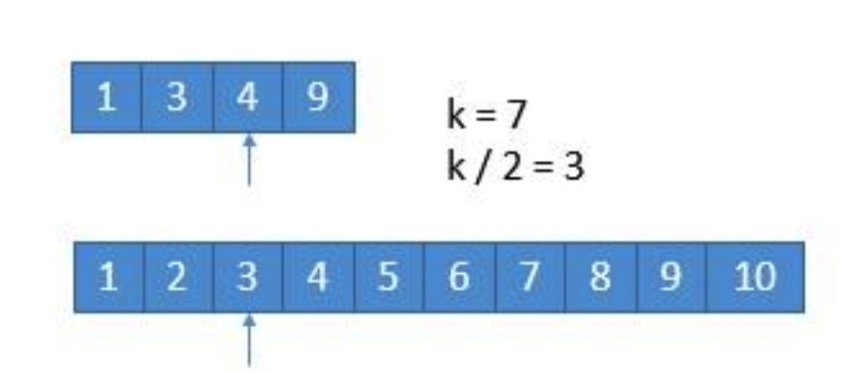
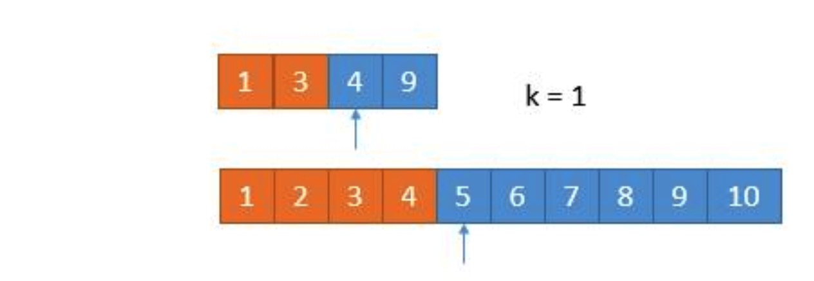

# 目录
* [题目地址](#题目地址)
* [题目描述](#题目描述)
* [解题思路](#解题思路)
* [解法1-合并两个有序数组](#解法1-合并两个有序数组)
* [解法2-二分](#解法2-二分)


# 题目地址
- 难易程度：
- 是否经典：⭐️

https://leetcode-cn.com/problems/median-of-two-sorted-arrays/

# 题目描述
```
给定两个大小为 m 和 n 的有序数组 nums1 和 nums2。

请你找出这两个有序数组的中位数，并且要求算法的时间复杂度为 O(log(m + n))。

你可以假设 nums1 和 nums2 不会同时为空。

示例 1:

nums1 = [1, 3]
nums2 = [2]

则中位数是 2.0
示例 2:

nums1 = [1, 2]
nums2 = [3, 4]

则中位数是 (2 + 3)/2 = 2.5
```


# 解题思路
- 合并两个有序数组，找第k大，但是复杂度O(m+n)
- 二分


# 解法1-合并两个有序数组
详见[23题](../2.题目/23.合并K个排序链表.md)


# 解法2-二分
## 关键点
看到 log，很明显，我们只有用到二分的方法才能达到。我们不妨用另一种思路，题目是求中位数，其实就是求第 k 小数的一种特殊情况，而求第 k 小数有一种算法。

由于数列是有序的，其实我们完全可以一半儿一半儿的排除。假设我们要找第 k 小数，我们可以每次循环排除掉 k/2 个数。看下边一个例子。

假设我们要找第 7 小的数字。



我们比较两个数组的第 k/2 个数字，如果 k 是奇数，向下取整。也就是比较第 3 个数字，上边数组中的 4 和下边数组中的 3，如果哪个小，就表明该数组的前 k/2 个数字都不是第 k 小数字，所以可以排除。也就是 1，2，3 这三个数字不可能是第 7 小的数字，我们可以把它排除掉。将 1349 和 45678910 两个数组作为新的数组进行比较。

更一般的情况 A[1] ，A[2] ，A[3]，A[k/2] ... ，B[1]，B[2]，B[3]，B[k/2] ... ，如果 A[k/2]<B[k/2] ，那么A[1]，A[2]，A[3]，A[k/2]都不可能是第 k 小的数字。

由于我们已经排除掉了 3 个数字，就是这 3 个数字一定在最前边，所以在两个新数组中，我们只需要找第 7 - 3 = 4 小的数字就可以了，也就是 k = 4。此时两个数组，比较第 2 个数字，3 < 5，所以我们可以把小的那个数组中的 1 ，3 排除掉了。

然后我们比较4,9和4,5,6,7,8,9,10两个人数组，找k=2，k/2=1，4 == 4，怎么办呢？由于两个数相等，所以我们无论去掉哪个数组中的都行，因为去掉 1 个总会保留 1 个的，所以没有影响。为了统一，我们就假设 4 > 4 吧，所以此时将下边的 4 去掉。



由于又去掉 1 个数字，此时我们要找第 1 小的数字，所以只需判断两个数组中第一个数字哪个小就可以了，也就是 4。

所以第 7 小的数字是 4。

我们每次都是取 k/2 的数进行比较，有时候可能会遇到数组长度小于 k/2的时候。此时直接将小的数组整个排除掉即可。

所以我们采用递归的思路，为了防止数组长度小于 k/2，所以每次比较 min(k/2，len(数组) 对应的数字，把小的那个对应的数组的数字排除，将两个新数组进入递归，并且 k 要减去排除的数字的个数。递归出口就是当 k=1 或者其中一个数字长度是 0 了。

## 代码
```Java
class Solution {
    public double findMedianSortedArrays(int[] nums1, int[] nums2) {
        int n = nums1.length;
        int m = nums2.length;
        int left = (n + m + 1) / 2;
        int right = (n + m + 2) / 2;
        return (getKth(nums1, 0, n - 1, nums2, 0, m - 1, left) + getKth(nums1, 0, n - 1, nums2, 0, m - 1, right)) * 0.5;   //将偶数和奇数的情况合并，如果是奇数，会求两次同样的 k 。
    }

    private int getKth(int[] nums1, int start1, int end1, int[] nums2, int start2, int end2, int k) {
        int len1 = end1 - start1 + 1;   //下标转长度要+1
        int len2 = end2 - start2 + 1;
        if (len1 > len2) return getKth(nums2, start2, end2, nums1, start1, end1, k);  //让 len1 的长度小于 len2，这样就能保证如果有数组空了，一定是 len1 
        if (len1 == 0) return nums2[start2 + k - 1];
        
        if (k == 1) return Math.min(nums1[start1], nums2[start2]);

        int i = start1 + Math.min(len1, k / 2) - 1; // 此时len1长度必>0，并且长度转下标必-1
        int j = start2 + Math.min(len2, k / 2) - 1;

        if (nums1[i] > nums2[j]) {
            return getKth(nums1, start1, end1, nums2, j + 1, end2, k - (j - start2 + 1));
        } else {
            return getKth(nums1, i + 1, end1, nums2, start2, end2, k - (i - start1 + 1));
        }
    }
}
```


## 复杂度
- 时间复杂度：每进行一次循环，我们就减少 k/2 个元素，所以时间复杂度是 O(log(k)，而 k=(m+n)/2，所以最终的复杂也就是 O(log(m+n）。
  
- 空间复杂度：虽然我们用到了递归，但是可以看到这个递归属于尾递归（一个函数中所有递归形式的调用都出现在函数的末尾，因此代码会被编译器自动优化），所以编译器不需要不停地堆栈，所以空间复杂度为 O(1)。
 

