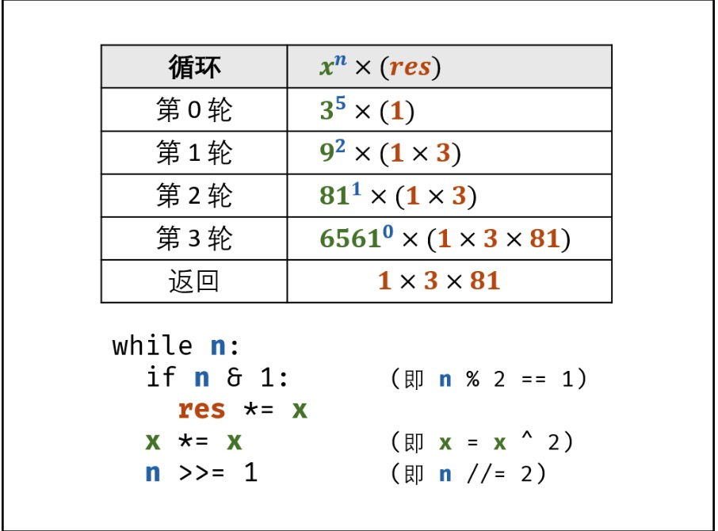

# 目录
* [题目地址](#题目地址)
* [题目描述](#题目描述)
* [解题思路](#解题思路)
* [解法1-二分法](#解法1-二分法)


# 题目地址
难易程度：
- 

是否经典：
- ⭐️

https://leetcode-cn.com/problems/powx-n/

# 题目描述
```$xslt
实现 pow(x, n) ，即计算 x 的 n 次幂函数。

示例 1:

输入: 2.00000, 10
输出: 1024.00000
示例 2:

输入: 2.10000, 3
输出: 9.26100
示例 3:

输入: 2.00000, -2
输出: 0.25000
解释: 2^-2 = 1/(2^2) = 1/4 = 0.25
说明:

-100.0 < x < 100.0
n 是 32 位有符号整数，其数值范围是 [−2^31, 2^31 − 1] 。

```


# 解题思路
- 快速幂解析（二分法角度）


# 解法1-二分法
## 关键点
二分推导： $x^n = x^{n/2} \times x^{n/2} = (x^2)^{n/2}$，令 n/2 为整数，则需要分为奇偶两种情况（设向下取整除法符号为 "//" ）：
- 当 n 为偶数： $x^n = (x^2)^{n//2}$；
- 当 n 为奇数： $x^n = x(x^2)^{n//2}$，即会多出一项 x ；

因此解法为下图：


转化为位运算：
- 向下整除 $n // 2$ 等价于 右移一位 $n >> 1$；
- 取余数 $n \% 2$ 等价于 判断二进制最右一位值 $n \& 1$；

## 代码
```Java
class Solution {
    public double myPow(double x, int n) {
        if(x == 0) return 0;
        long b = n;
        double res = 1.0;
        if(b < 0) {
            x = 1 / x;
            b = -b;
        }
        while(b > 0) {
            if((b & 1) == 1) res *= x;
            x *= x;
            b >>= 1;
        }
        return res;
    }
}
```


## 复杂度
- 时间复杂度 $O(log_2 n)$： 二分的时间复杂度为对数级别。
- 空间复杂度 O(1)。