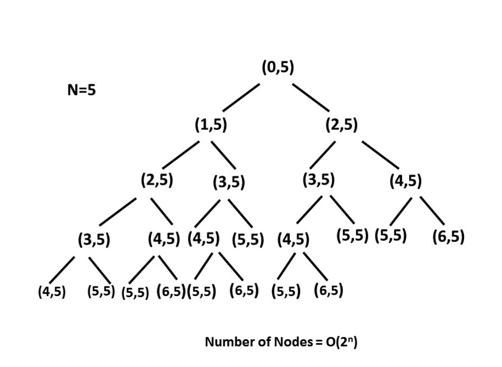

# 目录
* [题目地址](#题目地址)
* [题目描述](#题目描述)
* [解题思路](#解题思路)
* [解法1-动态规划](#解法1-动态规划)
* [扩展题目](#扩展题目)


# 题目地址
难易程度：
- 

是否经典：
- ⭐️

https://leetcode-cn.com/problems/climbing-stairs/

# 题目描述
```
假设你正在爬楼梯。需要 n 阶你才能到达楼顶。

每次你可以爬 1 或 2 个台阶。你有多少种不同的方法可以爬到楼顶呢？

注意：给定 n 是一个正整数。

示例 1：

输入： 2
输出： 2
解释： 有两种方法可以爬到楼顶。
1.  1 阶 + 1 阶
2.  2 阶
示例 2：

输入： 3
输出： 3
解释： 有三种方法可以爬到楼顶。
1.  1 阶 + 1 阶 + 1 阶
2.  1 阶 + 2 阶
3.  2 阶 + 1 阶
```


# 解题思路
- 暴力递归
- 动态规划
- 简化版动态规划


# 解法1-暴力递归
## 关键点
在暴力法中，我们将会把所有可能爬的阶数进行组合，也就是 1 和 2 。而在每一步中我们都会继续调用 s 这个函数模拟爬 1 阶和 2 阶的情形，并返回两个函数的返回值之和。

s(i,n)=s(i + 1, n) + s(i + 2, n)

其中 i 定义了当前阶数，而 n 定义了目标阶数。

## 代码
```Java
public class Solution {
    public int climbStairs(int n) {
        return climbStairs(0, n);
    }
    
    private int climbStairs(int i, int n) {
        if (i > n) {
            return 0;
        }
        if (i == n) {
            return 1;
        }
        return climbStairs(i + 1, n) + climbStairs(i + 2, n);
    }
}
```

## 复杂度
- 时间复杂度：$O(2^n)$，树形递归的大小为 $2^n$

在 n = 5 时的递归树将是这样的：


- 空间复杂度：O(n)，递归树的深度可以达到 n 。

# 解法2-动态规划
## 关键点
不难发现，这个问题可以被分解为一些包含最优子结构的子问题，即它的最优解可以从其子问题的最优解来有效地构建，我们可以使用动态规划来解决这一问题。

第 i 阶可以由以下两种方法得到：

在第 (i-1) 阶后向上爬一阶。

在第 (i-2)阶后向上爬 2 阶。

所以到达第 i 阶的方法总数就是到第 (i−1) 阶和第 (i−2) 阶的方法数之和。

令 dp[i] 表示能到达第 i 阶的方法总数：

dp[i]=dp[i-1]+dp[i-2]

## 代码
```Java
public class Solution {
    public int climbStairs(int n) {
        if (n == 1) {
            return 1;
        }
        int[] dp = new int[n + 1];
        dp[1] = 1;
        dp[2] = 2;
        for (int i = 3; i <= n; i++) {
            dp[i] = dp[i - 1] + dp[i - 2];
        }
        return dp[n];
    }
}
```

## 复杂度
- 时间复杂度：O(n)，单循环到 n 。
  
- 空间复杂度：O(n)，dp 数组用了 n 的空间。
  
  
# 解法3-动态规划优化空间
## 关键点
由于dp[i]=dp[i-1]+dp[i-2]，我们不需要记住所有的中间结果，只记住前两个即可。

## 代码
```Java
public class Solution {
    public int climbStairs(int n) {
        if (n == 1) {
            return 1;
        }
        int first = 1;
        int second = 2;
        for (int i = 3; i <= n; i++) {
            int third = first + second;
            first = second;
            second = third;
        }
        return second;
    }
}
```

## 复杂度
- 时间复杂度：O(n)，单循环到 n 。 
- 空间复杂度：O(1)，使用常量级空间。

# 扩展题目
## 母牛问题
假设农场中成熟的母牛每年只会生1头小母牛，并且永远不会死。第一年农场有1只 成熟的母牛，从第二年开始，母牛开始生小母牛。每只小母牛3年之后成熟又可以生 小母牛。给定整数N，求出N年后牛的数量。

思路：
所有的牛都不会死，所以第N-1年的牛会毫无损失地活到第N年。同时所 有成熟的牛都会生1头新的牛，那么成熟牛的数量如何估计？就是第N-3年的所有 牛，到第N年肯定都是成熟的牛，其间出生的牛肯定都没有成熟。所以C（n） =C（n-1）+C（n-3），初始项为C（1）==1，C（2）==2，C（3）==3。这个和斐波 那契数列又十分类似，只不过C（n）依赖C（n-1）和C（n-3）的值，而斐波那契数 列F（n）依赖F（n-1）和F（n-2）的值。