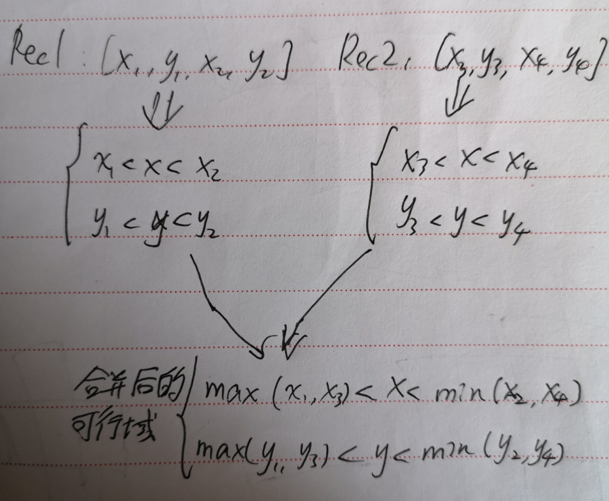

# 目录
* [题目地址](#题目地址)
* [题目描述](#题目描述)
* [解题思路](#解题思路)
* [解法1-动态规划](#解法1-动态规划)
* [解法2-动态规划](#解法2-动态规划)
* [扩展题目](#扩展题目)


# 题目地址
难易程度：
- 

是否经典：
- ⭐️

https://leetcode-cn.com/problems/rectangle-overlap/

# 题目描述
```text
矩形以列表 [x1, y1, x2, y2] 的形式表示，其中 (x1, y1) 为左下角的坐标，(x2, y2) 是右上角的坐标。

如果相交的面积为正，则称两矩形重叠。需要明确的是，只在角或边接触的两个矩形不构成重叠。

给出两个矩形，判断它们是否重叠并返回结果。

 

示例 1：

输入：rec1 = [0,0,2,2], rec2 = [1,1,3,3]
输出：true
示例 2：

输入：rec1 = [0,0,1,1], rec2 = [1,0,2,1]
输出：false
```

# 解法1-可行域
## 关键点
乍一看，要考虑的情况似乎很多，两矩形到底是怎么一个重叠情况也不清楚，一不小心就少考虑了一种。

事实上题目中的坐标系提醒了我，我们只要将这题中的两个矩形看成是两个可行域，求这两个可行域的交集，也就是最终的可行域即可。



最终只要判断最终的可行域面积是否大于0即可


## 代码
```java
class Solution {
    public boolean isRectangleOverlap(int[] rec1, int[] rec2) {
        int x1 = Math.max(rec1[0], rec2[0]);
        int y1 = Math.max(rec1[1], rec2[1]);

        int x2 = Math.min(rec1[2], rec2[2]);
        int y2 = Math.min(rec1[3], rec2[3]);

        return (x1 < x2) && (y1 < y2);
    }
}
```


# 解法2-转化为不重叠
## 关键点
矩形重叠要考虑的情况很多，两个矩形的重叠可能有好多种不同的形态。这道题如果用蛮力做的话，很容易遗漏掉某些情况，导致出错。

矩形重叠是二维的问题，所以情况很多，比较复杂。为了简化问题，我们可以考虑将二维问题转化为一维问题。既然题目中的矩形都是平行于坐标轴的，我们将矩形投影到坐标轴上：


矩形投影到坐标轴上，就变成了区间。稍加思考，我们发现：两个互相重叠的矩形，它们在 xx 轴和 yy 轴上投影出的区间也是互相重叠的。这样，我们就将矩形重叠问题转化成了区间重叠问题。

假设两个区间分别是 [s1, e1] 和 [s2, e2] 的话，区间不重叠的两种情况就是 e1 <= s2 和 e2 <= s1。

我们就得到区间不重叠的条件：e1 <= s2 || e2 <= s1。将条件取反即为区间重叠的条件。

## 代码
```java
class Solution {
    public boolean isRectangleOverlap(int[] rec1, int[] rec2) {
        boolean x_overlap = !(rec1[2] <= rec2[0] || rec2[2] <= rec1[0]);
        boolean y_overlap = !(rec1[3] <= rec2[1] || rec2[3] <= rec1[1]);
        return x_overlap && y_overlap;
    }
}
```