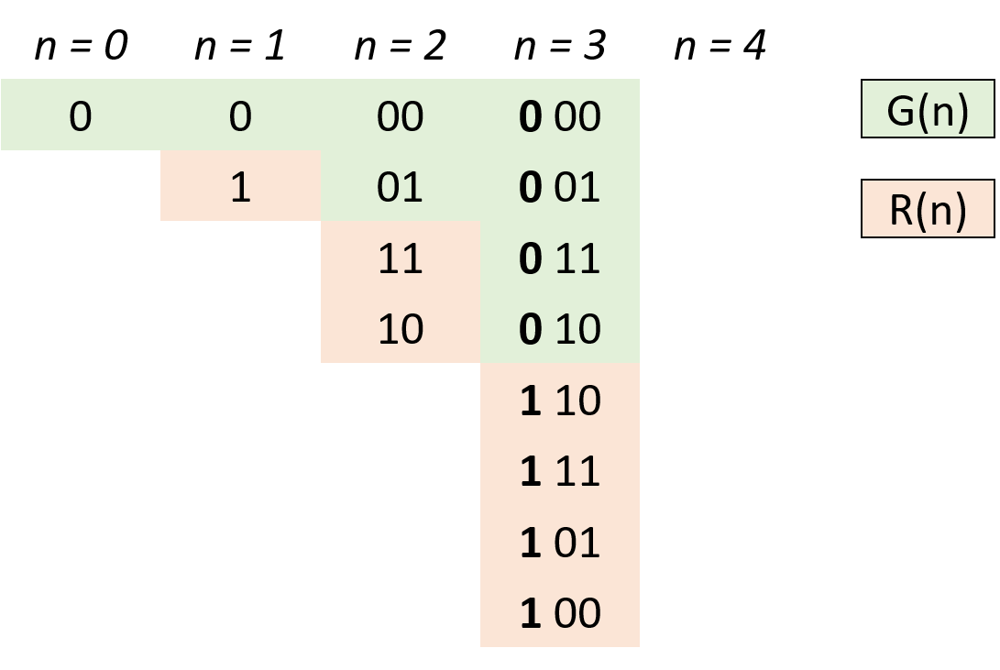

# 目录
* [题目地址](#题目地址)
* [题目描述](#题目描述)
* [解题思路](#解题思路)
* [解法1-动态规划](#解法1-动态规划)
* [解法2-动态规划](#解法2-动态规划)
* [扩展题目](#扩展题目)


# 题目地址
难易程度：
- 

是否经典：
- ⭐️

https://leetcode-cn.com/problems/gray-code/

# 题目描述
```text
格雷编码是一个二进制数字系统，在该系统中，两个连续的数值仅有一个位数的差异。

给定一个代表编码总位数的非负整数 n，打印其格雷编码序列。格雷编码序列必须以 0 开头。

示例 1:

输入: 2
输出: [0,1,3,2]
解释:
00 - 0
01 - 1
11 - 3
10 - 2

对于给定的 n，其格雷编码序列并不唯一。
例如，[0,2,3,1] 也是一个有效的格雷编码序列。

00 - 0
10 - 2
11 - 3
01 - 1
示例 2:

输入: 0
输出: [0]
解释: 我们定义格雷编码序列必须以 0 开头。
     给定编码总位数为 n 的格雷编码序列，其长度为 2^n。当 n = 0 时，长度为 2^0 = 1。
     因此，当 n = 0 时，其格雷编码序列为 [0]。
```


# 解题思路
- 格雷码规律

# 解法1-格雷码规律
## 关键点
设 n 阶格雷码集合为 G(n)，则 G(n+1) 阶格雷码为：
- 给 G(n) 阶格雷码每个元素二进制形式前面添加 0，得到 G'(n)；
- 设 G(n) 集合倒序（镜像）为 R(n)，给 R(n) 每个元素二进制形式前面添加 1，得到 R'(n)；
- G(n+1) = G'(n) ∪ R'(n) 拼接两个集合即可得到下一阶格雷码。



## 代码


## 复杂度
- 时间复杂度：
- 空间复杂度：


# 解法2-动态规划
## 关键点


## 代码


## 复杂度
- 时间复杂度：
- 空间复杂度：


# 扩展题目


图片压缩大小：
