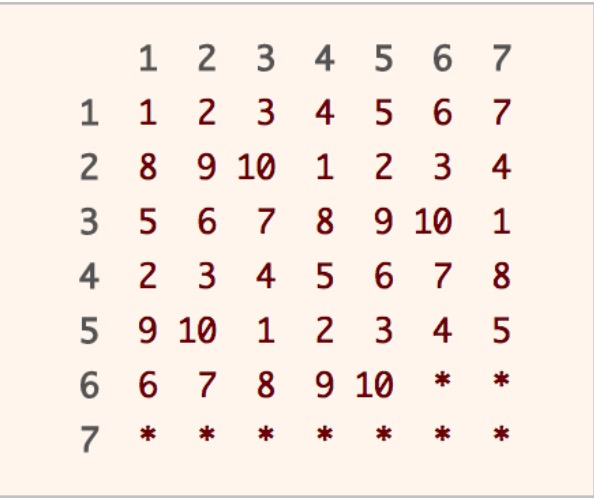

# 目录
* [题目地址](#题目地址)
* [题目描述](#题目描述)
* [解题思路](#解题思路)
* [解法1-动态规划](#解法1-动态规划)
* [扩展题目](#扩展题目)


# 题目地址
难易程度：
- 

是否经典：
- ⭐️


# 题目描述
```
已有方法 rand7 可生成 1 到 7 范围内的均匀随机整数，试写一个方法 rand10 生成 1 到 10 范围内的均匀随机整数。
不要使用系统的 Math.random() 方法。

示例 1:

输入: 1
输出: [7]
示例 2:

输入: 2
输出: [8,4]
示例 3:

输入: 3
输出: [8,1,10]
 

提示:

rand7 已定义。
传入参数: n 表示 rand10 的调用次数。
 

进阶:

rand7()调用次数的 期望值 是多少 ?
你能否尽量少调用 rand7() ?
```


# 解题思路
- 拒绝采样


# 解法1-拒绝采样1
## 关键点
- 合理调用rand7()来生成rand10()
- 先举一个简单的例子，如何用rand7()来生成rand5()呢？用rand7()产生一个随机数，如果随机数是1,2,3,4,5就取，是6,7就重新生成。因为rand7()生成1,2,3,4,5的概率时一样的，都是$\frac{1}{7}$，所以rand5()也是均分分布的。

思路：
- 把rand7()想象成一个7面的骰子🎲，现在我们有两个骰子
- 第一次如果掷出1,2,3,4,5,6就掷下一个骰子；如果掷出7，就继续掷这个骰子，直到不是7为止
- 第二次如果掷出1,2,3,4,5就结束；如果掷出6,7，就继续掷这个骰子，直到不是6,7为止
- 如果第一次掷出1,2,3，则first记为0；如果第一次掷出4,5,6，则记first为5；记第二次掷出的为second
- 最后返回first+second
  
  
验证一下是否是均匀分布:
- first为0的概率=第一次掷出1,2,3的概率=$\frac{3}{7}$
- first为5的概率=第一次掷出4,5,6的概率=$\frac{3}{7}$
- second为1,2,3,4,5的概率都相等=$\frac{1}{7}$
- 那么first+second为1,2,3,4,5,6,7,8,9,10的概率都相等=$\frac{3}{7}*\frac{1}{7}=\frac{3}{49}$

## 代码
```Java
class Solution extends SolBase {
    public int rand10() {
        int first = rand7();
        int second = rand7();
        while (first == 7)
            first = rand7();
        while (second > 5)
            second = rand7();
        return (first / 4 == 0 ? 0 : 5) + second;
    }
}
```


## 复杂度
我们来分析这种方法在平均情况下需要调用 Rand7() 的次数。我们称连续调用两次 Rand7() 为一轮，在第一轮中，有 40/49 的概率不被拒绝，而有 9/49 的概率被拒绝，进入第二轮。在第二轮中也是如此，因此调用 Rand7() 的期望次数为：

\begin{aligned} E(\text{\# calls}) &= 2 + 2 \cdot \frac{9}{49} + 2 \cdot (\frac{9}{49})^2 + \cdots\\ &= 2 \sum_{n=0}^\infty (\frac{9}{49})^n\\ &= 2 \cdot \frac{1}{1 - \frac{9}{49}}\\ &=2.45 \end{aligned}


# 解法1-拒绝采样2
## 关键点
我们可以用拒绝采样的方法实现 Rand10()。在拒绝采样中，如果生成的随机数满足要求，那么就返回该随机数，否则会不断生成直到一个满足要求的随机数为止。若我们调用两次 Rand7()，那么可以生成 [1, 49] 之间的随机整数，我们只用到其中的 40 个，用来实现 Rand10()，而拒绝剩下的 9 个数，如下图所示。



我们来分析这种方法在平均情况下需要调用 Rand7() 的次数。我们称连续调用两次 Rand7() 为一轮，在第一轮中，有 40/49 的概率不被拒绝，而有 9/49 的概率被拒绝，进入第二轮。在第二轮中也是如此，因此调用 Rand7() 的期望次数为：

$$\begin{aligned} E(\text{\# calls}) &= 2 + 2 \cdot \frac{9}{49} + 2 \cdot (\frac{9}{49})^2 + \cdots\\ &= 2 \sum_{n=0}^\infty (\frac{9}{49})^n\\ &= 2 \cdot \frac{1}{1 - \frac{9}{49}}\\ &=2.45 \end{aligned}$$

## 代码
```Java
class Solution extends SolBase {
    public int rand10() {
        int row, col, idx;
        do {
            row = rand7();
            col = rand7();
            idx = col + (row - 1) * 7;
        } while (idx > 40);
        return 1 + (idx - 1) % 10;
    }
}
```


## 复杂度
- 时间复杂度：期望时间复杂度为 O(1)，但最坏情况下会达到 $O(\infty)$（一直被拒绝）。
- 空间复杂度：O(1)。


# 扩展题目
