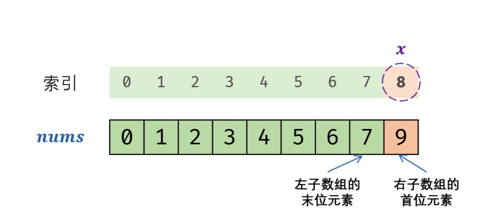

# 目录
* [题目地址](#题目地址)
* [题目描述](#题目描述)
* [解题思路](#解题思路)
* [解法1-二分](#解法1-二分)


# 题目地址
难易程度：
- 

是否经典：
- ⭐️

https://leetcode-cn.com/problems/que-shi-de-shu-zi-lcof/

# 题目描述
```$xslt
一个长度为n-1的递增排序数组中的所有数字都是唯一的，并且每个数字都在范围0～n-1之内。在范围0～n-1内的n个数字中有且只有一个数字不在该数组中，请找出这个数字。

 

示例 1:

输入: [0,1,3]
输出: 2
示例 2:

输入: [0,1,2,3,4,5,6,7,9]
输出: 8
 

限制：

1 <= 数组长度 <= 10000
```


# 解题思路
- 二分


# 解法1-二分
## 关键点
排序数组中的搜索问题，首先想到 二分法 解决。
根据题意，数组可以按照以下规则划分为两部分。
- 左子数组： nums[i] = i；
- 右子数组： $nums[i] \ne i$；

缺失的数字等于 “右子数组的首位元素” 对应的索引；因此考虑使用二分法查找 “右子数组的首位元素” 。



跳出时，变量 low 和 high 分别指向 “右子数组的首位元素” 和 “左子数组的末位元素” 。因此返回 low 即可。
## 代码
```Java
class Solution {
    public int missingNumber(int[] nums) {
        int low = 0;
        int high = nums.length - 1;
        while (low <= high) {
            int mid = (low + high) / 2;
            if (nums[mid] == mid) {
                low = mid + 1;
            } else {
                high = mid - 1;
            }
        }
        return low;
    }
}
```


## 复杂度
- 时间复杂度O(logN)： 二分法为对数级别复杂度。
- 空间复杂度O(1)： 几个变量使用常数大小的额外空间。