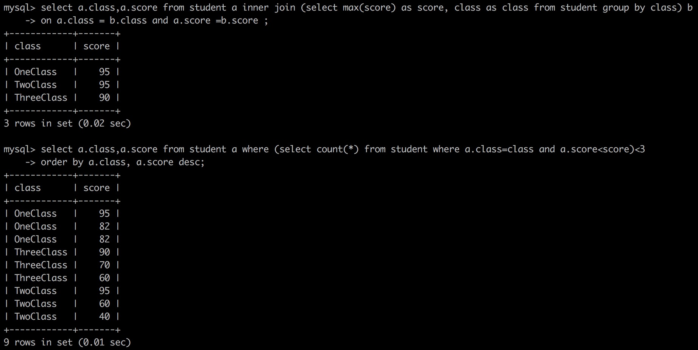

# 目录
* [1.查询班级成绩的前三名](#1.查询班级成绩的前三名)


# 1.查询班级成绩的前三名
```sql
CREATE TABLE IF NOT EXISTS  student(
   id varchar(20),-- 编号
   class varchar(20),-- 年级
   score int-- 分数
);

delete from student;
insert student values('1','OneClass',82);
insert student values('2','OneClass',95);
insert student values('3','OneClass',82);
insert student values('4','OneClass',40);
insert student values('5','OneClass',20);
insert student values('6','TwoClass',95);
insert student values('7','TwoClass',40);
insert student values('8','TwoClass',3);
insert student values('9','TwoClass',60);
insert student values('10','TwoClass',10);
insert student values('11','ThreeClass',70);
insert student values('12','ThreeClass',60);
insert student values('13','ThreeClass',40);
insert student values('14','ThreeClass',90);
insert student values('15','ThreeClass',20);
```

mysql实现分组查询每个班级的最高分:
```sql
select a.class,a.score from student a inner join (select max(score) as score, class as class from student group by class) b
on a.class = b.class and a.score =b.score ;
```

mysql实现分组查询每个班级的前三名
```sql
select a.class,a.score from student a where (select count(*) from student where a.class=class and a.score<score)<3
order by a.class, a.score desc;
```

核心思路：要算出某人成绩在第几名，可以转换成：算出他一共比多少人成绩高。比如，第一名的人，就没其它人成绩比他更好。第三名的人，就有两个人成绩比他好。
- 上面的查询，只会找出比当前成绩大的在三个以内的分数，也就是1+2=3，因此可以实现目标




# 2.第二高的薪水
https://leetcode-cn.com/problems/second-highest-salary/

```text
编写一个 SQL 查询，获取 Employee 表中第二高的薪水（Salary） 。

+----+--------+
| Id | Salary |
+----+--------+
| 1  | 100    |
| 2  | 200    |
| 3  | 300    |
+----+--------+
例如上述 Employee 表，SQL查询应该返回 200 作为第二高的薪水。如果不存在第二高的薪水，那么查询应返回 null。

+---------------------+
| SecondHighestSalary |
+---------------------+
| 200                 |
+---------------------+
```

```mysql
SELECT
    IFNULL(
    # 结果可能有多个
      (SELECT DISTINCT Salary
       FROM Employee
       ORDER BY Salary DESC
        LIMIT 1, 1),
    NULL) AS SecondHighestSalary
```

# 3.部门工资最高的员工
https://leetcode-cn.com/problems/department-highest-salary/

```text
Employee 表包含所有员工信息，每个员工有其对应的 Id, salary 和 department Id。

+----+-------+--------+--------------+
| Id | Name  | Salary | DepartmentId |
+----+-------+--------+--------------+
| 1  | Joe   | 70000  | 1            |
| 2  | Henry | 80000  | 2            |
| 3  | Sam   | 60000  | 2            |
| 4  | Max   | 90000  | 1            |
+----+-------+--------+--------------+
Department 表包含公司所有部门的信息。

+----+----------+
| Id | Name     |
+----+----------+
| 1  | IT       |
| 2  | Sales    |
+----+----------+
编写一个 SQL 查询，找出每个部门工资最高的员工。例如，根据上述给定的表格，Max 在 IT 部门有最高工资，Henry 在 Sales 部门有最高工资。

+------------+----------+--------+
| Department | Employee | Salary |
+------------+----------+--------+
| IT         | Max      | 90000  |
| Sales      | Henry    | 80000  |
+------------+----------+--------+
```

只输出一个数字结果，要用 Distinct 去重。

```mysql
SELECT
    Department.name AS 'Department',
    Employee.name AS 'Employee',
    Salary
FROM
    Employee
        JOIN
    Department ON Employee.DepartmentId = Department.Id
WHERE
    (Employee.DepartmentId , Salary) IN
    (   SELECT
            DepartmentId, MAX(Salary)
        FROM
            Employee
        GROUP BY DepartmentId
	)
;
```

# 4.超过经理收入的员工
https://leetcode-cn.com/problems/employees-earning-more-than-their-managers/
```text
Employee 表包含所有员工，他们的经理也属于员工。每个员工都有一个 Id，此外还有一列对应员工的经理的 Id。

+----+-------+--------+-----------+
| Id | Name  | Salary | ManagerId |
+----+-------+--------+-----------+
| 1  | Joe   | 70000  | 3         |
| 2  | Henry | 80000  | 4         |
| 3  | Sam   | 60000  | NULL      |
| 4  | Max   | 90000  | NULL      |
+----+-------+--------+-----------+
给定 Employee 表，编写一个 SQL 查询，该查询可以获取收入超过他们经理的员工的姓名。在上面的表格中，Joe 是唯一一个收入超过他的经理的员工。

+----------+
| Employee |
+----------+
| Joe      |
+----------+
```

```mysql
SELECT
     a.NAME AS Employee
FROM Employee AS a JOIN Employee AS b
     ON a.ManagerId = b.Id
     AND a.Salary > b.Salary
;
```

# 5. 查找重复的电子邮箱
https://leetcode-cn.com/problems/duplicate-emails/
```text
编写一个 SQL 查询，查找 Person 表中所有重复的电子邮箱。

示例：

+----+---------+
| Id | Email   |
+----+---------+
| 1  | a@b.com |
| 2  | c@d.com |
| 3  | a@b.com |
+----+---------+
根据以上输入，你的查询应返回以下结果：

+---------+
| Email   |
+---------+
| a@b.com |
+---------+
说明：所有电子邮箱都是小写字母。
```

- 子查询
```mysql
select Email from
(
  select Email, count(Email) as num
  from Person
  group by Email
) as statistic
where num > 1
;
```

- HAVING
```mysql
select Email
from Person
group by Email
having count(Email) > 1;
```

- 自连接
```mysql
select distinct p1.Email from Person as p1,Person as p2 where p1.Email =p2.Email and p1.Id!=p2.Id;
```


# 6. 从不订购的客户
https://leetcode-cn.com/problems/customers-who-never-order/

```text
某网站包含两个表，Customers 表和 Orders 表。编写一个 SQL 查询，找出所有从不订购任何东西的客户。

Customers 表：

+----+-------+
| Id | Name  |
+----+-------+
| 1  | Joe   |
| 2  | Henry |
| 3  | Sam   |
| 4  | Max   |
+----+-------+
Orders 表：

+----+------------+
| Id | CustomerId |
+----+------------+
| 1  | 3          |
| 2  | 1          |
+----+------------+
例如给定上述表格，你的查询应返回：

+-----------+
| Customers |
+-----------+
| Henry     |
| Max       |
+-----------+
```

- not in
```mysql
select customers.name as 'Customers'
from customers
where customers.id not in
(
    select customerid from orders
);
```

- left join
```mysql
select a.Name as Customers
from Customers as a
left join Orders as b
on a.Id=b.CustomerId
where b.CustomerId is null;
```

# 7. 删除重复的电子邮箱
https://leetcode-cn.com/problems/delete-duplicate-emails/
```text
编写一个 SQL 查询，来删除 Person 表中所有重复的电子邮箱，重复的邮箱里只保留 Id 最小 的那个。

+----+------------------+
| Id | Email            |
+----+------------------+
| 1  | john@example.com |
| 2  | bob@example.com  |
| 3  | john@example.com |
+----+------------------+
Id 是这个表的主键。
例如，在运行你的查询语句之后，上面的 Person 表应返回以下几行:

+----+------------------+
| Id | Email            |
+----+------------------+
| 1  | john@example.com |
| 2  | bob@example.com  |
+----+------------------+
```

- DELETE + 子查询，实测效率更高
```mysql
DELETE FROM Person
WHERE Id NOT IN (   -- 删除不在查询结果中的值
    SELECT id FROM
   (
       SELECT MIN(Id) AS Id -- 排除Email相同时中Id较大的行
       FROM Person
       GROUP BY Email
   ) AS temp    -- 此处需使用临时表，否则会发生报错
)
```

- 自连接
```mysql
# 方法二：官方题解，DELETE + 自连接
DELETE P1 
FROM Person P1, Person P2
WHERE P1.Email = P2.Email   -- 利用where进行自连接
AND P1.Id > P2.Id   -- 选择Id较大的行
```

# 8. 分数排名
https://leetcode-cn.com/problems/rank-scores/

```text
编写一个 SQL 查询来实现分数排名。

如果两个分数相同，则两个分数排名（Rank）相同。请注意，平分后的下一个名次应该是下一个连续的整数值。换句话说，名次之间不应该有“间隔”。

+----+-------+
| Id | Score |
+----+-------+
| 1  | 3.50  |
| 2  | 3.65  |
| 3  | 4.00  |
| 4  | 3.85  |
| 5  | 4.00  |
| 6  | 3.65  |
+----+-------+
例如，根据上述给定的 Scores 表，你的查询应该返回（按分数从高到低排列）：

+-------+------+
| Score | Rank |
+-------+------+
| 4.00  | 1    |
| 4.00  | 1    |
| 3.85  | 2    |
| 3.65  | 3    |
| 3.65  | 3    |
| 3.50  | 4    |
+-------+------+
```

主要思路是对于每一个分数，找出表中有多少个大于或者等于该分数的不同分数，然后降序排列即可。比如 3.65，表里大于等于 3.65 的数字分别是 4、3.85 和 3.65，所以它的排名是 3。

```mysql
select a.Score as Score,
(select count(distinct b.Score) from Scores b where b.Score >= a.Score) as Rank
from Scores a
order by a.Score DESC
```

