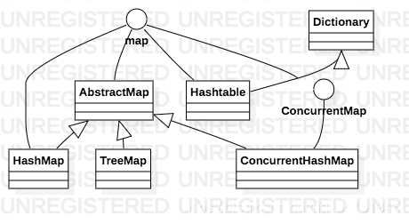
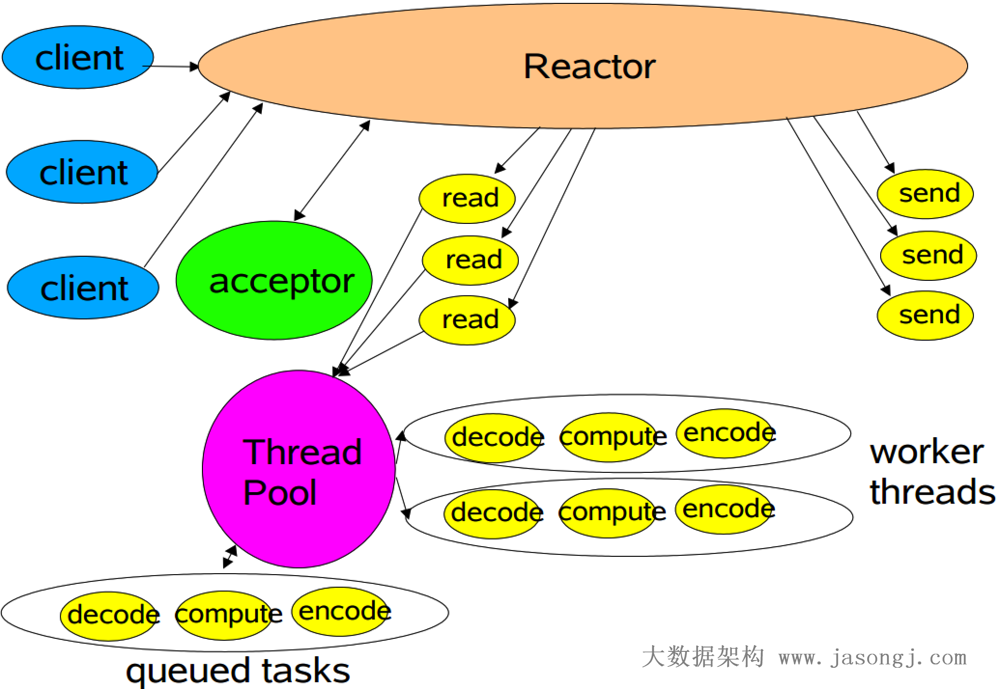
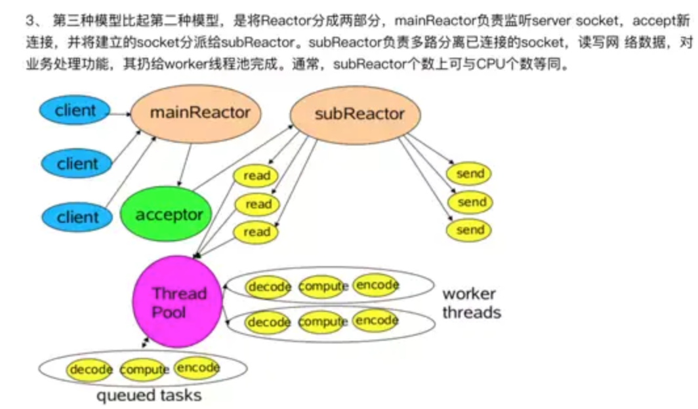
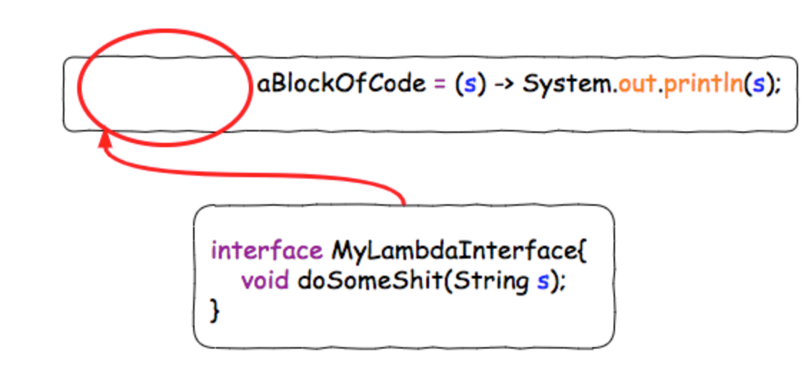
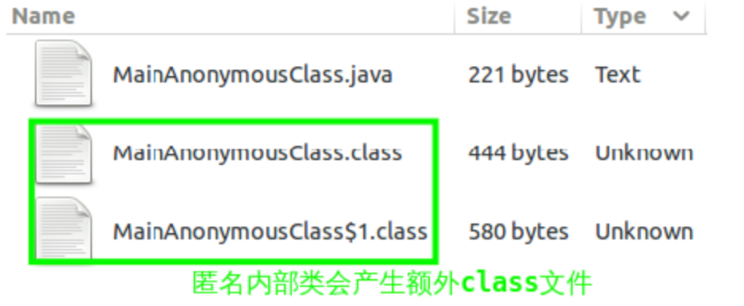
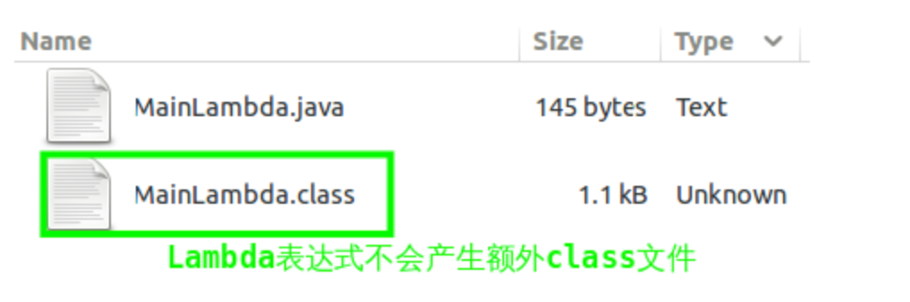
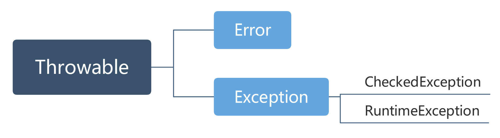

[toc]
[春季最新最全面 JAVA 面试题 附答案](https://www.jianshu.com/p/97e210a6d95a)

# 6. 用过哪些Map类，都有什么区别，HashMap是线程安全的吗,并发下使用的Map是什么，他们内部原理分别是什么，比如存储方式，hashcode，扩容，默认容量等。


map结构：元素按键值对存储，一般无放入顺序，其中值可以重复，但键是唯一的，不能重复。

区别：
## **HashMap**:
[https://www.cnblogs.com/xzwblog/p/7289952.html](https://www.cnblogs.com/xzwblog/p/7289952.html)

1、HashMap的底层数据结构是数组加链表；
2、并允许使用null值和null键；
3、JDK8 HashMap采用的是数组+链表+红黑树(链表长度大于8)的形式。
4、put详细过程：当我们往HashMap中put元素的时候，先根据key的hashCode重新计算hash值，根据hash值得到这个元素在数组中的位置（即下标），如果数组该位置上已经存放有其他元素了，那么在这个位置上的元素将以链表的形式存放，**刚刚加入的Entry在链头，最先加入的在链尾**。如果数组该位置上没有元素，就直接将该元素放到此数组中的该位置上。
5、扩容详细流程：当HashMap中的元素个数超过`数组大小*loadFactor`时，就会进行数组扩容，loadFactor的默认值为0.75，每次扩大一倍；
- 创建一个新的Entry空数组，长度是原来的2倍；
- 遍历原Entry数组，把所有的Entry重新Hash到新数组里。
    - 由于位运算计算下标，假设扩容前的table大小为2的N次方，元素的table索引为其hash值的后N位确定，那么扩容后的table大小即为2的N+1次方，则其中元素的table索引为其hash值的后N+1位确定，比原来多了一位，因此，table中的元素只有两种情况：
        - 元素hash值第N+1位为0：不需要进行位置调整
        - 元素hash值第N+1位为1：调整至原索引的两倍位置

6、有哪些计算技巧：
- 通过位运算计算数据所在的数组下标`h & (table.length -1)`，当length总是 2 的n次方时，h& (length-1)运算等价于对length取模，也就是h%length，但是&比%具有更高的效率；
- 扩容的时候不必全部重新计算hash，只需要判断最高位：
- 刚刚加入的Entry在链头，最先加入的在链尾
- hash算法：是key的hash值高16位和低16位异或操作
- 当hash表数据length总是 2 的n次方时，h & (length-1)运算等价于对length取模，也就是h%length，但是&比%具有更高的效率，能快速定位到数据在数组中的位置。因此hashmap的大小总是2的n次方；

7、jdk1.8对HashMap做的哪些优化？
1）哈希值的计算方法
实际上在jdk1.7中使用的是取模算法，而jdk1.8中使用的是高位与运算。因为&运算比%运算速度更快。
2）引入红黑树
如果HashMap的同一个Hash桶中链表节点数超过8个，则链表转为红黑树处理。

8、HashMap的死循环
HashMap在并发使用时可能发生死循环，导致cpu100%，参考：[https://juejin.im/post/5a66a08d5188253dc3321da0](https://juejin.im/post/5a66a08d5188253dc3321da0)
jdk7中，由于新元素插在队列头，可能出现resize()的时候形成链表环，遍历的过程中：
- 原链表：a->b->c，两个线程同时扩容，线程x变成：c->b->a，但是对于线程y来说，他还在从a开始遍历，并且它的临时变量里(e从a遍历)e=a.next=b，所以y接着遍历b，但是b.next已经指向a了，因此形成环，并且数据c也丢失了。然后get的时候死循环cpu100%；
但是jdk8中，由链表冲突头部插入，改为了直接在链表尾部插入，所以不会有死循环了。但仍有数据覆盖问题，所以多线程还是要用ConcurrentHashMap。

9、Fail-Fast机制
java.util.HashMap不是线程安全的，因此如果在使用迭代器的过程中有其他线程修改了map，那么将抛出ConcurrentModificationException，这就是所谓fail-fast策略。
通过volatile修饰的modCount（修改次数）变量来判断每次迭代直接是否有修改，有则抛出异常。

**Hashtable**：
方法是同步的，也就是线程安全的，key和value都不能为空。

**TreeMap**：
底层的数据结构是有顺序访问的红黑树。

## **CurrentHashMap**：
- 用分段锁实现多个线程并发写入、删除或者修改（默认16），即　Segment 类继承于 ReentrantLock 类，从而每个segment都可以当做一个锁；
- 利用HashEntry的不变性和 volatile 变量的可见性来保证get读几乎不需要加锁（判断获取的entry的value是否为null，为null时才使用加锁的方式再次去获取，原因是put的时候的指令重排序），同时新节点只能放在表头插入。HashEntry 中的 key，hash，next 都声明为 final 型。这意味着，不能把节点添加到链接的中间和尾部，也不能在链接的中间和尾部删除节点。这个特性可以保证：在访问某个节点时，这个节点之后的链接不会被改变。这个特性可以大大降低处理链表时的复杂性。
- put方法：
    - 首先，根据 key 计算出对应的 hash 值；
    - 根据 hash 值找到对应的Segment 对象，并获取锁；
    - 在这个 Segment 中执行具体的 put 操作。
- get方法安全性分析：
    - 另一个线程恰好新增entry：插在头部，不影响；
    - 修改value：由于对 volatile 变量的可见性，写线程对链表的非结构性修改能够被后续不加锁的读线程“看到”；
    - 另一个线程删除了一个entry：假设我们的链表元素是：e1-> e2 -> e3 -> e4 我们要删除 e3这个entry。因为HashEntry中next的不可变，所以我们无法直接把e2的next指向e4，而是将要删除的节点之前的节点复制一份，形成新的链表，最后才将数组中对应桶位置的链表替换为新链表。如果我们get的也恰巧是e3，可能我们顺着链表刚找到e1，这时另一个线程就执行了删除e3的操作，而我们线程还会继续沿着旧的链表找到e3返回，这时候可能看到被删除的数据，但是在高并发环境下，这种影响是很小的。
- size方法：
　在 ConcurrentHashMap中，每一个 Segment 对象都有一个 count 对象来表示本 Segment 中包含的 HashEntry 对象的个数。做法是先尝试2次通过不锁住Segment的方式来统计各个Segment大小，如果统计的过程中，容器的count发生了变化，则再采用加锁的方式来统计所有Segment的大小。
- 与Hashtable比较：由于Hashtable无论是读还是写还是遍历，都需要获得对象锁，串行操作，因此在多线程环境下性能比较差。但是ConcurrentHashMap不能完全取代Hashtable：HashTable的迭代器是强一致性的，而ConcurrentHashMap是弱一致的（不保证数据完全处于一致性状态）。比如上面的get可能获得删除的数据。

# 7. JAVA8的ConcurrentHashMap为什么放弃了分段锁，有什么问题吗，如果你来设计，你如何设计。
**ConcurrentHashMap1.8有哪些变化**：
[深入浅出ConcurrentHashMap1.8](https://www.jianshu.com/p/c0642afe03e0)

HashMap是我们平时开发过程中用的比较多的集合，但它是非线程安全的;
解决方案有Hashtable和Collections.synchronizedMap(hashMap)，不过这两个方案基本上是对读写进行加锁操作，一个线程在读写元素，其余线程必须等待，性能可想而知。
1.8的实现已经抛弃了Segment分段锁机制，利用CAS+Synchronized来保证并发更新的安全，底层采用数组+链表+红黑树的存储结构。
table初始化操作会延缓到第一次put行为。
put:put操作采用CAS+synchronized实现并发插入或更新操作
- hash算法：某种位操作；
- table中定位索引位置，n是table的大小：(n - 1) & hash
- 如果f为null，说明table中这个位置第一次插入元素，直接CAS替换；
- 如果CAS失败，说明有其它线程提前插入了节点，自旋重新尝试在这个位置插入节点；
- 其余情况把新的Node节点按链表或红黑树的方式插入到合适的位置，这个过程采用同步内置锁实现并发（节点数>8使用红黑树）。

get：完全并发读，不需要锁。
table扩容：
整个扩容分为两部分：
- 构建一个nextTable，大小为table的两倍（单线程）。
- 把table的数据复制到nextTable中（并发插入），链表同样是反序的，然后把table指向nextTable。

## 为什么放弃分段锁
首先我们说下1.8以前的ConcurrentHashMap是怎么保证线程并发的,首先在初始化ConcurrentHashMap的时候,会初始化一个Segment数组,容量为16,而每个Segment呢,都继承了ReentrantLock类,也就是说每个Segment类本身就是一个锁,之后Segment内部又有一个table数组,而每个table数组里的索引数据呢,又对应着一个Node链表.

当我们使用put方法的时候,是对我们的key进行hash拿到一个整型,然后将整型对16取模,拿到对应的Segment,之后调用Segment的put方法,然后上锁,请注意,这里lock()的时候其实是this.lock(),也就是说,每个Segment的锁是分开的

并发量为16；

原因：
1、Segment并发度默认是16，而CAS+Synchronized并发度可以认为是map的大小，对于没有冲突的节点，直接一次cas，可能冲突的节点，多次cas自旋尝试，尝试无效后才会加锁，**锁住的是链表的头节点**；
2、哪怕出现争抢了,只要线程可以在30到50次自旋里拿到锁,那么Synchronized就不会升级为重量级锁,而等待的线程也就不用被挂起,我们也就少了挂起和唤醒这个线程上下文切换的开销。
3、如果是线程并发量不大的情况下,那么Synchronized因为自旋锁,偏向锁,轻量级锁的原因,不用将等待线程挂起,偏向锁甚至不用自旋,所以在这种情况下要比ReentrantLock高效。

# 8. 有没有有顺序的Map实现类，如果有，他们是怎么保证有序的。
LinkedHashMap，TreeMap便是有顺序的map实现类。LinkedHashMap继承于HashMap。
LinkedHashMap保证有序的结构是双向链表，TreeMap保证有序的结构是红黑树。


# 11. IO模型有哪些，讲讲你理解的nio ，他和bio，aio的区别是啥，谈谈reactor模型。
## Unix下五种I/O模型
- 阻塞 IO 模型：即在读写数据过程中会发生阻塞现象。。典型的阻塞 IO 模型的例子为：data = socket.read();如果数据没有就绪，就会一直阻塞在 read 方法。
- 非阻塞 IO 模型：当用户线程发起一个 read 操作后，并不需要等待，而是马上就得到了一个结果。如果结果是一个error 时，它就知道数据还没有准备好，于是它可以再次发送 read 操作。也就是通过while循环取代等待，这样会一直占用CPU。
- 多路复用 IO 模型：。Java NIO 实际上就是多路复用 IO。在多路复用 IO模型中，会有一个线程不断去轮询多个 socket 的状态，只有当 socket 真正有读写事件时，才真正调用实际的 IO 读写操作。另外多路复用 IO 为何比非阻塞 IO 模型的效率高是因为在非阻塞 IO 中，不断地询问 socket 状态时通过用户线程去进行的，而在多路复用 IO 中，轮询每个 socket 状态是内核在进行的，这个效率要比用户线程要高的多。
- 信号驱动 IO 模型：当用户线程发起一个 IO 请求操作，会给对应的 socket 注册一个信号函数，然后用户线程会继续执行，当内核数据就绪时会发送一个信号给用户线程，用户线程接收到信号之后，便在信号函数中调用 IO 读写操作来进行实际的 IO 请求操作。
- 异步 IO 模型：异步 IO 模型才是最理想的 IO 模型，在异步 IO 模型中，当用户线程发起 read 操作之后，立刻就可以开始去做其它的事。而另一方面，从内核的角度，当它受到一个 asynchronous read 之后，它会立刻返回，说明 read 请求已经成功发起了，因此不会对用户线程产生任何 block。然后，内核会等待数据准备完成，然后将数据拷贝到用户线程，当这一切都完成之后，内核会给用户线程发送一个信号，告诉它 read 操作完成了。也就说用户线程完全不需要实际的整个 IO 操作是如何进行的，只需要先发起一个请求，当接收内核返回的成功信号时表示 IO 操作已经完成，可以直接去使用数据了。在异步 IO 模型中，IO 操作的两个阶段都不会阻塞用户线程，这两个阶段都是由内核自动完成，然后发送一个信号告知用户线程操作已完成。用户线程中不需要再次调用 IO 函数进行具体的读写。这点是和信号驱动模型有所不同的，在信号驱动模型中，当用户线程接收到信号表示数据已经就绪，然后需要用户线程调用 IO 函数进行实际的读写操作；而在异步 IO 模型中，收到信号表示 IO 操作已经完成，不需要再在用户线程中调用 IO 函数进行实际的读写操作。

## Java I/O模型
同步 vs. 异步
- 同步I/O　每个请求必须逐个地被处理，一个请求的处理会导致整个流程的暂时等待，这些事件无法并发地执行。用户线程发起I/O请求后需要等待或者轮询内核I/O操作完成后才能继续执行。
- 异步I/O　多个请求可以并发地执行，一个请求或者任务的执行不会导致整个流程的暂时等待。用户线程发起I/O请求后仍然继续执行，当内核I/O操作完成后会通知用户线程，或者调用用户线程注册的回调函数。

阻塞 vs. 非阻塞
- 阻塞　某个请求发出后，由于该请求操作需要的条件不满足，请求操作一直阻塞，不会返回，直到条件满足。
- 非阻塞　请求发出后，若该请求需要的条件不满足，则立即返回一个标志信息告知条件不满足，而不会一直等待。一般需要通过循环判断请求条件是否满足来获取请求结果。

需要注意的是，阻塞并不等价于同步，而非阻塞并非等价于异步。事实上这两组概念描述的是I/O模型中的两个不同维度。同步和异步着重点在于多个任务执行过程中，后发起的任务是否必须等先发起的任务完成之后再进行。而不管先发起的任务请求是阻塞等待完成，还是立即返回通过循环等待请求成功。而阻塞和非阻塞重点在于请求的方法是否立即返回（或者说是否在条件不满足时被阻塞）。

上面所述Unix中的五种I/O模型，除信号驱动I/O外，Java对其它四种I/O模型都有所支持。其中Java最早提供的blocking I/O即是阻塞I/O，而NIO即是非阻塞I/O，同时通过NIO实现的Reactor模式即是I/O复用模型的实现，通过AIO实现的Proactor模式即是异步I/O模型的实现。
- bio:同步阻塞io,即在读写数据过程中会发生阻塞现象。典型的阻塞 IO 模型的例子为：data = socket.read();如果数据没有就绪，就会一直阻塞在 read 方法。
- nio：同步非阻塞io，采用的原理主要是轮询。JAVA NIO：
    - NIO 主要有三大核心部分：Channel(通道)，Buffer(缓冲区), Selector。传统 IO 基于字节流和字符流进行操作，而 NIO 基于 Channel 和 Buffer(缓冲区)进行操作，数据总是从通道读取到缓冲区中，或者从缓冲区写入到通道中。Selector(选择区)用于监听多个通道的事件（比如：连接打开，数据到达）。因此，单个线程可以监听多个数据通道。
    - NIO 和传统 IO 之间第一个最大的区别是，IO 是面向流的，NIO 是面向缓冲区的。Java IO 面向流意味着每次从流中读一个或多个字节，直至读取所有字节，它们没有被缓存在任何地方。此外，它不能前后移动流中的数据。如果需要前后移动从流中读取的数据，需要先将它缓存到一个缓冲区。NIO 的缓冲导向方法不同。数据读取到一个它稍后处理的缓冲区，需要时可在缓冲区中前后移动。这就增加了处理过程中的灵活性。
    - 通过NIO实现的Reactor模式即是I/O复用模型的实现。
- aio：异步非阻塞，也成为nio2.是nio的改进版。每一个io操作都会有一个回调函数。线程不会去轮询。当某个io需要读取或写入数据时，便会执行回调函数，通过AIO实现的Proactor模式即是异步I/O模型的实现。

## reactor
[https://juejin.im/post/5d95970151882509615bd55e](https://juejin.im/post/5d95970151882509615bd55e)
[http://www.jasongj.com/java/nio_reactor/](http://www.jasongj.com/java/nio_reactor/)
Reactor模式是处理并发I/O常见的一种模式，用于同步I/O，其中心思想是将所有要处理的I/O事件注册到一个中心I/O多路复用器上，同时主线程阻塞在多路复用器上，一旦有I/O事件到来或是准备就绪，多路复用器将返回并将相应I/O事件分发到对应的处理器中。
Reactor是一种事件驱动机制，应用程序需提供相应的接口并注册到Reactor上，如果有相应的事件发生，Reactor将主动调用应用程序注册的接口（回调函数）。
- 精典Reactor模式-单线程：单个线程完成监听，读写多个socket；


- 多工作线程Reactor模式：经典Reactor模式中，尽管一个线程可同时监控多个请求（Channel），但是所有读/写请求以及对新连接请求的处理都在同一个线程中处理，无法充分利用多CPU的优势，同时读/写操作也会阻塞对新连接请求的处理。因此可以引入多线程，并行处理多个读/写操作。


- 多Reactor：Netty中使用的Reactor模式，引入了多Reactor，也即一个主Reactor负责监控所有的连接请求，多个子Reactor负责监控并处理读/写请求，减轻了主Reactor的压力，降低了主Reactor压力太大而造成的延迟。并且每个子Reactor分别属于一个独立的线程，每个成功连接后的Channel的所有操作由同一个线程处理。这样保证了同一请求的所有状态和上下文在同一个线程中，避免了不必要的上下文切换，同时也方便了监控请求响应状态。**线程池是静态线程池，公用**。

Netty是建立在NIO基础之上，Netty在NIO之上又提供了更高层次的抽象。在Netty里面，Accept连接可以使用单独的线程池去处理，读写操作又是另外的线程池来处理。Accept连接和读写操作也可以使用同一个线程池来进行处理。而请求处理逻辑既可以使用单独的线程池进行处理，也可以跟放在读写线程一块处理。线程池中的每一个线程都是NIO线程。用户可以根据实际情况进行组装，构造出满足系统需求的高性能并发模型。

## Netty的零拷贝提体现在哪里，与操作系统上的有什么区别？
传统意义的拷贝是在发送数据的时候，
传统的实现方式是：
```
File.read(bytes)
Socket.send(bytes)
```
这种方式需要四次数据拷贝和四次上下文切换：
1. 数据从磁盘读取到内核的read buffer
2. 数据从内核缓冲区拷贝到用户缓冲区
3. 数据从用户缓冲区拷贝到内核的socket buffer
4. 数据从内核的socket buffer拷贝到网卡接口（硬件）的缓冲区

零拷贝的概念明显上面的第二步和第三步是没有必要的，通过java的FileChannel.transferTo方法，可以避免上面两次多余的拷贝（当然这需要底层操作系统支持）
调用transferTo,数据从文件由DMA引擎拷贝到内核read buffer
接着DMA从内核read buffer将数据拷贝到网卡接口buffer上面的两次操作都不需要CPU参与，所以就达到了零拷贝。

Netty中的零拷贝主要体现在三个方面：
1、bytebufferNetty发送和接收消息主要使用bytebuffer，bytebuffer使用堆外内存（DirectMemory）直接进行Socket读写。原因：如果使用传统的堆内存进行Socket读写，JVM会将堆内存buffer拷贝一份到直接内存中然后再写入socket，多了一次缓冲区的内存拷贝。DirectMemory中可以直接通过DMA发送到网卡接口。
2、Composite Buffers传统的ByteBuffer，如果需要将两个ByteBuffer中的数据组合到一起，我们需要首先创建一个size=size1+size2大小的新的数组，然后将两个数组中的数据拷贝到新的数组中。但是使用Netty提供的组合ByteBuf，就可以避免这样的操作，因为CompositeByteBuf并没有真正将多个Buffer组合起来，而是保存了它们的引用，从而避免了数据的拷贝，实现了零拷贝。
3、对于FileChannel.transferTo的使用Netty中使用了FileChannel的transferTo方法，该方法依赖于操作系统实现零拷贝。

## I/O 多路复用之select、poll、epoll详解
[https://www.cnblogs.com/xzwblog/p/7403350.html#_label0_8](https://www.cnblogs.com/xzwblog/p/7403350.html#_label0_8)
- select：select通过遍历描述符，来找到就绪的描述符，发出IO请求后，线程阻塞，直到数据准备完毕，同时需要把数据从内核空间拷贝到用户控件；单个进程能够监视的文件描述符的数量存在最大限制，在Linux上一般为1024
- poll：更多的是参数形式变化，相比select没有最大数量限制（但是数量过大后性能也是会下降），但也是通过轮询描述符，然后阻塞读取数据，性能和select接近；
- epoll：
    - 支持一个进程打开大数目的socket描述符：一般来说这个数目和系统内存关系很大，因为是通过fd回调的方式通知内核线程，只有活跃的fd才会扫描；
    - IO的效率不会随着监视fd的数量的增长而下降：epoll不同于select和poll轮询的方式，而是通过每个fd定义的回调函数来实现的。一般任一时间只有部分的socket是“活跃”的，但是select/poll每次调用都会线性扫描全部的集合，导致效率呈现线性下降；
    - 使用mmap加速内核与用户空间的消息传递。无论是select，poll还是epoll都需要内核把fd消息通知给用户空间，如何避免不必要的内存拷贝就很重要，在这点上，epoll是通过内核与用户空间mmap（实现文件地址和虚拟地址区域的映射）同一块内存实现的。

# 12. 反射的原理，反射创建类实例的三种方式是什么。
原理：在jvm运行中，java文件被编译为.class文件。通过字节码找到类，以及类中的方法和属性。
1.通过已知对象s1.getClass();
2.通过类名Student.class();
3.通过Class.forName(“包名.类名”);
通过以上三种方法便可得到一个Class类，一个Class类对应着該类的.class字节码，但此时不能直接通过new来创建对象。可以通过getConstructors() 获取该类的构造器。在使用构造器类的newInstance(）方法便可以得到該类的对象。

# 13. 反射中，Class.forName和ClassLoader区别 ，为什么自定义类加载器。
[https://blog.csdn.net/briblue/article/details/54973413](https://blog.csdn.net/briblue/article/details/54973413)

Java类装载过程
加载–>验证–>准备–>解析–>初始化–>使用–>卸载

java中class.forName()和classLoader都可用来对类进行加载。
1.Class.forName(className)方法，内部实际调用的方法是Class.forName(className,true,classloader);
第二个参数表示是否需要初始化，默认为true，则需要初始化，初始化便会激活静态变量和静态代码块，并赋值。

2.ClassLoader.loadClass(className)方法，内部实际调用的方法是 ClassLoader.loadClass(className,false);第二个参数表示是否进行链接。链接包含以上的三个步骤，验证–>准备–>解析。在准备的时候便会给类的静态变量分配并初始化内存空间。false表示不进行链接，则无法执行静态代码块或静态对象。

为什么自定义类加载器：
1）加密：Java代码可以轻易的被反编译，如果你需要把自己的代码进行加密以防止反编译，可以先将编译后的代码用某种加密算法加密，类加密后就不能再用Java的ClassLoader去加载类了，这时就需要自定义ClassLoader在加载类的时候先解密类，然后再加载。
2）从非标准的来源加载代码：如果你的字节码是放在数据库、甚至是在云端，就可以自定义类加载器，从指定的来源加载类。

**自定义ClassLoader**：
- 编写一个类继承自ClassLoader抽象类。
- 复写它的findClass()方法。
- 在findClass()方法中调用defineClass()。

# 14. 描述动态代理的几种实现方式，分别说出相应的优缺点。
1.jdk动态代理。利用反射实现，必须继承接口
```
Proxy.newProxyInstance(target.getClass().getClassLoader(), target.getClass().getInterfaces(), this);
```
2.cglib动态代理采用了非常底层的字节码技术，其原理是通过字节码技术为一个类创建子类，并在子类中采用方法拦截的技术拦截所有父类方法的调用，顺势织入横切逻辑。这个实现类只要不是final类，便可以创建其子类，便可以实现动态代理。

优缺点：CGLib创建的动态代理对象性能比JDK创建的动态代理对象的性能高不少，但是CGLib在创建代理对象时所花费的时间却比JDK多得多，所以对于单例的对象，因为无需频繁创建对象，用CGLib合适，反之，使用JDK方式要更为合适一些。同时，由于CGLib由于是采用动态创建子类的方法，对于final方法，无法进行代理。

JDK动态代理与CGLib动态代理均是实现Spring AOP的基础。

# 15. java8的新特性。
## Lambda表达式
1、Lambda表达式（也称为闭包）是Java 8中最大和最令人期待的语言改变。它允许我们将函数当成参数传递给某个方法，或者把代码本身当作数据处理；
- 在Java 8里面，所有的Lambda的类型都是一个接口，而Lambda表达式本身，也就是”那段代码“，需要是这个接口的实现。

- 这种只有一个接口函数需要被实现的接口类型，我们叫它”函数式接口“。为了避免后来的人在这个接口中增加接口函数导致其有多个接口函数需要被实现，变成"非函数接口”，我们可以在这个上面加上一个声明@FunctionalInterface, 这样别人就无法在里面添加新的接口函数了：
- Lambda表达式有什么作用?
    - 最直观的作用就是使得代码变得异常简洁。可以直接把Lambda作为参数传给函数, 而传统的Java必须有明确的接口实现的定义，初始化才行。
    - Lambda结合FunctionalInterface Lib, forEach, stream()，method reference等新特性可以使代码变的更加简洁！

## Lambda表达式与匿名内部类
**匿名内部类**
- 匿名内部类适合创建那种只需要一次使用的类。匿名内部类其实就是没有名字的内部类，但是其必须要实现一个接口或者继承一个父类，通常是用来简化代码。
```
语法格式一般如下：
new 实现接口() | 父类构造器 (实参列表){
　　//匿名内部类的类体部分
}
```
从上面可以看出，匿名内部类必须继承一个父类，或者实现一个接口，但最多只能继承一个父类，或者实现一个接口。

关于匿名内部类还有如下两条规则：
1.匿名内部类不能是抽象类，因为系统在创建匿名内部类时，会立即创建匿名内部类的对象，因此不允许将匿名内部类定义为抽象类。
2.匿名内部类不能定义构造器（Constructor），由于匿名内部类没有类名，所以无法定义构造器，但匿名构造类可以定义初始化块，可以通过实例初始化块来完成构造函数需要完成的部分。

**Lambda表达式**
Lambda表达式支持将代码块作为参数，Lambda表达式允许使用更简洁的代码来创建只有一个抽象方法的接口（这种接口被称为函数式接口）的实例。
lambda表达式代替匿名内部类的时候，lambda代码块将会实现代替实现抽象类的方法体，lambda表达式的语法主要由三部分构成：
（1）形参列表，如果只有一个参数可以省略括号，当无参数类型时可以使用（）或者obj来代替。
（2）箭头（->）
（3）代码块部分，如果代码只有一行则可以省略掉花括号，不然使用花括号将lambda表达式的代码部分标记出来。

lambda表达式只能为函数式接口创建对象，lambda表达式只能实现一个方法，因此他它只能为只有一个抽象方法的借口（函数式接口）创建对象。

在java.util.function包预定下了大量函数式接口，典型的包含如下4类接口。
- Function：这类接口通常包含一个apply抽象方法，对参数进行处理转换，然后返回一个新的值。
- Consumer：这类接口通常包含一个accept抽象方法，用于对参数进行处理，但是不返回一个新的值。
- Predicate：这类接口通常包含一个test抽象方方法，通过对参数的处理计算，然后返回一个boolean值
- Supplier:这类接口通常包含一个getAs***抽象方法，这种方法无参数，按照某种逻辑运算返回一个数据值。

**核心区别**：
1. 匿名内部类可以包含多个抽象方法，而Lambda表达式只能包含一个，可以通过@FunctionalInterface注解限制；
2. lambda表达式更加简洁，省略了大量的无效代码；Lambda表达式可以简化匿名内部类对象，不需要new Xxx(){}这种繁琐的代码，不需要指出重写的方法名字，也不需要给出重写的方法的返回值类型-----只要给出重写的方法括号以及括号里的形参列表即可。
3. 在JVM层面，Lambda表达式和匿名内部类有着明显的差别，参考：[Lambda](https://github.com/CarpenterLee/JavaLambdaInternals/blob/master/2-Lambda%20and%20Anonymous%20Classes(II).md)。
    - 匿名内部类仍然是一个类，只是不需要程序员显示指定类名，编译器会自动为该类取名。因此如果有如下形式的代码，编译之后将会产生两个class文件
```
public class MainAnonymousClass {
    public static void main(String[] args) {
        new Thread(new Runnable(){
            @Override
            public void run(){
                System.out.println("Anonymous Class Thread run()");
            }
        }).start();;
    }
}
```
编译之后文件分布如下，两个class文件分别是主类和匿名内部类产生的：

进一步分析主类MainAnonymousClass.class的字节码，可发现其创建了匿名内部类的对象：
```
// javap -c MainAnonymousClass.class
public class MainAnonymousClass {
  ...
  public static void main(java.lang.String[]);
    Code:
       0: new           #2                  // class java/lang/Thread
       3: dup
       4: new           #3                  // class MainAnonymousClass$1 /*创建内部类对象*/
       7: dup
       8: invokespecial #4                  // Method MainAnonymousClass$1."<init>":()V
      11: invokespecial #5                  // Method java/lang/Thread."<init>":(Ljava/lang/Runnable;)V
      14: invokevirtual #6                  // Method java/lang/Thread.start:()V
      17: return
}
```

- Lambda表达式通过invokedynamic指令实现，书写Lambda表达式不会产生新的类。如果有如下代码，编译之后只有一个class文件：
```
public class MainLambda {
    public static void main(String[] args) {
        new Thread(
                () -> System.out.println("Lambda Thread run()")
            ).start();;
    }
}
```
编译之后的结果：

通过javap反编译命名，我们更能看出Lambda表达式内部表示的不同：
```
// javap -c -p MainLambda.class
public class MainLambda {
  ...
  public static void main(java.lang.String[]);
    Code:
       0: new           #2                  // class java/lang/Thread
       3: dup
       4: invokedynamic #3,  0              // InvokeDynamic #0:run:()Ljava/lang/Runnable; /*使用invokedynamic指令调用*/
       9: invokespecial #4                  // Method java/lang/Thread."<init>":(Ljava/lang/Runnable;)V
      12: invokevirtual #5                  // Method java/lang/Thread.start:()V
      15: return

  private static void lambda$main$0();  /*Lambda表达式被封装成主类的私有方法*/
    Code:
       0: getstatic     #6                  // Field java/lang/System.out:Ljava/io/PrintStream;
       3: ldc           #7                  // String Lambda Thread run()
       5: invokevirtual #8                  // Method java/io/PrintStream.println:(Ljava/lang/String;)V
       8: return
}
```
反编译之后我们发现Lambda表达式被封装成了主类的一个私有方法，并通过invokedynamic指令进行调用。

2、Java 8使用两个新概念扩展了接口的含义：默认方法和静态方法。默认方法使得接口有点类似traits，不过要实现的目标不一样。默认方法使得开发者可以在 不破坏二进制兼容性的前提下，往现存接口中添加新的方法，即不强制那些实现了该接口的类也同时实现这个新加的方法。默认方法和抽象方法之间的区别在于抽象方法需要实现，而默认方法不需要。接口提供的默认方法会被接口的实现类继承或者覆写。
3、实现优化：HashMap、ConcurrentHashMap、LongAdder。

# 16. 什么是序列化，怎么序列化，为什么序列化，反序列化会遇到什么问题，如何解决。
什么是序列化：在java中，把对象转换成字节序列的过程叫做序列化。
把字节序列转换成对象的过程叫做反序列化。
怎么序列化：在实现了Serializable接口的情况下，便可以序列化。
为什么要序列化：
1.为了我们在内存中的对象能够存储在硬盘文件或数据库需要序列化
2.为了对象在网络中通过套接字进行传输。
反序列化会遇到什么问题。
在我们实现了Serializable接口后，没有给serialVersionUID一个固定值。这时候会发生这种情况，当我们序列化之后，然后改变了类中的属性。然后再进行反序列化。这时候程序便会报错，原因在于我们序列化时候的serialVersionUID与我们反序列化时候的serialVersionUID不一致所导致的，这也是为什么我们在实现了Serializable接口后，不给serialVersionUID一个固定值，ide会给我们一个警告。因为我们没有给一个固定的值。系统会根据类的属性自动生成一个值，在我们改变了类中的属性后，这个值自然也会发生变化。

# 17. final的用途。
- final声明变量：可以保证在构造器函数返回之前，这个变量的值已经被设置；
    - 声明基本数据类型变量：该变量只能被赋值一次，赋值后值不再改变；
    - final声明引用数据类型变量：final只保证这个引用类型变量所引用的地址不会改变，即一直引用同一个对象，但是这个对象的内容(对象的非final成员变量的值可以改变)完全可以发生改变；
- final声明方法：不可以被重写；
- final声明类：不可以被继承。

好处：
- 将类、方法、变量声明为final能够提高性能，这样JVM就有机会进行分析优化。比如被final修饰的方法，JVM会尝试为之寻求内联（编译器将指定的函数体插入并取代每一处调用该函数的地方（上下文），从而节省了每次调用函数带来的额外时间开支），这对于提升Java的效率是非常重要的。因此，假如能确定方法不会被继承，那么尽量将方法定义为final的。
- 被final修饰的常量，在编译阶段会存入调用类的常量池中（比如子类继承父类，那么父类的final常量会被复制到子类常量池中），当子类使用这个常量时，不会引起父类的初始化。
- final可以用于不可变对象的创建，而不可变对象一定是线程安全的。

# 18. 写出三种单例模式实现。
```
/**
 * 立即加载方式==饿汉模式
 * 此代码版本为立即加载，此版本代码的缺点是类加载时就要初始化对象
 */
public class Test {
    private Test() {}

    private static Test uniqueInstance = new Test();

    public static Test getInstance() {  
        return uniqueInstance;
    }
}
```
```
/**
 * 延迟加载方式==懒汉模式
 * 使用双检测机制,尽量减小同步块的大小，同时保证线程安全
 */
public class Test {
    private Test() {}

    private volatile static Test uniqueInstance;

    public static Test getInstance() {
        if (uniqueInstance == null) {
            synchronized (Test.class) {
                if (uniqueInstance == null) {
                    uniqueInstance = new Test();
                }
            }
        }
        return uniqueInstance;
    }
}
```
```
public class Test {
    private static class MyObject {
        public static Test uniqueInstance = new Test();
    }

    private Test() {
    }

    public static Test getInstance() {
        return MyObject.uniqueInstance;
    }
}
```

# 20. 请结合OO设计理念，谈谈访问修饰符public、private、protected、default在应用设计中的作用。
- public：具有最大的访问权限，可以访问任何一个在classpath下的类、接口、异常等。它往往用于对外的情况，也就是对象或类对外的一种接口的形式。
- default：是针对本包访问而设计的，任何处于本包下的类、接口、异常等，都可以相互访问，即使是父类没有用protected修饰的成员也可以。
- protected：主要的作用就是用来保护子类的。它的含义在于子类可以用它修饰的成员，其他的不可以，它相当于传递给子类的一种继承的东西。
- private：访问权限仅限于类的内部，是一种封装的体现，例如，大多数成员变量都是修饰符为private的，它们不希望被其他任何外部的类访问。

表面：权限控制，即要遵循最小权限原则，则只要需要protected权限，绝不能使用public。
深层含义：封装，解耦。

# 21. 深拷贝和浅拷贝区别。

# 22. 数组和链表数据结构描述，各自的时间复杂度。

# 23. error和exception的区别，CheckedException，RuntimeException的区别。

Exception
一般分为Checked异常和Runtime异常，所有RuntimeException类及其子类的实例被称为Runtime异常，不属于该范畴的异常则被称为CheckedException。
- Checked异常：Java认为Checked异常都是可以被处理的异常，所以Java程序必须显示处理Checked异常。如果程序没有处理Checked异常，该程序在编译时就会发生错误无法编译。两种处理方式：try...catch或者抛出；
- RuntimeException：Runtime如除数是0和数组下标越界等，其产生频繁，处理麻烦，若显示申明或者捕获将会对程序的可读性和运行效率影响很大。所以由系统自动检测并将它们交给缺省的异常处理程序。当然如果你有处理要求也可以显示捕获它们。

我们比较熟悉的RumtimeException子类：
- 空指针异常类：NullPointerException
- 类型强制转换异常：ClassCastException
- 数组下标越界异常：ArrayIndexOutOfBoundsException
- 文件未找到异常：FileNotFoundException
- 字符串转换为数字异常：NumberFormatException
- 操作数据库异常：SQLException
- 输入输出异常：IOException
- 方法未找到异常：NoSuchMethodException

# 25. 在自己的代码中，如果创建一个java.lang.String类，这个类是否可以被类加载器加载？为什么。
不能
java中类加载器 自定义类加载器 >> 应用程序类加载器 >> 扩展类加载器 >> 启动类加载器
应用程序类加载器 ，扩展类加载器继承自抽象类java.lang.ClassLoader。这4个加载器之间并不是继承关系，而是组合关系。
首先要知道自定义String能不能被加载，我们先来了解下类加载器采用的模式，双亲委托模式。
1.什么是双亲委托模式。
即一个类在加载过程中，会向上传递，最终到达启动类加载器，查看该类是否是核心库里面的类同名，如果是，只会加载核心库的类，不会加载该类。如果改类与核心库不同名，启动类加载器也不会加载该类，而会交给下一级加载器进行处理。
双亲委托模式便是至下向上传递。至上往下加载。

所以我们自定义的String对象不会被加载。这种模式也更好的保护了我们的核心类不会被自定义类所替换。

# 26. 说一说你对java.lang.Object对象中hashCode和equals方法的理解。在什么场景下需要重新实现这两个方法。这样的a.hashcode() 有什么用，与a.equals(b)有什么关系。有没有可能2个不相等的对象有相同的hashcode。

# 27. 在jdk1.5中，引入了泛型，泛型的存在是用来解决什么问题。
泛型的本质是参数化类型，也就是说所操作的数据类型被指定为一个参数，泛型的好处是在编译的时候检查类型安全，并且所有的强制转换都是自动和隐式的，以提高代码的重用率。

# 28. Java中的HashSet内部是如何工作的。
HashSet继承于AbstractSet，实现了set接口。
内部实现是一个私有化的hashmap。当我们add（E）时。实际调用的是map.put(e, PRESENT)
hashmap的键值对，键由于不能重复，所以我们传入的值作了map的键，而map的值则是一个常量。

# 29. fail-fast与fail-safe
## fail-fast
fail-fast机制在遍历一个集合时，当集合结构被修改，会抛出Concurrent Modification Exception。
通过volatile修饰的modCount（修改次数）变量来判断每次迭代直接是否有修改，有则抛出异常。

如果只是修改了 Map 的值，没有修改 Map 的结构，则不会抛出 ConcurrentModificationException。例如将例子中的代码 m.put("D", "DD"); 修改为 m.put("A", "AAA");。

## fail-safe机制
使用 java.util.concurrent.ConcurrentHashMap，无论改变值还是改变结构，都不会抛出 ConcurrentModificationException。
原理：在原集合的 copy 上遍历。
存在两个问题：
- 创建 copy 需要额外的空间和时间上的开销
- 不能保证遍历的是最新的内容

# 30. Object obj=new Object()占多少字节?
[一个Java对象到底占多少内存](https://juejin.im/post/5d0fa403f265da1bb67a2335)

结论：8字节引用（开启指针压缩就是4字节），16字节堆内存，所以new一个Object对象占用24字节

首先记住公式，java对象由 对象头 + 实例数据 + padding填充字节组成，虚拟机规范要求对象所占内存必须是8的倍数（因为CPU每次读取一段连续的空间，如果不做，需要移除无效和合并其他，如果做了内存对齐，CPU可以直接从地址0开始读取，一次就读取到想要的数据，不需要进行额外读取操作和运算操作，节省了运行时间），padding就是干这个的。

Java中对象头由 Markword(8个字节) + 类指针kclass（该指针指向该类型在方法区的元类型，默认Jvm对指针进行了压缩，用4个字节存储，如果不压缩就是8个字节） 组成。
Markword是8个字节，kclass是4个字节， 加起来是12个字节，加上4个字节的对齐填充，所以它占用的空间是16个字节。

**Null占用多大空间**：null不是对象，而是一个空指针，不是对象为null，而是变量为null，因此只有一个引用而已。我猜测是1字节吧，实际不需要真的保存指针，
```
Test Exam=new Test(); 
...
Exam=null;
```
第一个“=”将new Test()所创建的对象，引用给Exam。Exam是对象的引用而不是对象本身，Exam=null只是解除了Exam与原对象的引用关系，而并不没有释放原对象。所以，在这个时候，内存并不会减少。这时，该对象就成为了“垃圾”占用着内存空间，需要通过垃圾收集器来回收这些空间。由于Java的垃圾回收机制，Java不需要像C或C++那样通过程序代码来显示地释放空间，而会由JVM自行回收，这部分空间何时回收是不可预知的。
用完的变量设为NULL有助于java的gc更早的将无用的内存收回。


# 1. JAVA中的几种基本数据类型是什么，各自占用多少字节。
java分为两种数据类型：
1.基本数据类型
2.引用数据类型：如，类，接口，数组

基本数据类型：8种
1.byte 1个字节，-128~127
2.short 2个字节，-32768 ~ 32767
3.int 4个字节，-2^31-1~2^31 （-2147483648 ~ 2147483647, 为什么负数比正数多一位：https://blog.csdn.net/zl10086111/article/details/80907428）
4.long 8个字节，
5.float 4个字节，
6.double 8个字节，
7.char 2个字节，
8.boolean 1或4个字节，一个字节表示，至少也得用一个字节来表示，4个字节，32位的cpu每次处理4个字节，效率问题

# 2. String类能被继承吗，为什么。
不可以，因为String类有final修饰符，而final修饰的类是不能被继承的，实现细节不允许改变。

# 3. String，Stringbuffer，StringBuilder的区别。
String对象一旦被创建，里面的值便不可改变。需要改变就需要创建新的对象
而Stringbuffer和StringBuilder是可变的。里面的值改变而不需要创建新的对象。
Stringbuffer是线程安全的，性能低
StringBuilder是线程不安全的，性能高

# 4. ArrayList和LinkedList有什么区别。
都实现了List接口。
- ArrayList的底层实现原理是数組类型。JDK8源码中，初始长度是10，每次数组扩展都增加1/2左右。数组类型代表着，查询快，但是插入和删除慢，需要查询某个值时，直接通过索引，时间复杂度O（1）。当需要插入某个值时，在这个位置后面的值都得向后移动一位，物理上是一段连续内存。
- LinkedList低层实现是链表，链表则表示查询慢，新增删除快。删除，只需要改变，指针的指向，当然在java中没有指针这一概念。

# 5. 讲讲类的实例化顺序，比如父类静态数据，构造函数，字段，子类静态数据，构造函数，字段，当new的时候，他们的执行顺序。
类的实例化顺序。
父类的静态数据(先变量后代码块)->子类的静态数据(先变量后代码块)->
父类非静态变量（父类实例成员变量）->父类的构造方法->子类非静态变量（子类实例成员变量）->子类的构造方法。
记住两个顺序，先静态，先父类。

# 9. 抽象类和接口的区别，类可以继承多个类么，接口可以继承多个接口么,类可以实现多个接口么。
- 使用动机。使用抽象类是为了代码的复用（可以理解为代码和表示的共享机制），而使用接口的动机是为了实现多态性。
- 抽象类和它的子类之间应该是一般和具体的关系，而接口仅仅是它的子类应该实现的一组规则。

1、抽象类和接口都不能直接实例化，抽象类要被子类继承，接口要被类实现。
3、接口只能做方法申明，抽象类中可以做方法申明，也可以做方法实现
4、接口里定义的变量只能是公共的静态的常量，抽象类中的变量是普通变量。
5、抽象类里的抽象方法必须全部被子类所实现，如果子类不能全部实现父类抽象方法，那么该子类只能是抽象类。同样，一个实现接口的时候，如不能全部实现接口方法，那么该类也只能为抽象类。
6、接口可继承接口，并可多继承接口，但类只能单根继承。

# 10. 继承和聚合的区别在哪。
- 继承:指的是一个类（称为子类、子接口）继承另外的一个类（称为父类、父接口）的功能，并可以增加它自己的新功能的能力，继承是类与类或者接口与接口之间最常见的关系；在Java中此类关系通过关键字extends明确标识，在设计时一般没有争议性； 
- 关联:他体现的是两个类、或者类与接口之间语义级别的一种强依赖关系，比如我和我的朋友；这种关系比依赖更强、不存在依赖关系的偶然性、关系也不是临时性的，一般是长期性的，而且双方的关系一般是平等的、关联可以是单向、双向的；表现在代码层面，为被关联类B以类属性的形式出现在关联类A中，也可能是关联类A引用了一个类型为被关联类B的全局变量； 
- 聚合:聚合是关联关系的一种特例，他体现的是整体与部分、拥有的关系，即has-a的关系，此时整体与部分之间是可分离的，他们可以具有各自的生命周期，部分可以属于多个整体对象，也可以为多个整体对象共享；比如计算机与CPU、公司与员工的关系等；表现在代码层面，和关联关系是一致的，只能从语义级别来区分； 

