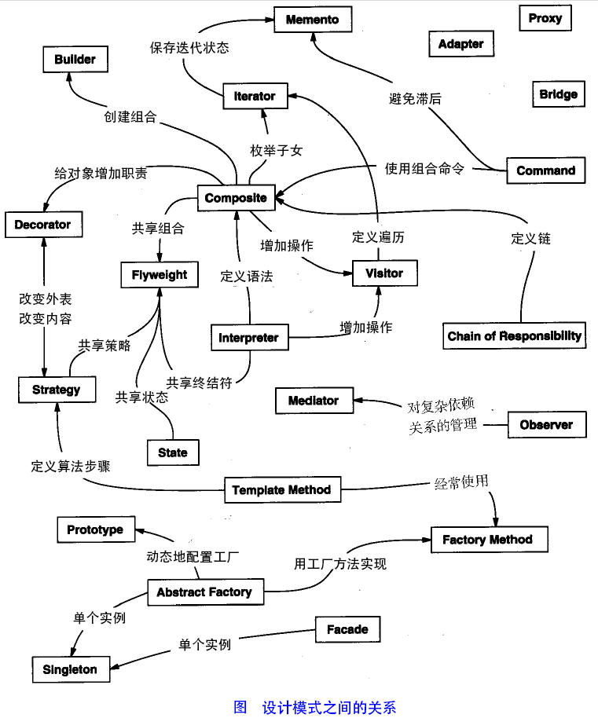
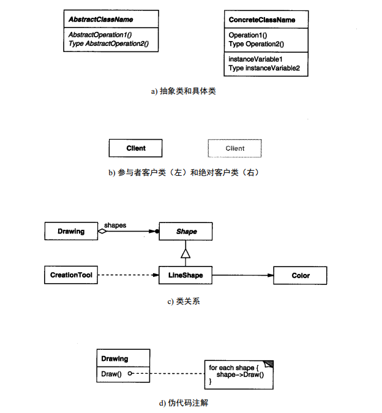
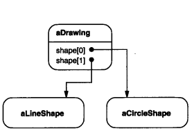
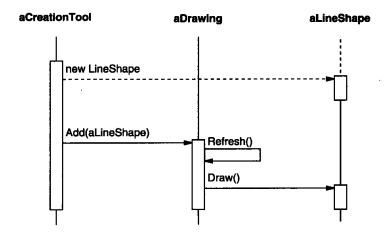

[toc]
## 第1章 引言
　　<font color='red'>设计模式（Design pattern）：</font>是一套被反复使用、多数人知晓的、经过分类编目的、代码设计经验的总结。使用设计模式是为了可重用代码、让代码更容易被他人理解、保证代码可靠性。 毫无疑问，设计模式于己于他人于系统都是多赢的，设计模式使代码编写真正工程化，设计模式是软件工程的基石，如同大厦的一块块砖石一样。项目中合理的运用设计模式可以完美的解决很多问题，每种模式在现实中都有相应的原理来与之对应，**每一个模式描述了一个在我们周围不断重复发生的问题，以及该问题的核心解决方案**，这也是它能被广泛应用的原因。

### 1.1 <font color='red'>设计模式的分类</font>
　　总体来说设计模式分为三大类：
- 创建型模式，共五种：工厂方法模式、抽象工厂模式、建造者模式、原型模式、单例模式。
- 结构型模式，共七种：适配器模式、桥接模式、组合模式、装饰模式、外观模式、享元模式、代理模式。
- 行为型模式，共十一种：职责链模式、命令模式、解释器模式、迭代器模式、中介者模式、备忘录模式、观察者模式、状态模式、策略模式、模板方法模式、访问者模式。
<div class="wiz-table-container" style="position: relative; padding: 0px;"><div class="wiz-table-body"><table style="width: 1006px;"><tbody><tr><td align="left" valign="middle" style="width: 192px;" class="" rowspan="12" colspan="1">范围</td><td align="left" valign="middle" style="width: 192px;" class=""><br></td><td align="left" valign="middle" style="width: 192px;" class="">创建型</td><td align="left" valign="middle" style="width: 192px;" class="">结构型&nbsp;</td><td align="left" valign="middle" style="width: 237px;" class="">行为型</td></tr><tr><td align="left" valign="middle" style="width: 192px;" class="" rowspan="2" colspan="1">类</td><td align="left" valign="middle" style="width: 192px;" class="">Factory Method(3.1)</td><td align="left" valign="middle" style="width: 192px;" class="">Adapter(类)(4.1)</td><td align="left" valign="middle" style="width: 237px;" class="">Interpreter(5.3)</td></tr><tr><td align="left" valign="middle" style="width: 192px;" class=""><br></td><td align="left" valign="middle" style="width: 192px;" class=""><br></td><td align="left" valign="middle" style="width: 237px;" class="">Template Method(5.10)</td></tr><tr><td style="width: 192px;" class="" rowspan="9" colspan="1">对象</td><td align="left" valign="middle" style="width: 192px;" class="">Abstract Factory(3.2)</td><td align="left" valign="middle" style="width: 192px;" class=""><meta content="text/html; charset=utf-8" http-equiv="Content-Type">Adapter(对象)(4.1)<br></td><td align="left" valign="middle" style="width: 237px;" class="">Chain of Responsibility(5.1)</td></tr><tr><td align="left" valign="middle" style="width: 192px;" class="">Builder(3.3)</td><td align="left" valign="middle" style="width: 192px;" class="">Bridge(4.2)</td><td align="left" valign="middle" style="width: 237px;" class="">Command(5.2)</td></tr><tr><td style="width: 192px;" class="">Prototype(3.4)</td><td style="width: 192px;" class="">Composite(4.3)</td><td style="width: 237px;" class="">Iterator(5.4)</td></tr><tr><td style="width: 192px;" class="">Singleton（3.5）</td><td style="width: 192px;" class="">Decorator(4.4)</td><td style="width: 237px;" class="">Mediator(5.5)</td></tr><tr><td style="width: 192px;" class=""><br></td><td style="width: 192px;" class="">Facade(4.5)</td><td style="width: 237px;" class="">Memento(5.6)</td></tr><tr><td style="width: 192px;" class=""><br></td><td style="width: 192px;" class="">Flyweight(4.6)</td><td style="width: 237px;" class="">Observer(5.7)</td></tr><tr><td style="width: 192px;" class=""><br></td><td style="width: 192px;" class="">Proxy(4.7)</td><td style="width: 237px;" class="">State(5.8)</td></tr><tr><td style="width: 192px;" class=""><br></td><td style="width: 192px;" class=""><br></td><td style="width: 237px;" class="">Strategy(5.9)</td></tr><tr><td style="width: 192px;" class=""><br></td><td style="width: 192px;" class=""><br></td><td style="width: 237px;" class="">Visitor(5.10)</td></tr></tbody></table></div></div>
　　我们根据两条准则对模式进行分类。第一是**目的准则**，即模式是用来完成什么工作的。模式依据其目的可分为创建型、结构型、或行为型三种。<font color='blue'>创建型模式与对象的创建有关；结构型模式处理类或对象的组合；行为型模式对类或对象怎样交互和怎样分配职责进行描述。</font>
　　第二是**范围准则**，指定模式主要是用于类还是用于对象。<font color='blue'>类模式处理类和子类之间的关系，这些关系通过继承建立，是静态的，在编译时刻便确定下来了。对象模式处理对象间的关系，这些关系在运行时刻是可以变化的，更具动态性。</font>从某种意义上来说，几乎所有模式都使用继承机制，所以“类模式”只指那些集中于处理类间关系的模式，而大部分模式都属于对象模式的范畴。
　　创建型类模式将对象的部分创建工作延迟到子类，而创建型对象模式则将它延迟到另一个对象中。结构型类模式使用继承机制来组合类，而结构型对象模式则描述了对象的组装方式。行为型类模式使用继承描述算法和控制流，而行为型对象模式则描述一组对象怎样协作完成单个对象所无法完成的任务。


## 第2章 设计模式的六大原则
参考：http://www.uml.org.cn/sjms/201211023.asp#1
### <font color='red'>开闭原则</font>
<font color='blue'>（Open Close Principle）定义</font>：一个软件实体如类、模块和函数应该对扩展开放，对修改关闭。
<font color='blue'>问题由来</font>：在软件的生命周期内，因为变化、升级和维护等原因需要对软件原有代码进行修改时，可能会给旧代码中引入错误，也可能会使我们不得不对整个功能进行重构，并且需要原有代码经过重新测试。
<font color='blue'>解决方案</font>：当软件需要变化时，尽量通过扩展软件实体的行为来实现变化，而不是通过修改已有的代码来实现变化，其实就是合理的利用抽象类和接口。
<font color='blue'>注意事项</font>：
- 通过接口或者抽象类约束扩展，对扩展进行边界限定，不允许出现在接口或抽象类中不存在的public方法
- 参数类型、引用对象尽量使用接口或者抽象类，而不是实现类
- 抽象层尽量保持稳定，一旦确定即不允许修改

　　开闭原则是面向对象设计中最基础的设计原则，它指导我们如何建立稳定灵活的系统。其他几条，则可以看做是开闭原则的实现方法，只要我们对后面5项原则遵守的好了，设计出的软件自然是符合开闭原则的。 设计模式就是实现了这些原则，从而达到了代码复用、增加可维护性的目的。
　　开闭原则无非就是想表达这样一层意思：用抽象构建框架，用实现扩展细节。因为抽象灵活性好，适应性广，只要抽象的合理，可以基本保持软件架构的稳定。而软件中易变的细节，我们用从抽象派生的实现类来进行扩展，当软件需要发生变化时，我们只需要根据需求重新派生一个实现类来扩展就可以了。当然前提是我们的抽象要合理，要对需求的变更有前瞻性和预见性才行。
　　后面5项原则，则是告诉我们用抽象构建框架，用实现扩展细节的注意事项而已：<font color='blue'>单一职责原则告诉我们实现类要职责单一；里氏代换原则告诉我们不要破坏继承体系；依赖倒置原则告诉我们要面向接口编程；接口隔离原则告诉我们在设计接口的时候要精简单一；迪米特法则告诉我们要降低耦合。而开闭原则是总纲，他告诉我们要对扩展开放，对修改关闭。</font>

<font color='blue'>开闭原则的优点</font>：可复用性；可维护性。

### <font color='red'>单一职责原则</font>
<font color='blue'>(Single Responsibility Principle)定义</font>：类的职责要单一，不能将太多的职责放在一个类中。（高内聚、低耦合）
<font color='blue'>问题由来</font>：类T负责两个不同的职责：职责P1，职责P2。当由于职责P1需求发生改变而需要修改类T时，有可能会导致原本运行正常的职责P2功能发生故障。
<font color='blue'>解决方案</font>：遵循单一职责原则。分别建立两个类T1、T2，使T1完成职责P1功能，T2完成职责P2功能。这样，当修改类T1时，不会使职责P2发生故障风险；同理，当修改T2时，也不会使职责P1发生故障风险。

<font color='blue'>原则分析</font>：
1)一个类（或者大到模块，小到方法）承担的职责越多，它被复用的可能性越小，而且如果一个类承担的职责过多，就相当于将这些职责耦合在一起，当其中一个职责变化时，可能会影响其他职责的运作。 
2)类的职责主要包括两个方面：数据职责和行为职责，数据职责通过其属性来体现，而行为职责通过其方法来体现。
3)单一职责原则是实现高内聚、低耦合的指导方针，在很多代码重构手法中都能找到它的存在，它是最简单但又最难运用的原则，需要设计人员发现类的不同职责并将其分离，而发现类的多重职责需要设计人员具有较强的分析设计能力和相关重构经验。 

<font color='blue'>优点</font>：
- 可以降低类的复杂度，一个类只负责一项职责，其逻辑肯定要比负责多项职责简单的多。
- 提高类的可读性，提高系统的可维护性。
- 变更引起的风险降低。如果单一职责原则遵守的好，当修改一个功能时，可以显著降低对其他功能的影响。

### <font color='red'>里氏代换原则</font>
<font color='blue'>（Liskov Substitution Principle）定义</font>：所有引用基类的地方必须能透明地使用其子类的对象。
<font color='blue'>问题由来</font>：有一功能P1，由类A完成。现需要将功能P1进行扩展，扩展后的功能为P，其中P由原有功能P1与新功能P2组成。新功能P由类A的子类B来完成，则子类B在完成新功能P2的同时，有可能会导致原有功能P1发生故障。
<font color='blue'>解决方案</font>：当使用继承时，遵循里氏替换原则，子类不能覆盖父类的非抽象方法，可以用接口等其他方法绕过。

<font color='blue'>原则分析</font>：
　　继承包含这样一层含义：父类中凡是已经实现好的方法（相对于抽象方法而言），实际上是在设定一系列的规范和契约，虽然它不强制要求所有的子类必须遵从这些规范，但是如果子类对这些非抽象方法任意修改，就会对整个继承体系造成破坏。而里氏替换原则就是表达了这一层含义。继承作为面向对象三大特性之一，在给程序设计带来巨大便利的同时，也带来了弊端。比如使用继承会给程序带来侵入性，程序的可移植性降低，增加了对象间的耦合性，如果一个类被其他的类所继承，则当这个类需要修改时，必须考虑到所有的子类，并且父类修改后，所有涉及到子类的功能都有可能会产生故障。

<font color='blue'>里氏替换原则更通俗的定义</font>：子类可以扩展父类的功能，但不能改变父类原有的功能。它包含以下4层含义：
- 子类可以实现父类的抽象方法，但不能覆盖父类的非抽象方法。
- 子类中可以增加自己特有的方法。
- 当子类的方法重载父类的方法时，方法的前置条件（即方法的形参）要比父类方法的输入参数更宽松。
- 当子类的方法实现父类的抽象方法时，方法的后置条件（即方法的返回值）要比父类更严格。

下面一一说明：
**1.子类可以实现父类的抽象方法，但是不能覆盖父类的非抽象方法**
　　在我们做系统设计时，经常会设计接口或抽象类，然后由子类来实现抽象方法，这里其实使用了里氏替换原则。子类可以实现父类的抽象方法很好理解，事实上，子类也必须完全实现父类的抽象方法，哪怕写一个空方法，否则会编译报错。
　　里氏替换原则的关键点在于不能覆盖父类的非抽象方法。父类中凡是已经实现好的方法，实际上是在设定一系列的规范和契约，虽然它不强制要求所有的子类必须遵从这些规范，但是如果子类对这些非抽象方法任意修改，就会对整个继承体系造成破坏。比如下面一个简单的例子：
```
public class C {
    public int func(int a, int b){
        return a+b;
    }
}
 
public class C1 extends C{
    @Override
    public int func(int a, int b) {
        return a-b;
    }
}
 
public class Client{
    public static void main(String[] args) {
        C c = new C1();
        System.out.println("2+1=" + c.func(2, 1));
    }
}
```
　　运行结果：2+1=1
　　上面的运行结果明显是错误的。类C1继承C，后来需要增加新功能，类C1并没有新写一个方法，而是直接重写了父类C的func方法，违背里氏替换原则，引用父类的地方并不能透明的使用子类的对象，导致运行结果出错。

**2.子类中可以增加自己特有的方法**
　　在继承父类属性和方法的同时，每个子类也都可以在父类的基础上扩展自己的功能。因此上面的例子中可以另写一个方法实现新功能，使其符合里氏替换原则。

**3.当子类的方法重载父类的方法时，方法的前置条件（即方法的形参）要比父类方法的输入参数更宽松**
```
import java.util.HashMap;
public class Father {
    public void func(HashMap m){
        System.out.println("执行父类...");
    }
}
 
import java.util.Map;
public class Son extends Father{
    public void func(Map m){//方法的形参比父类的更宽松
        System.out.println("执行子类...");
    }
}
 
import java.util.HashMap;
public class Client{
    public static void main(String[] args) {
        Father f = new Son();//引用基类的地方能透明地使用其子类的对象。
        HashMap h = new HashMap();
        f.func(h);
    }
}
```
　　运行结果：执行父类...
　　注意Son类的func方法前面是不能加`@Override`注解的，因为否则会编译提示报错，这并不是重写（Override），而是重载（Overload），因为方法的输入参数不同。保证能实现父类功能的同时，还能实现子类的新功能。

**4.当子类的方法实现父类的抽象方法时，方法的后置条件（即方法的返回值）要比父类更严格**
　　这个好理解，比如父类返回值HashMap，结果子类返回值Map，由于HashMap的引用是不能指向Map对象的，很明显引用基类的地方不能透明地使用其子类的对象。

### <font color='red'>依赖倒置原则</font>
<font color='blue'>（Dependence Inversion Principle）定义</font>：高层模块不应该依赖低层模块，二者都应该依赖其抽象；抽象不应该依赖细节，细节应该依赖抽象。
<font color='blue'>问题由来</font>：类A直接依赖类B，假如要将类A改为依赖类C，则必须通过修改类A的代码来达成。这种场景下，类A一般是高层模块，负责复杂的业务逻辑；类B和类C是低层模块，负责基本的原子操作；假如修改类A，会给程序带来不必要的风险。
<font color='blue'>解决方案</font>：将类A修改为依赖接口I，类B和类C各自实现接口I，类A通过接口I间接与类B或者类C发生联系，则会大大降低修改类A的几率。

<font color='blue'>原则分析</font>：
　　依赖倒置原则基于这样一个事实：相对于细节的多变性，抽象的东西要稳定的多。以抽象为基础搭建起来的架构比以细节为基础搭建起来的架构要稳定的多。在java中，抽象指的是接口或者抽象类，细节就是具体的实现类，使用接口或者抽象类的目的是制定好规范和契约，而不去涉及任何具体的操作，把展现细节的任务交给他们的实现类去完成。
　　<font color='blue'>依赖倒置原则的核心思想是[面向接口编程](http://www.cnblogs.com/xzwblog/p/6822286.html#_label2)</font>。

例子：
　　本来我们的业务逻辑是卖苹果，所以设计系统的时候传入的参数设置为(Apple apple)，在实例化的时候new Apple()实例传入即可。后来我们改卖香蕉了，那么业务逻辑代码传入的参数就要修改为(Banana banana)，并且所有使用apple实例名的地方都要修改为banana，很容易出错。如果面向接口编程，设置一个水果Fruit接口，苹果类和香蕉类都是接口的具体实现。系统代码传入的参数修改为(Fruit fruit)，无论是哪种实现了接口的水果实例传进来都可以使用。所以遵循依赖倒置原则可以降低类之间的耦合性，提高系统的稳定性，降低修改程序造成的风险。

<font color='blue'>优点</font>：
- 对系统灵活性大有好处。当下层需要改变时，只要接口及接口功能不变，则上层不用做任何修改。甚至可以在不改动上层代码时将下层整个替换掉。
- 不同部件或层次的开发人员可以并行开工，就像造硬盘的不用等造CPU的，也不用等造显示器的，只要接口一致，设计合理，完全可以并行进行开发，从而提高效率。

### <font color='red'>接口隔离原则</font>
<font color='blue'>（Interface Segregation Principle）定义</font>：客户端不应该依赖它不需要的接口；一个类对另一个类的依赖应该建立在最小的接口上。 就比如Service层中，处理文件的接口不应该和处理登陆的接口放在一个接口内。
<font color='blue'>问题由来</font>：类A通过接口I依赖类B，类C通过接口I依赖类D，如果接口I对于类A和类B来说不是最小接口，则类B和类D必须去实现他们不需要的方法。
<font color='blue'>解决方案</font>：将臃肿的接口I拆分为独立的几个接口，类A和类C分别与他们需要的接口建立依赖关系。也就是采用接口隔离原则。

<font color='blue'>原则分析</font>：
　　接口隔离原则的含义是：建立单一接口，不要建立庞大臃肿的接口，尽量细化接口，接口中的方法尽量少。也就是说，我们要为各个类建立专用的接口，而不要试图去建立一个很庞大的接口供所有依赖它的类去调用。在程序设计中，依赖几个专用的接口要比依赖一个综合的接口更灵活。接口是设计时对外部设定的“契约”，通过分散定义多个接口，可以预防外来变更的扩散，提高系统的灵活性和可维护性。
　　说到这里，很多人会觉的接口隔离原则跟之前的单一职责原则很相似，其实不然。其一，单一职责原则注重的是职责；而接口隔离原则注重对接口依赖的隔离。其二，单一职责原则主要是约束类，其次才是接口和方法，它针对的是程序中的实现和细节；而接口隔离原则主要约束接口，针对抽象，针对程序整体框架的构建。

<font color='blue'>采用接口隔离原则对接口进行约束时，要注意以下几点</font>：
- 接口尽量小，但是要有限度。对接口进行细化可以提高程序设计灵活性是不争的事实，但是如果过小，则会造成接口数量过多，使设计复杂化。所以一定要适度。
- 为依赖接口的类定制服务，只暴露给调用的类它需要的方法，它不需要的方法则隐藏起来。只有专注地为一个模块提供定制服务，才能建立最小的依赖关系。
- 提高内聚，减少对外依赖。

### <font color='red'>迪米特法则</font>
<font color='blue'>（Demeter Principle）定义</font>：一个对象应该对其他对象保持最少的了解。
<font color='blue'>问题由来</font>：类与类之间的关系越密切，耦合度越大，当一个类发生改变时，对另一个类的影响也越大。
<font color='blue'>解决方案</font>：尽量降低类与类之间的耦合。

<font color='blue'>原则分析</font>：
　　自从我们接触编程开始，就知道了软件编程的总的原则：高内聚、低耦合。无论是面向过程编程还是面向对象编程，只有使各个模块之间的耦合尽量的低，才能提高代码的复用率。迪米特法则又叫最少知道原则，通俗的来讲，就是一个类对自己依赖的类知道的越少越好。也就是说，对于被依赖的类来说，无论逻辑多么复杂，都尽量地的将逻辑封装在类的内部，对外除了提供的public方法，不对外泄漏任何信息。迪米特法则还有一个更简单的定义：只与直接的朋友通信。首先来解释一下什么是直接的朋友：每个对象都会与其他对象有耦合关系，只要两个对象之间有耦合关系，我们就说这两个对象之间是朋友关系。耦合的方式很多，依赖、关联、组合、聚合等。其中，我们称出现在成员变量、方法参数、方法返回值中的类为直接的朋友，而出现在局部变量中的类则不是直接的朋友。也就是说，陌生的类最好不要作为局部变量的形式出现在类的内部。

<font color='blue'>例子</font>：有一个集团公司，下属单位有分公司和直属部门，现在要求打印出所有下属单位的员工ID。先来看一下违反迪米特法则的设计。
```
//总公司员工
class Employee{
 private String id;
 public void setId(String id){
  this.id = id;
 }
 public String getId(){
  return id;
 }
}

//分公司员工
class SubEmployee{
 private String id;
 public void setId(String id){
  this.id = id;
 }
 public String getId(){
  return id;
 }
}

class SubCompanyManager{
 public List<SubEmployee> getAllEmployee(){
  List<SubEmployee> list = new ArrayList<SubEmployee>();
  for(int i=0; i<100; i++){
   SubEmployee emp = new SubEmployee();
   //为分公司人员按顺序分配一个ID
   emp.setId("分公司"+i);
   list.add(emp);
  }
  return list;
 }
}

class CompanyManager{
 public List<Employee> getAllEmployee(){
  List<Employee> list = new ArrayList<Employee>();
  for(int i=0; i<30; i++){
   Employee emp = new Employee();
   //为总公司人员按顺序分配一个ID
   emp.setId("总公司"+i);
   list.add(emp);
  }
  return list;
 }
	
 public void printAllEmployee(SubCompanyManager sub){
  List<SubEmployee> list1 = sub.getAllEmployee();
  for(SubEmployee e:list1){
   System.out.println(e.getId());
  }

  List<Employee> list2 = this.getAllEmployee();
  for(Employee e:list2){
   System.out.println(e.getId());
  }
 }
}

public class Client{
 public static void main(String[] args){
  CompanyManager e = new CompanyManager();
  e.printAllEmployee(new SubCompanyManager());
 }
} 
```
　　现在这个设计的主要问题出在CompanyManager中，根据迪米特法则，只与直接的朋友发生通信，而SubEmployee类并不是CompanyManager类的直接朋友（以局部变量出现的耦合不属于直接朋友），从逻辑上讲总公司只与他的分公司耦合就行了，与分公司的员工并没有任何联系，这样设计显然是增加了不必要的耦合。按照迪米特法则，应该避免类中出现这样非直接朋友关系的耦合。修改后的代码如下:
```
class SubCompanyManager{
 public List<SubEmployee> getAllEmployee(){
  List<SubEmployee> list = new ArrayList<SubEmployee>();
  for(int i=0; i<100; i++){
   SubEmployee emp = new SubEmployee();
   //为分公司人员按顺序分配一个ID
   emp.setId("分公司"+i);
   list.add(emp);
  }
  return list;
 }
 public void printEmployee(){
  List<SubEmployee> list = this.getAllEmployee();
  for(SubEmployee e:list){
   System.out.println(e.getId());
  }
 }
}

class CompanyManager{
 public List<Employee> getAllEmployee(){
  List<Employee> list = new ArrayList<Employee>();
  for(int i=0; i<30; i++){
   Employee emp = new Employee();
   //为总公司人员按顺序分配一个ID
   emp.setId("总公司"+i);
   list.add(emp);
  }
  return list;
 }
	
 public void printAllEmployee(SubCompanyManager sub){
  sub.printEmployee();
  List<Employee> list2 = this.getAllEmployee();
  for(Employee e:list2){
   System.out.println(e.getId());
  }
 }
}
```
　　修改后，为分公司增加了打印人员ID的方法，总公司直接调用来打印，从而避免了与分公司的员工发生耦合。

<font color='blue'>优缺点</font>：
1. 迪米特法则的优点在于降低类之间的耦合。
2. 缺点是会产生比较多的小方法，让系统变得比较凌乱，而且通信效率会降低。
3. 设计模式中的应用：外观模式(Facade Pattern)和中介者模式(Mediator Pattern)。

### 总结
　　最后说明一下如何去遵守这六个原则。对这六个原则的遵守并不是`是和否`的问题，而是多和少的问题，也就是说，我们一般不会说有没有遵守，而是说遵守程度的多少。任何事都是过犹不及，设计模式的六个设计原则也是一样，制定这六个原则的目的并不是要我们刻板的遵守他们，而需要根据实际情况灵活运用。对他们的遵守程度只要在一个合理的范围内，就算是良好的设计。

## 附录 图示符号指南
　　我们使用了三种不同的图形符号：
1) 类图描述各个类、它们的结构以及它们之间的静态关系。
2) 对象图描述运行时刻特定的对象结构。
3) 交互图展示对象间请求的流程。

### 类图

　　图a是以OMT符号表示的抽象类和具体类。一个类表示为一个线框，在顶部以粗体写着类名，其下是主要的操作，再下是实例变量。将类型名置于操作名（强调返回类型）、变量名或参数之前。斜体表示该类或操作是抽象的。
　　在类图中，当某个客户类是某模式的参与者（即该客户类在这个模式中承担一定的责任）时，我们以正常的方式表示它；而当该客户不是该模式的参与者（即客户类在模式中不承担责任），而仅仅是为了说明其与模式的参与者之间的交互关系时，我们以灰色来表示它，如图b所示。代理模式（ Proxy）就是一个例子。这种灰客户表示法也提醒我们在讨论模式参与者时不要漏掉客户类。
　　图c展示了类间的几种关系。在OMT表示法中，类继承表示为一个从子类（图中的LineShape）到父类（图中的Shape）的三角形连线；代表聚合关系的对象引用表示为一个根部有菱形的箭头，指向被聚合的类（图中的 Shape）；根部没有菱形的箭头表示相识关系（图中LineShape有一个指向Color的引用，而Color可能是多个Shape对象共享的）。在箭头根部附近可以注明引用的名称，以区别于其他引用 。
　　另一个有用的表示是说明哪个类创建哪个类的对象。由于OMT不支持这种表示，所以我们用虚线箭头来标记这种情况。我们称之为“创建”关系。箭头指向的是被实例化的对象。在图c中，CreationTool创建LineShape对象。
　　OMT还定义了一种实心圆点，表示“多于一个”。当圆点位于引用的头部，它表示指向或聚集多个对象。图c中Drawing聚集了多个Shape类型的对象。
　　最后，我们认为可以在OMT图上加上一些伪代码，以简要说明操作的实现。图d中的伪代码说明了Drawing类的Draw操作的实现。

**对象聚合**：意味着一个对象拥有另一个对象或对另一个对象负责。一般我们称一个对象包含另一个对象或者是另一个对象的一部分。聚合意味着聚合对象和其所有者具有相同的生命周期。
**对象相识**：意味着一个对象仅仅知道另一个对象。有时相识也被称为“关联”或“引用”关系。相识的对象可能请求彼此的操作，但是它们不为对方负责。相识是一种比聚合要弱的关系，它只标识了对象间较松散的耦合关系。

### 对象图

　对象图仅仅描述实例。它描述了设计模式中的对象某个时刻的状况。对象的名字通常表示为“ aSomething”，其中Something是该对象的类。我们用来表示对象的符号是一个圆角矩形，并以一条直线将对象名与对象引用分开。箭头表示对象引用。

### 交互图

　　交互图展示了对象间各请求的执行顺序。上图描述了一个Shape对象是如何加入到某个Drawing对象中去的。
　　交互图中从上到下表示时间流向。一条垂直实线表示一个特定对象的生命周期。对象的命名规则与对象图一样。如果某对象在本图所示的时间区间开始时还未被创建，则用垂直虚线表示，这条虚线一直延伸到它被创建的时间点。一个垂直的矩形表示对象在活动，也就是说它正在处理某个请求。在操作过程中也可以向其它对象发出请求，这以一个指向接收对象的水平箭头表示。请求的名称标注在箭头上方。创建对象的请求以虚线箭头表示。一个发给自身的请求也指向发送者自身。
　　在上图中，第一个请求是aCreationTool发出的，请求创建aLineShape 。接下来，aLineShape被加入到aDrawing中，这导致aDrawing向它自身发出一个Refresh请求。而在Refresh操做过程中aDrawing又向aLineShape发出一个Draw请求。
